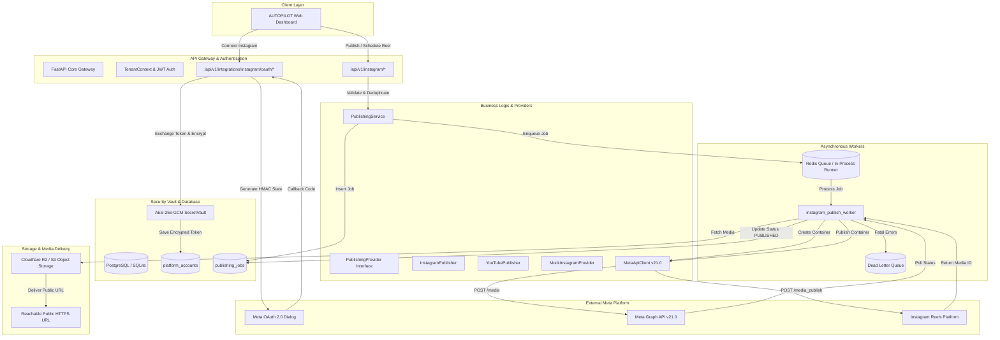
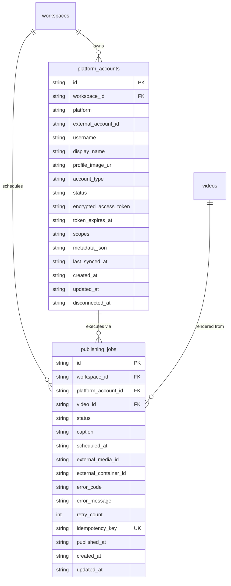
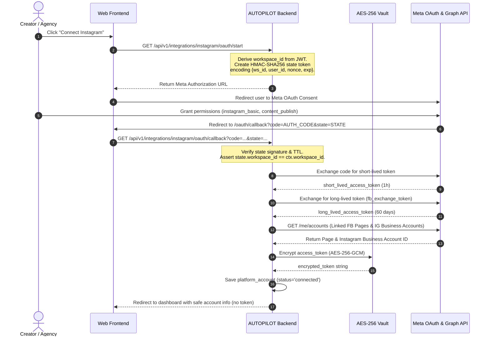
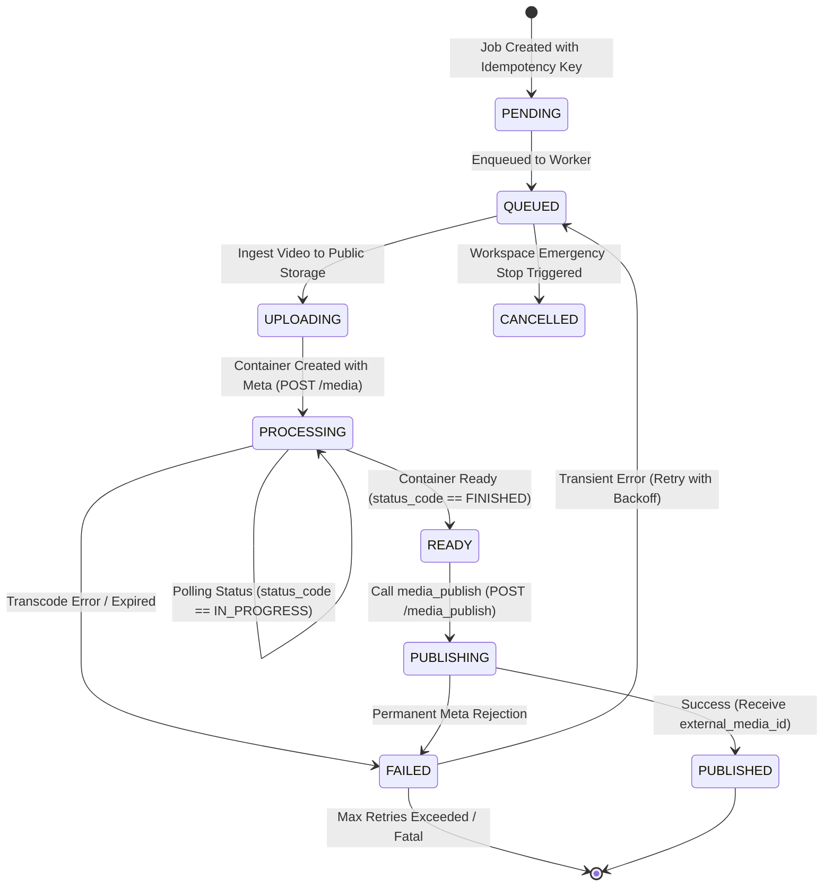

# AUTOPILOT — INSTAGRAM INTEGRATION ARCHITECTURE
**Author:** Principal Backend & Meta Platform Integration Architect  
**Version:** 1.0  
**Scope:** Multi-Tenant Meta Platform Publishing Infrastructure  
**Date:** September 2026

---

## 1. System Overview & Data Flow

The Instagram Publishing Integration establishes an asynchronous, multi-tenant publishing pipeline connecting AUTOPILOT's autonomous video rendering engine to Meta's Instagram Graph API v21.0.



---

## 2. Provider Abstraction Architecture

To keep AUTOPILOT platform-agnostic and extensible to YouTube, TikTok, Facebook, and LinkedIn, all publishing operations are abstracted behind a unified interface:

```python
class PublishingProvider(ABC):
    """Abstract base contract for multi-platform video publishing."""

    @abstractmethod
    async def validate_credentials(self, account: PlatformAccount) -> bool:
        """Verifies token validity and active permissions."""
        ...

    @abstractmethod
    async def validate_media(self, video_path: str, metadata: Dict[str, Any]) -> ValidationResult:
        """Enforces platform-specific video codecs, duration, and aspect ratio."""
        ...

    @abstractmethod
    async def create_container(self, account: PlatformAccount, video_url: str, caption: str) -> str:
        """Initializes remote media upload or container ingestion."""
        ...

    @abstractmethod
    async def check_container_status(self, account: PlatformAccount, container_id: str) -> ContainerStatus:
        """Polls ingestion or transcoding status."""
        ...

    @abstractmethod
    async def publish(self, account: PlatformAccount, container_id: str) -> PublishResult:
        """Commits and publishes the media container to the platform feed."""
        ...

    @abstractmethod
    async def get_analytics(self, account: PlatformAccount, external_media_id: str) -> Dict[str, Any]:
        """Fetches post-publish metrics (views, reach, engagement)."""
        ...
```

### Concrete Implementations
1. `InstagramPublisher`: Concrete provider communicating with Meta Graph API v21.0.
2. `YouTubePublisher`: Concrete provider communicating with Google YouTube Data API v3.
3. `MockInstagramProvider`: Deterministic in-memory provider for unit and automated integration tests, simulating all edge conditions (`SUCCESS`, `RATE_LIMIT`, `TOKEN_EXPIRED`, `MEDIA_INVALID`, `PROCESSING_TIMEOUT`).

---

## 3. Multi-Tenant Database Schema

To prevent data collision and support tenant isolation, two dedicated tables are added to `core/db_base.py`:



### Database Invariants
- **Uniqueness:** `(workspace_id, platform, external_account_id)` is strictly unique in `platform_accounts`.
- **Idempotency:** `idempotency_key` is unique across `publishing_jobs`.
- **Tenant Partitioning:** Every query filters on `workspace_id = %s`.

---

## 4. OAuth 2.0 Security & State Lifecycle



---

## 5. Asynchronous Publishing Lifecycle

Publishing is strictly decoupled from HTTP requests. All operations execute asynchronously in background workers:



### Worker Execution Stages
1. **Workspace & Stop Check:** Check `workspace.is_active` and `workspace.emergency_stop`. If stopped, abort and mark job `CANCELLED`.
2. **Account Validation:** Load `platform_account`, verify status is `connected` and token is unexpired.
3. **Decryption:** Decrypt token in local worker process memory via `SecretVault`.
4. **Media Validation:** Check MP4 container, H.264+AAC codecs, aspect ratio (9:16), duration ($\le 90$s), and caption length ($\le 2200$ chars).
5. **Hosting:** Ensure media is hosted on a verified public HTTPS URL (`core/hosting.py`).
6. **Container Creation:** Call `POST /{ig_user_id}/media` with `media_type=REELS`.
7. **Status Polling:** Poll container with exponential backoff ($5s \rightarrow 8s \rightarrow 12s \rightarrow 15s \dots$).
8. **Publish:** Call `POST /{ig_user_id}/media_publish`.
9. **Finalize:** Record `external_media_id`, update job to `PUBLISHED`, deduct platform publish quota, and trigger analytics sync.

---

## 6. Error Handling & Normalization Matrix

| Meta Error Code | Subcode | Category | Action / Retry Behavior | Normalized System Code |
|:---|:---|:---|:---|:---|
| **190** | - | Auth | Permanent: Mark account `TOKEN_EXPIRED`, notify user, halt queue. | `INSTAGRAM_TOKEN_EXPIRED` |
| **200** | - | Permission | Permanent: Missing permission, stop retries. | `INSTAGRAM_PERMISSION_DENIED` |
| **24** | - | Media | Permanent: Codec reject (H.264+AAC required). Do not retry. | `INSTAGRAM_MEDIA_INVALID` |
| **2207026** | - | Media | Permanent: Duration $>90$s or aspect ratio invalid. | `INSTAGRAM_MEDIA_INVALID` |
| **2207050** | - | Media | Permanent: Aspect ratio not 9:16. | `INSTAGRAM_MEDIA_INVALID` |
| **2207052** | - | Network/Host | Transient: Media URL unreachable; retry with backoff. | `INSTAGRAM_MEDIA_PROCESSING_FAILED` |
| **4 / 17** | - | Rate Limit | Transient: App/User rate limit hit; backoff 15-60 min. | `INSTAGRAM_RATE_LIMITED` |
| **2207042**| - | Rate Limit | 24h publishing cap reached (100 posts/day). Schedule for tomorrow. | `INSTAGRAM_RATE_LIMITED` |
| **2207001**| - | Ingest | Transient: Server upload failure; retry container creation. | `INSTAGRAM_API_ERROR` |

---

## 7. Content Scientist Feedback Loop

After publication, analytics data flows back into AUTOPILOT's learning systems (`agents/analyst.py` and `agents/scientist.py`):
1. **Sync Metrics:** Fetches views, reach, likes, comments, shares, and saves.
2. **Hook Attribution:** Correlates 3-second retention with the selected hook type (`pov`, `question`, `contrarian`, `specific_outcome`).
3. **Pacing Attribution:** Correlates completion rate with scene pacing and visual template (`noir_teal`, `crimson_alert`, `moonlit_blue`).
4. **Autonomous Improvement:** The Content Scientist incorporates winning combinations into future script ideation for that workspace.
