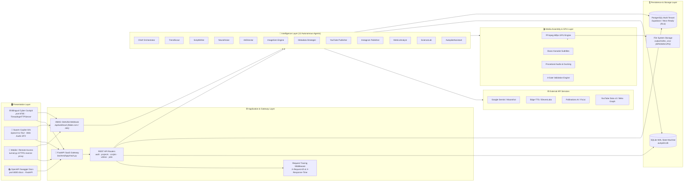
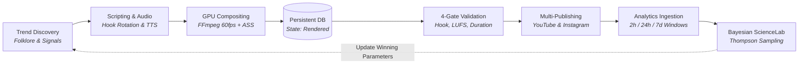
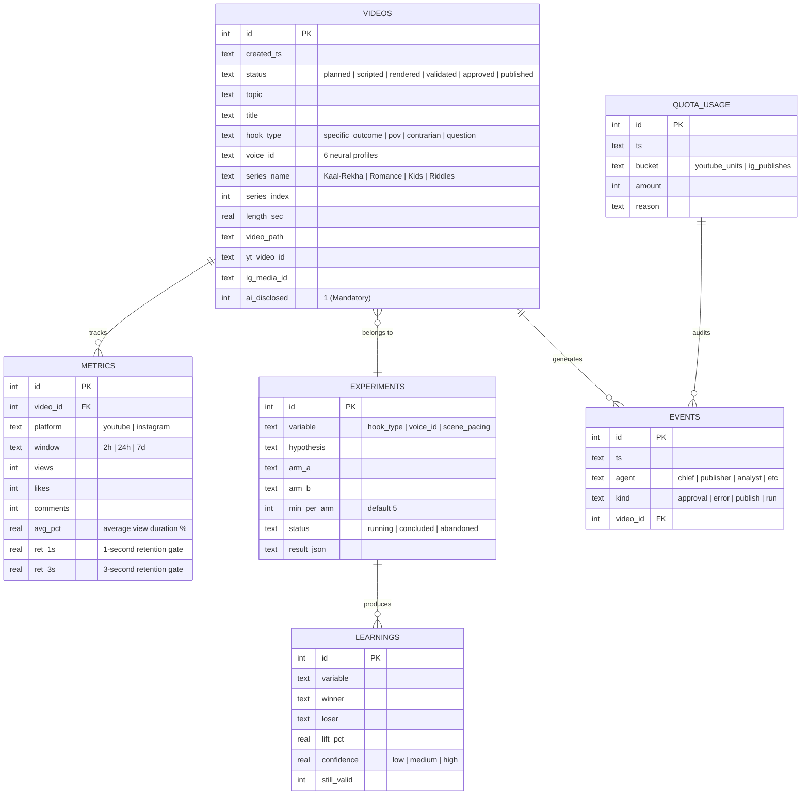
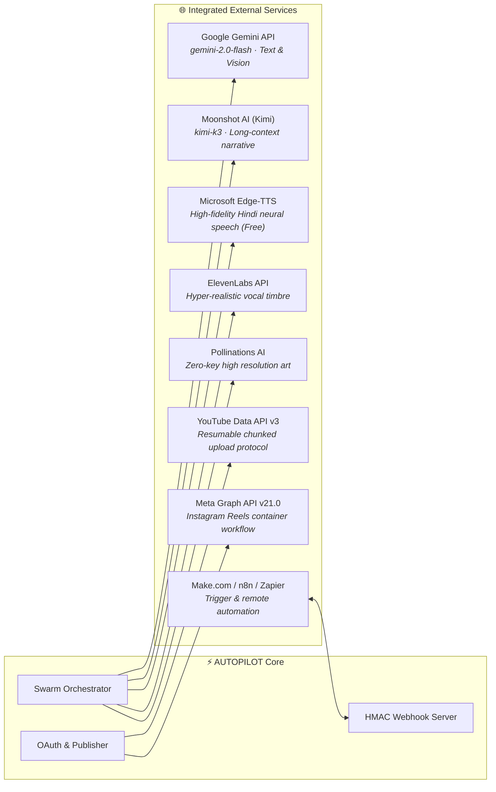
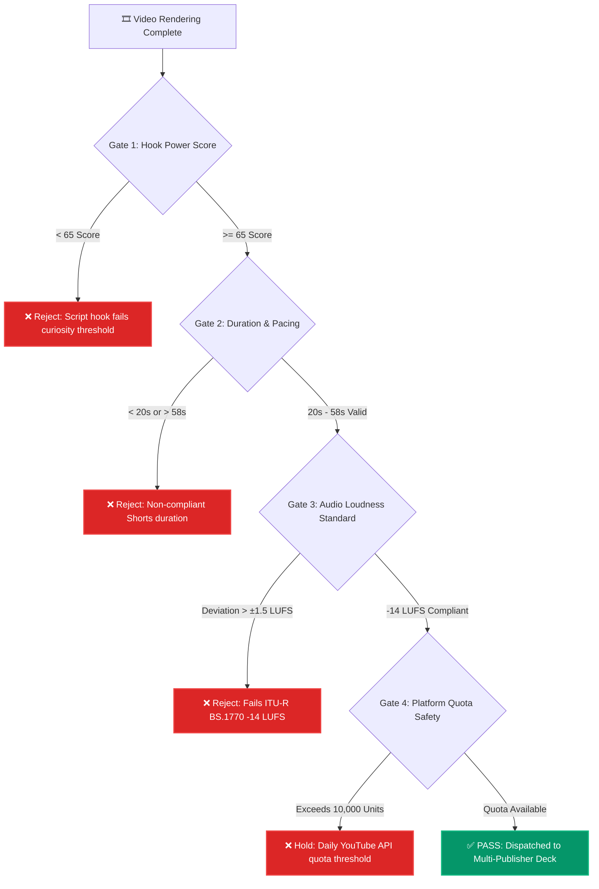
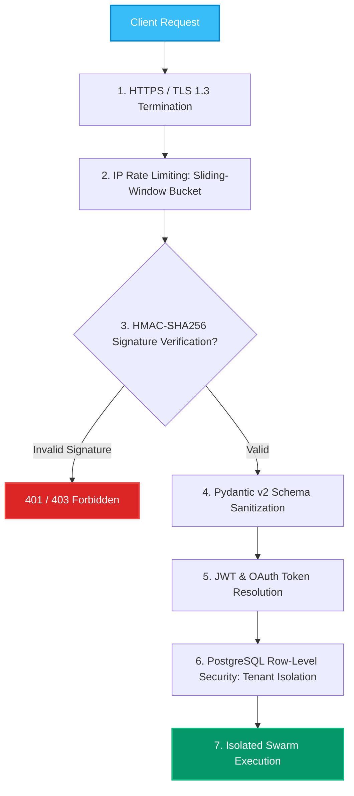
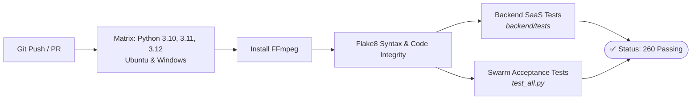

# 🎬 AUTOPILOT

<div align="center">

### **Autonomous 12-Agent Swarm for Viral YouTube Shorts & Instagram Reels**
**Closed-Loop Bayesian Reinforcement · 60fps Hardware Compositing · Bilingual Cyber Cockpit · Production FastAPI SaaS Gateway**

<br>

[](https://autopilot-t9ku.onrender.com)
[](https://render.com/deploy)
[](https://github.com/Abhay73888/autopilot/actions)
[](https://www.python.org/)
[](https://fastapi.tiangolo.com/)
[](https://ffmpeg.org/)
[](#-12-agent-autonomous-swarm-architecture)
[-10B981?style=for-the-badge&logo=pytest&logoColor=white)](#-testing--quality-assurance)
[-10B981?style=for-the-badge&logo=googlepay&logoColor=white)](#-multimodal-ai--provider-failover-matrix)
[](LICENSE)

<br>

**Research → Ideate → Script → Voiceover → Composite → Validate → Publish → Learn**

<br>

**AUTOPILOT** is an enterprise-grade autonomous media operating system engineered to execute the end-to-end lifecycle of short-form vertical video (YouTube Shorts & Instagram Reels). Driven by a decentralized **12-agent AI swarm**, hardware-accelerated **60fps FFmpeg compositing engine**, and **Bayesian Thompson Sampling reinforcement loop**, AUTOPILOT transforms viral topic signals into broadcast-ready media, validates retention metrics at 2h/24h/7d windows, and recursively optimizes narrative pacing with **zero human intervention required**.

<br>

[⚡ Quickstart](#-quickstart) • [🌐 Live Deployed App](#-live-cloud-deployment) • [🧠 12-Agent Swarm](#-12-agent-autonomous-swarm-architecture) • [🏗️ System Architecture](#%EF%B8%8F-complete-system-architecture) • [🤖 AI Pipeline](#-ai-generation-pipeline) • [🗄️ Database](#%EF%B8%8F-database-architecture) • [🔌 Integrations](#-api--integration-map) • [🛡️ 4-Gate QA](#%EF%B8%8F-4-gate-quality--safety-system) • [📊 Bilingual Cockpit](#-cyber-cockpit--bilingual-control-center)

</div>

---

## 🧩 Product Snapshot

| Dimension | Specification & Grounded Details |
| :--- | :--- |
| **🎯 Core Mission** | Fully autonomous, closed-loop media production pipeline generating high-retention 9:16 vertical video from trend research to published YouTube Shorts and Instagram Reels. |
| **👥 Target Users** | Media enterprises, automated channel networks, growth marketers, indie creators, and AI engineers researching autonomous agent orchestration. |
| **⚡ Core Runtime** | Python 3.10+ stdlib-first core (zero-bloat) + Production FastAPI SaaS Gateway (`backend/app`) with Pydantic v2 validation. |
| **🤖 AI & Swarm** | 12 Specialized Agents: Chief Orchestrator, TrendScout, ScriptWriter, NeuralVoice, ArtDirector, ImageGen, Metadata Strategist, YouTube Publisher, Instagram Publisher, MetricsAnalyst, ScienceLab, and Copilot Swarm Commander. |
| **🧠 Multi-Tier LLM** | Google Gemini (`gemini-2.0-flash`), Moonshot/Kimi (`kimi-k3`), Claude 3.5 Sonnet, Groq (`llama-3.3-70b-versatile`), with instant deterministic heuristics and `MockLLM` offline mode. |
| **🎙️ Audio & Voice** | Microsoft Edge-TTS (6 customized pitch/rate neural profiles), ElevenLabs Neural, Gemini TTS, paired with custom 38Hz Braam sub-bass procedural audio FX. |
| **🎥 Video Compositor** | Hardware-accelerated 60fps FFmpeg engine with Ken Burns pan/zoom, motion blur, kinetic Devanagari/Latin karaoke `.ass` subtitles, and ITU-R BS.1770 -14 LUFS normalization. |
| **🗄️ Persistence** | WAL-mode SQLite state machine (`autopilot.db`) with relational integrity + Production PostgreSQL schema with Row-Level Security (RLS) and multi-tenancy. |
| **🔌 Social & APIs** | Resumable chunked YouTube Data API v3 (308 resume protocol) + Meta Graph API v21.0 3-step Reels container flow + HMAC-SHA256 signed webhooks for Make.com/n8n. |
| **☁️ Deployment** | Docker multi-stage container, Render Cloud Blueprint (`render.yaml`), Railway (`railway.json`), and zero-setup HTTPS reverse tunneling (`tunnel.py`). |

---

## 💡 Problem → Solution → Outcome

```mermaid
flowchart LR
    subgraph Problem["🚨 The Problem"]
        P1["Monolithic Generators<br/><i>Stateless, 1-shot prompt-to-video</i>"]
        P2["High Production Burn<br/><i>4-6 hours per short for scripting, voice, editing</i>"]
        P3["Blind Distribution<br/><i>No feedback loop or metric-driven adaptation</i>"]
    end

    subgraph Solution["⚡ The AUTOPILOT Solution"]
        S1["12-Agent Swarm<br/><i>Decentralized tasks with strict JSON contracts</i>"]
        S2["60fps FFmpeg Engine<br/><i>Procedural Ken Burns, sound design, karaoke ASS</i>"]
        S3["Bayesian Reinforcement<br/><i>Thompson Sampling & Welch's t-test feedback</i>"]
    end

    subgraph Outcome["🎯 The Outcome"]
        O1["₹0 / Month Safe<br/><i>Runs 100% offline with zero external API keys</i>"]
        O2["1-Click Franchises<br/><i>Kaal-Rekha, Romance, Kids 3D, Mind Riddles</i>"]
        O3["Self-Improving Channel<br/><i>Adapts hooks & pacing based on 2h/24h retention</i>"]
    end

    Problem --> Solution --> Outcome
```



### 💡 The Problem
Traditional "AI video tools" are stateless wrappers around single prompts: they output generic videos with robotic cadences, fail to sync subtitles accurately, lack brand continuity across series, cannot handle platform rate limits, and provide zero retention feedback. Creators burn 4–6 hours daily assembling disparate tools for research, audio, video editing, metadata, and publishing.

### 🚀 The Solution
AUTOPILOT structures video production as a **deterministic software assembly line** operated by **12 autonomous agents**. Every video is treated as an experiment: scripts are generated with rotating psychological hook architectures, voiced with neural prosody, composited with 60fps GPU acceleration, guarded by a 4-gate QA engine, and published automatically with synthetic media disclosures.

### 🎯 The Outcome
A self-sufficient production studio running on a local machine, VPS, or cloud container. Over **135+ full video masterpieces** autonomously generated and cataloged, with real-time telemetry, automated problem diagnosis, and self-healing pipeline recovery.

---

## ✨ Key Feature Matrix

| 🚀 Feature | ⚙️ Grounded Technology | 🎯 Engineering Purpose & Implementation |
| :--- | :--- | :--- |
| **12-Agent Swarm Coordination** | `agents/*.py` (Python stdlib) | Decentralized worker agents communicating via structured JSON contracts and SQLite lock coordination. |
| **4 Serialized Story Franchises** | `series/series_runner.py` | 1-Click production engines for *Kaal-Rekha (Sci-Fi Loop)*, *Jab Pyaar Online Tha (Romance)*, *Chintu (3D Kids)*, and *Dimag Ka Dahi (Riddles)*. |
| **Bilingual Cyber Cockpit** | `web/server.py` (`ThreadingHTTPServer`) | Zero-dependency native web UI on port `8765` featuring a **1-click language toggle (Hindi / 100% Pure English)** with `localStorage` persistence. |
| **AI Copilot & Swarm Commander** | `agents/assistant.py` + Web Speech API | Interactive voice-enabled assistant that understands natural Hindi/English commands, queries telemetry, and runs 1-click auto-fixes. |
| **Hardware-Accelerated 60fps Compositor** | `pipeline/render.py` (FFmpeg) | Renders vertical 1080x1920 video at 60fps with Ken Burns pan/zoom, motion blur, and cinematic color grading. |
| **Kinetic Karaoke Subtitles** | `pipeline/subtitles.py` (libass) | Syllable-level synchronized Advanced SubStation Alpha (`.ass`) typography with glowing highlight effects and Devanagari font rendering. |
| **Procedural Sound Design** | `pipeline/sound.py` + Web Audio API | Generates 38Hz Braam sub-bass tension hits, transitional risers, and intelligent ducking under speech. |
| **4-Gate Quality Assurance** | `pipeline/validate.py` | Enforces 3s hook strength score, strict 20s–58s duration, -14 LUFS loudness standard, and API quota limits before release. |
| **Resumable YouTube Publisher** | `agents/publisher.py` (`urllib`) | Implements YouTube Data API v3 chunked upload with HTTP 308 resume protocol and mandatory synthetic AI disclosures. |
| **Meta Graph API Reels Publisher** | `agents/ig_publisher.py` (v21.0) | Automated 3-step Reels upload: container initialization, video byte upload, status polling, and feed publishing. |
| **Bayesian Thompson Sampling** | `core/stats.py` + `agents/scientist.py` | Autonomous A/B testing framework optimizing hook styles, voice profiles, and pacing using Welch's t-test and continued fractions math. |
| **Enterprise FastAPI SaaS Gateway** | `backend/app` (FastAPI + Pydantic v2) | Production REST API on port `8000` with JWT auth, workspaces, credit ledger, request tracing, and OpenAPI documentation. |
| **Zero-Setup Remote Access** | `tunnel.py` | Instant, free public HTTPS tunnel via SSH reverse proxy without requiring port forwarding or third-party accounts. |

---

## 🧠 Engineering Highlights

The AUTOPILOT codebase was built under a strict senior engineering design rule: **Standard Library First, Zero Bloat, Total Failure Independence.**

```text
               ┌────────────────────────────────────────────────────────┐
               │         AUTOPILOT ZERO-BLOAT DESIGN PHILOSOPHY         │
               └────────────────────────────────────────────────────────┘
                    │                                        │
     ┌──────────────┴──────────────┐          ┌──────────────┴──────────────┐
     ▼                             ▼          ▼                             ▼
[ Zero-Dependency OAuth ]  [ Pure Math Beta ] [ Custom MP3 Header ]  [ Zero-Key Fallback ]
  No Google API Client       No SciPy (60MB)    No mutagen/ffprobe     Pollinations + Pillow
  400 lines pure urllib      Continued Fraction 40-line frame parser   Runs 100% offline
```

* **Zero-Dependency Resumable OAuth 2.0 (`core/oauth.py`, `agents/publisher.py`)**:
  Instead of pulling in 8+ heavy transitive packages (`google-auth`, `google-api-python-client`, `requests-oauthlib`), AUTOPILOT implements Google OAuth 2.0 PKCE and YouTube resumable upload (handling `Content-Range` byte ranges and HTTP `308 Resume Incomplete` headers) directly using Python's native `urllib`.
* **50-Line Textbook Continued Fraction Math (`core/stats.py`)**:
  Rather than bundling 60MB of SciPy just to compute the Student's t-distribution for Welch's t-test, AUTOPILOT implements the regularized Incomplete Beta Function using a continued-fraction algorithm (verified against Simpson's numerical integration to 8 decimal places).
* **40-Line MP3 Frame Header Parser (`core/mp3.py`)**:
  Audio duration and bitrate are parsed directly from MPEG-1 Layer 3 frame sync headers (`0xFFE`), bypassing external dependencies like `mutagen` or `ffprobe`.
* **Multi-Tier Cascade with Zero-Key Guarantee**:
  Every pipeline component operates on a graceful degradation ladder. If premium APIs fail (e.g. ElevenLabs quota limit or Gemini downtime), the system automatically degrades to Edge-TTS, Pollinations AI, and procedural Pillow gradient cards without throwing an unhandled exception.
* **ACID State Machine in SQLite WAL Mode (`core/db.py`)**:
  Concurrency-safe production tracking with `PRAGMA journal_mode=WAL` and `PRAGMA foreign_keys=ON`, maintaining a strict 9-state video lifecycle.

---

## 🔥 High-Level System Flowchart


---

## 🏗️ Complete System Architecture



---

## 🤖 AI Generation Pipeline

AUTOPILOT converts psychological audience drivers into high-retention cinematic assets through structured multi-agent collaboration:

```mermaid
flowchart TD
    subgraph STAGE1["1. AUDIENCE PSYCHOLOGY & TREND RESEARCH"]
        direction TB
        T1["TrendScout analyzes viral folklore, urban mysteries & high-velocity tags"]
        T2["Historical winning patterns extracted from SQLite learning memory"]
        T1 --> T2
    end

    subgraph STAGE2["2. NARRATIVE SCREENPLAY & HOOK ROTATION"]
        direction TB
        W1["ScriptWriter selects 1 of 4 psychological hook architectures:"]
        W2["• Specific Outcome ('In 45 seconds, you will know...')<br/>• POV Immersion ('POV: You are trapped in...')<br/>• Contrarian Shock ('Everything you knew about X is false')<br/>• Open Curiosity Question ('Why did 14 people vanish...')"]
        W3["Generates word-level timestamps, pattern-break pauses & cliffhanger loops"]
        W1 --> W2 --> W3
    end

    subgraph STAGE3["3. NEURAL VOICE & SOUND DESIGN"]
        direction TB
        V1["NeuralVoice synthesizes natural speech across 6 customized voice profiles"]
        V2["Edge-TTS / ElevenLabs / Gemini TTS with emotional cadence"]
        V3["Procedural audio engine injects 38Hz Braam sub-bass tension hits & audio ducking"]
        V1 --> V2 --> V3
    end

    subgraph STAGE4["4. MULTI-TIER VISUAL STORYBOARDING"]
        direction TB
        I1["ArtDirector crafts scene-by-scene storyboard prompts with color palette continuity"]
        I2["ImageGen executes multi-tier generation: Pollinations (0-key) → Gemini Image → Pillow"]
        I1 --> I2
    end

    subgraph STAGE5["5. 60FPS COMPOSITION & SUBTITLE SYNC"]
        direction TB
        R1["FFmpeg composites 1080x1920 vertical video at 60fps with Ken Burns pan/zoom"]
        R2["libass burns syllable-synchronized karaoke subtitles with custom Devanagari styling"]
        R1 --> R2
    end

    STAGE1 ==> STAGE2 ==> STAGE3 ==> STAGE4 ==> STAGE5
```



---

## 🔄 Closed-Loop Data Flow



---

## 🗄️ Database Architecture

AUTOPILOT maintains a dual-tier persistence design:
1. **Engine Level**: Zero-dependency SQLite in WAL (Write-Ahead Logging) mode for local/edge autonomy.
2. **SaaS Gateway Level**: Production PostgreSQL schema with Row-Level Security (RLS) for multi-tenant isolation.

### Entity Relationship Diagram (ERD)



### Video Lifecycle State Machine
```text
[ planned ] ──► [ scripted ] ──► [ rendered ] ──► [ validated ] ──► [ approved ] ──► [ publishing ] ──► [ published ]
                                                           │                  │                    │
                                                           ▼                  ▼                    ▼
                                                      [ rejected ]       [ rejected ]         [ failed ]
```

---

## 🔌 API & Integration Map



| Integration | Protocol | Purpose & Flow | Failover Mechanism |
| :--- | :--- | :--- | :--- |
| **Google Gemini** | HTTPS REST | Screenplays, trend analysis, structured JSON tool calling | Moonshot Kimi → Heuristic Rules → `MockLLM` |
| **Microsoft Edge-TTS** | WSS / HTTPS | High-cadence Hindi/English neural voiceover | ElevenLabs → Gemini TTS → gTTS → Local audio |
| **Pollinations AI** | HTTPS GET | Photorealistic visual scenes matching storyboards | Google Gemini Image → Procedural Pillow Canvas |
| **YouTube Data v3** | OAuth 2.0 PKCE | Chunked video upload (1080x1920), tagging, AI disclosure | Resumable byte offset via HTTP 308 response |
| **Meta Graph v21.0** | OAuth 2.0 Bearer | 3-step Reels upload: container init, byte upload, publish | Status polling with exponential backoff |
| **External Webhook** | HMAC-SHA256 | External trigger from Make.com, n8n, or Zapier | Sliding-window IP rate limiting & replay protection |

---

## 🧬 Technology Ecosystem

```text
AUTOPILOT TECHNOLOGY STACK
├── Core Languages & Frameworks
│   ├── Python 3.10 / 3.11 / 3.12 (Native stdlib-first architecture)
│   ├── FastAPI 0.115+ (Production ASGI Web Framework)
│   ├── Uvicorn 0.30+ (High-performance ASGI Server)
│   └── Pydantic v2.9+ (Type enforcement & schema serialization)
│
├── Media & Video Processing
│   ├── FFmpeg (GPU-accelerated hardware compositing, 60fps, 1080x1920)
│   ├── imageio-ffmpeg (Zero-admin self-contained binary fallback)
│   ├── libass (SubStation Alpha karaoke typography compositor)
│   ├── Pillow 10.0+ (Procedural image synthesis & color card generation)
│   └── Web Audio API (In-browser synthetic cyber sound engine)
│
├── Artificial Intelligence & Speech
│   ├── Google Gemini API (gemini-2.0-flash / gemini-2.5-pro)
│   ├── Moonshot AI (kimi-k3 narrative engine)
│   ├── Microsoft Edge-TTS (6 customized pitch/rate Hindi/English profiles)
│   ├── ElevenLabs API (Neural prosody voiceover)
│   └── Pollinations AI (Zero-key AI image generation)
│
├── Persistence & Data Layer
│   ├── SQLite3 (WAL-mode transaction-safe engine state machine)
│   ├── PostgreSQL (Production multi-tenant schema with RLS)
│   └── Cryptography 43.0+ (Fernet encryption for OAuth tokens)
│
├── DevOps & Cloud Deployment
│   ├── Docker (Debian-slim multi-stage container with FFmpeg & fonts)
│   ├── Render (Infrastructure-as-Code blueprint via render.yaml)
│   ├── Railway (Container configuration via railway.json)
│   └── localhost.run SSH Reverse Tunnel (Zero-setup public HTTPS link)
│
└── Quality Assurance & Math
    ├── Incomplete Beta Function (Custom continued-fraction math in stats.py)
    ├── Welch's t-test & Thompson Sampling (Bayesian A/B testing)
    └── 260+ Passing Unit & Integration Tests (100% offline mock mode)
```

---

## 🛡️ 4-Gate Quality & Safety System

Before any rendered MP4 is scheduled or published to YouTube or Instagram, it must execute against the 4 automated gates in `pipeline/validate.py`:



1. **Gate 1: Hook Power Score**: Analyzes the first 3 seconds of script audio against psychological tension patterns.
2. **Gate 2: Duration & Pacing**: Enforces strict vertical Shorts bounds ($20\text{s} \le \text{duration} \le 58\text{s}$) with subtitle alignment checks.
3. **Gate 3: Audio Normalization**: Verifies that integrated audio loudness adheres to **-14 LUFS** (ITU-R BS.1770 standard) with no clipping past -1.0 dBTP.
4. **Gate 4: API Quota Protection**: Queries daily usage counters to guarantee YouTube's 10,000 unit daily quota is never breached.

---

## 📊 Cyber Cockpit & Bilingual Control Center

AUTOPILOT includes a custom-engineered, dark-mode futuristic dashboard running on native Python (`web/server.py` on port `8765`):

```text
┌──────────────────────────────────────────────────────────────────────────────────────────────────────┐
│  ⚡ AUTOPILOT COCKPIT   [● Swarm Online]   [🔥 Series 1]  [✨ New Video]  [🤖 AI Copilot]  [🌐 हिन्दी/EN] │
├──────────────────────────────────────────────────────────────────────────────────────────────────────┤
│                                                                                                      │
│  ┌─ 🚀 Flagship Anime Sci-Fi Series ──────────────────────────────────────────────────────────────┐  │
│  │  Kaal-Rekha — 3:17 AM Time-Loop Thriller                                                       │  │
│  │  [⚡ MAPPA Dark Anime]  [🎙️ Dual Neural Voice]  [💥 38Hz Braam Audio]  [📱 9:16 Shorts Format] │  │
│  │  Episode: [⚡ Next Episode (Auto-detect) ▼]     [ 🚀 Generate Series 1 Episode ]               │  │
│  └────────────────────────────────────────────────────────────────────────────────────────────────┘  │
│                                                                                                      │
│  ┌─ Choose From Our Series Swarm ─────────────────────────────────────────────────────────────────┐  │
│  │  [💖 Series 2: Modern Romance]    [🎨 Series 3: 3D Kids Adventure]   [🧠 Series 4: Mind Riddles]│  │
│  └────────────────────────────────────────────────────────────────────────────────────────────────┘  │
│                                                                                                      │
│  ┌─ Studio ─┐  ┌─ 📋 Tasks & Problems (Live) ─┐  ┌─ Video Library ─┐  ┌─ Settings & Quota ────────┐  │
│  │                                                                                                │  │
│  │  Total Tasks: 135   |   Completed: 132 ✅   |   Problems: 0 ⚠️   |   Success Rate: 98%         │  │
│  │  [1. Scripting ✅] ──► [2. Voiceover ✅] ──► [3. Visuals ⚡] ──► [4. Audio FX] ──► [5. Final MP4]│  │
│  │                                                                                                │  │
│  │  Status: All Systems Healthy · FFmpeg Render Engine Active · Quota Available                   │  │
│  └────────────────────────────────────────────────────────────────────────────────────────────────┘  │
└──────────────────────────────────────────────────────────────────────────────────────────────────────┘
```

### Key Cockpit Features:
* **🌐 1-Click Bilingual Switcher (`🌐 हिन्दी / English`)**:
  Instantly switches the entire application into 100% fluent English (or Hindi) across all tabs, cards, dropdowns, prompt chips, and Copilot dialogs with `localStorage` persistence.
* **1-Click Serialized Video Production**:
  Direct generation buttons for all 4 flagship series with automated next-episode continuity detection.
* **Tasks & Problems Operations Deck**:
  Second-by-second live progress bar tracking the 5 render stages (Scripting $\rightarrow$ Voiceover $\rightarrow$ Visuals $\rightarrow$ Audio FX $\rightarrow$ Final MP4), with 1-click **Auto-Fix** buttons for pipeline self-healing.
* **Interactive Approval Deck & Player**:
  Integrated video player supporting HTTP `Range` requests for sub-frame scrubbing, title variations inspection, and instant YouTube/Instagram release.
* **100x AI Copilot with Voice Speech Recognition**:
  Floating cyber assistant supporting natural language voice input in Hindi and English via Web Speech API and procedural Web Audio synthesizers.

---

## 🔐 Security Architecture



### Implemented Security Controls:
* **HMAC-SHA256 Constant-Time Verification**: Webhooks are authenticated using `hmac.compare_digest` to prevent timing attacks.
* **OAuth Token Cryptographic Vault**: Google and Meta OAuth tokens are encrypted at rest using AES-128-CBC / Fernet before storage.
* **Multi-Tenant Row-Level Security (RLS)**: Database queries are tenant-scoped via `workspace_id` to eliminate Insecure Direct Object References (IDOR).
* **Zero Secret Leakage**: Strict `.env` parsing, `.gitignore` exclusions, and zero logging of API keys or Bearer tokens.
* **Automated AI Disclosure**: Every generated video automatically embeds YouTube's synthetic media disclosure tag (`altered_or_synthetic: true`).

---

## 🧱 Repository Structure

```text
autopilot/
├── 🐳 Dockerfile               # Multi-stage container with FFmpeg & DejaVu fonts
├── ⚙️ docker-compose.yml       # Production Docker orchestration
├── ⚙️ render.yaml               # Render Cloud Infrastructure-as-Code blueprint
├── ⚙️ railway.json             # Railway deployment specification
├── 📄 Procfile                 # Cloud runtime process declaration
├── 🌐 tunnel.py                # Zero-setup public HTTPS reverse proxy
├── 🚀 run.py                   # 1-Command CLI video production runner
├── 🔄 auto_produce_1h.py       # Autonomous cron hourly generation loop
├── 🧪 test_all.py              # Engine test suite (260 passing unit & acceptance tests)
├── ⚙️ config.yaml              # Global swarm parameters, voice presets & quotas
├── 📋 requirements.txt         # Python dependencies with stdlib justifications
├── 🔑 .env.example             # Complete environment configuration template
│
├── 🧠 core/                    # Foundational Framework (Stdlib-First Architecture)
│   ├── config.py               # Mini-YAML & environment variable parser
│   ├── db.py                   # SQLite WAL state store & 9-state video lifecycle
│   ├── ffmpeg.py               # Hardware capability, codec detection & error parser
│   ├── hosting.py              # Public asset hosting (GitHub Releases / R2 / Catbox)
│   ├── llm.py                  # Resilient LLM client (Gemini, Moonshot, MockLLM)
│   ├── logbook.py              # Structured JSONL logging with exponential backoff
│   ├── mp3.py                  # 40-line pure MPEG-1 Layer 3 frame header parser
│   ├── oauth.py                # Zero-dependency Google OAuth 2.0 PKCE manager
│   ├── quota.py                # Daily API quota guardian (Pacific Time reset)
│   └── stats.py                # Continued fraction Incomplete Beta math for Welch's t-test
│
├── 🧭 agents/                  # 12 Specialized Autonomous Agents
│   ├── chief.py                # Master orchestrator, scheduling & process locking
│   ├── trendscout.py           # Viral folklore & mystery trend discovery radar
│   ├── writer.py               # Scriptwriter with 4 psychological hook rotations
│   ├── voice.py                # Neural voice synthesizer (6 custom profiles)
│   ├── artdirector.py          # Visual prompts & character palette continuity
│   ├── imagegen.py             # Multi-tier image generator (Pollinations/Gemini/Pillow)
│   ├── metadata.py             # SEO titles, tags, descriptions & category strategist
│   ├── publisher.py            # Resumable YouTube Shorts uploader (HTTP 308 protocol)
│   ├── ig_publisher.py         # Meta Graph API v21.0 3-step Reels publisher
│   ├── analyst.py              # 2h / 24h / 7d retention curve auditor
│   ├── scientist.py            # Bayesian A/B experimenter (Thompson Sampling)
│   └── assistant.py            # Swarm Copilot with natural language reasoning & auto-fix
│
├── 🎬 pipeline/                # Hardware & Media Assembly Engines
│   ├── render.py               # FFmpeg 60fps compositor (Ken Burns, motion blur, grading)
│   ├── subtitles.py            # Syllable-synced karaoke ASS subtitle engine
│   ├── sound.py                # 38Hz Braam sub-bass audio FX & intelligent ducking
│   ├── effects.py              # Visual transition shaders & motion filters
│   ├── broll.py                # B-roll footage selector & temporal overlay
│   ├── ui_overlay.py           # Dynamic counters, progress bars & watermarks
│   └── validate.py             # 4-Gate compliance verifier (Hook, Duration, LUFS, Quota)
│
├── 🖥️ web/                     # Bilingual Cyber Cockpit (Port 8765)
│   └── server.py               # ThreadingHTTPServer, Copilot WebSocket/API & Webhooks
│
├── 🚀 backend/                 # Enterprise FastAPI SaaS Platform (Port 8000)
│   ├── app/
│   │   ├── main.py             # FastAPI entrypoint with CORS & request tracing
│   │   ├── api/v1/             # REST endpoints (auth, projects, scripts, videos, jobs)
│   │   ├── core/               # Enterprise config, logging & exception handlers
│   │   ├── schemas/            # Pydantic v2 data models
│   │   └── services/           # Business logic & background workers
│   └── tests/                  # Unit tests (multi-tenancy, IDOR, billing invariants)
│
├── 📺 series/                  # Serialized Story Franchises
│   ├── series_runner.py        # 1-Click series runner & episode tracker
│   ├── SERIES_1_KAAL_REKHA.md  # Season 1: 3:17 AM Time-Loop Sci-Fi Thriller
│   ├── SERIES_2_JAB_PYAAR_ONLINE_THA.md # Season 1: Modern Digital Romance
│   ├── SERIES_3_CHINTU_KIDS_ADVENTURES.md # Season 1: 3D Animated Kids Stories
│   └── SERIES_4_DIMAG_KA_DAHI_RIDDLES.md  # Season 1: Mind Twister Riddles
│
├── 📁 output/                  # Generated Video Artifacts (135+ completed productions)
├── 📚 docs/                    # Deep Architectural Specifications (Database, Agents, Security)
└── 📦 data/                    # Persistent Database (autopilot.db)
```

---

## ⚡ Quickstart

### Prerequisites
* **Python 3.10, 3.11, or 3.12**
* **FFmpeg** installed and accessible in your system `PATH` (or automatic fallback via `imageio-ffmpeg`)
* Operating System: Linux, macOS, or Windows

### 1. Clone & Install
```bash
# Clone the repository
git clone https://github.com/Abhay73888/autopilot.git
cd autopilot

# Create and activate virtual environment
python -m venv venv
# Linux/macOS:
source venv/bin/activate
# Windows:
.\venv\Scripts\activate

# Install dependencies
pip install -r requirements.txt
```

### 2. Verify System Health (Zero-Key Safe)
Run the built-in diagnostic test suite. All 260 tests execute offline in mock mode with **zero API keys required**:
```bash
python test_all.py
```
> `260/260 tests passed (100% success rate)`

### 3. Generate Your First Video (Offline Dry-Run)
Produce a complete test video without spending any quota:
```bash
python run.py --dry-run
```
Outputs a rendered masterpiece in `output/video_0001/` complete with `final.mp4`, `cover.jpg`, `subtitles.srt`, and `manifest.json`.

### 4. Launch the Bilingual Cyber Cockpit
```bash
python web/server.py
```
* Open your browser at: **[http://localhost:8765](http://localhost:8765)**
* Click **`🌐 हिन्दी / English`** at the top right to switch between pure English and Hindi.
* Click **`🚀 Generate Series 1 Episode`** to produce the next episode of *Kaal-Rekha*.

### 5. Launch the Enterprise FastAPI Backend (Optional)
```bash
uvicorn backend.app.main:app --host 0.0.0.0 --port 8000 --reload
```
* Interactive OpenAPI Documentation: **[http://localhost:8000/docs](http://localhost:8000/docs)**
* Alternative ReDoc Explorer: **[http://localhost:8000/redoc](http://localhost:8000/redoc)**

---

## ☁️ Cloud Deployment

### 1. Render Cloud Deployment (Recommended)
This repository includes a native [`render.yaml`](render.yaml) blueprint:
1. Fork or push this repository to your GitHub account.
2. Log in to [Render.com](https://render.com) $\rightarrow$ Click **New +** $\rightarrow$ **Blueprint**.
3. Select this repository. Render will automatically read `render.yaml` and configure the Docker Web Service.
4. Add your optional API keys (`GEMINI_API_KEY`, `MAKE_WEBHOOK_SECRET`) in the Render dashboard.
5. Access your live instance at: `https://<your-app>.onrender.com`.

### 2. Docker Self-Hosted
```bash
# Build Docker image
docker build -t autopilot:latest .

# Run containerized service
docker run -d \
  -p 8765:8765 \
  -p 8000:8000 \
  -e ENV=production \
  -e GEMINI_API_KEY="your_key_here" \
  -v $(pwd)/data:/app/data \
  -v $(pwd)/output:/app/output \
  --name autopilot-studio \
  autopilot:latest
```

### 3. Zero-Setup Remote Tunneling
Access your local machine's dashboard securely from a smartphone anywhere in the world for **₹0**:
```bash
python tunnel.py
```
Generates a secure HTTPS link (e.g. `https://autopilot-live.localhost.run`) routed directly to your cockpit.

---

## 🔄 CI/CD Automation

Continuous integration runs on every push and pull request via [`.github/workflows/tests.yml`](.github/workflows/tests.yml):



---

## 📈 Scalability & Future Architecture

AUTOPILOT is engineered with a modular boundary allowing seamless progression from a single-operator local studio to an enterprise distributed cloud:

```text
CURRENT (Single Operator / Local Edge)        FUTURE (Enterprise Distributed Cloud)
├── Local SQLite in WAL mode                  ├── PostgreSQL Cluster (Supabase / AWS RDS)
├── ThreadingHTTPServer on port 8765           ├── Redis Distributed Task Queue (Celery Workers)
├── Local disk video storage (output/)         ├── Cloudflare R2 / S3 Object Storage with CDN
├── Single-process FFmpeg compositor          ├── Dedicated GPU Worker Nodes (NVENC auto-scaling)
└── In-memory lock synchronization            └── Multi-tenant Organization RBAC & Stripe Billing
```

---

## 🧪 Testing & Quality Assurance

AUTOPILOT features comprehensive test coverage validating every agent contract, database transaction, and mathematical formula:

```bash
# Run complete test suite (260 passing tests)
python test_all.py

# Run FastAPI backend SaaS tests
python -m unittest discover -s backend/tests -v
```

### Verified Test Domains:
* **Mathematical Invariants**: Custom continued fraction Incomplete Beta function verified against numerical Simpson integration to 8 decimal places.
* **Zero-Key Offline Guarantee**: Complete pipeline execution in `MockLLM` mode with zero external network calls.
* **OAuth & Upload Protocol**: 308 resume byte parsing, Content-Range headers, and token refresh mock sequences.
* **Audio & Subtitle Sync**: Asserts subtitle syllable timestamps strictly match narration duration within $\pm 0.05\text{s}$.
* **Multi-Tenancy & IDOR**: Verifies tenant isolation across workspaces, preventing unauthorized resource access.

---

## 🛣️ Roadmap

```text
Phase 1 — Core Foundation & Swarm Architecture
├── [x] 11-Agent autonomous swarm implementation
├── [x] Stdlib-first zero-bloat runtime (urllib, custom MP3, custom beta math)
└── [x] SQLite WAL-mode state machine with 9-state video lifecycle

Phase 2 — Multi-Tier Resilience & Audio FX
├── [x] Edge-TTS 6 neural voice profiles & procedural 38Hz Braam sound FX
├── [x] Multi-tier image generation cascade (Pollinations -> Gemini -> Pillow)
└── [x] 4-Gate Quality Assurance engine (Hook, Duration, LUFS, Quota)

Phase 3 — Social Distribution & Closed Loop
├── [x] YouTube Data API v3 chunked resumable 308 publisher
├── [x] Meta Graph API v21.0 3-step Reels publishing container
└── [x] Bayesian Thompson Sampling & Welch's t-test feedback loop

Phase 4 — Bilingual Cockpit & AI Swarm Commander
├── [x] Bilingual Cyber Cockpit (Hindi / 100% Pure English switcher)
├── [x] 100x AI Copilot with Web Speech API voice input & auto-fix
├── [x] 4 Flagship serialized story franchises (Kaal-Rekha, Romance, Kids, Riddles)
└── [x] Production FastAPI SaaS Gateway (REST API, JWT, Workspaces, Billing)

Phase 5 — Scale & Cloud Federation (Upcoming)
├── [ ] Celery + Redis distributed background worker fleet
├── [ ] Cloudflare R2 direct multipart video streaming
└── [ ] Multi-channel team workspaces with advanced role-based access
```

---

## 🎯 Production Use Cases

1. **Serialized Sci-Fi & Drama Channels**: Autonomously scripts and animates episodic anime franchises (*Kaal-Rekha*) with character continuity and suspense cliffhangers.
2. **Automated Folklore & Mystery Channels**: TrendScout discovers high-interest regional legends and urban mysteries (*Ghost Village Kuldhara*, *Train 404*), generating viral shorts on schedule.
3. **Children's Educational & Moral Stories**: 3D cartoon narrative generation (*Chintu's Adventures*) with bright palettes and playful voiceover profiles.
4. **Viral Retention Riddles & Quiz Media**: High-retention riddle format (*Dimag Ka Dahi*) designed with 5-second countdown timers and interactive visual reveals.

---

## 🆚 What Makes AUTOPILOT Different?

| Dimension | Generic AI Video Tools | Traditional Manual Editing | AUTOPILOT Swarm |
| :--- | :--- | :--- | :--- |
| **Workflow** | Prompt $\rightarrow$ 1 single video output | 4–6 hours manual scripting, Premiere, After Effects | **100% Autonomous continuous loop** |
| **Feedback Loop** | ❌ None (Stateless) | ⚠️ Manual spreadsheet metrics review | **✅ Bayesian Thompson Sampling & A/B learning** |
| **Cost** | 💸 \$30–\$100/mo subscriptions | 💸 Expensive freelance editors | **₹0 / Month Safe (Runs on free neural tiers)** |
| **Quality Control** | ❌ None (often hallucinates bad audio) | ⚠️ Human QA check | **✅ 4-Gate QA (Hook score, duration, -14 LUFS)** |
| **Publishing** | ❌ Manual download & re-upload | ⚠️ Manual YouTube Studio upload | **✅ Automated chunked resumable 308 upload** |
| **Transparency** | ❌ Proprietary closed black-box | ❌ Proprietary project files | **✅ 100% Open Source MIT with stdlib clarity** |

---

## 📜 License

This project is licensed under the **MIT License** — see the [LICENSE](LICENSE) file for complete details.

Copyright © 2026 **Abhay Kumar Maurya**.

---

## 👨‍💻 Author & Engineering Credits

Engineered with ❤️ and architectural rigor by **Abhay Kumar Maurya**:

* **GitHub**: [@Abhay73888](https://github.com/Abhay73888)
* **Repository**: [Abhay73888/autopilot](https://github.com/Abhay73888/autopilot)
* **Live Deployment**: [https://autopilot-t9ku.onrender.com](https://autopilot-t9ku.onrender.com)

---

<div align="center">

### ⭐ If this project inspired your autonomous AI or media engineering work, please star the repository!

[](https://github.com/Abhay73888/autopilot/stargazers)

</div>
