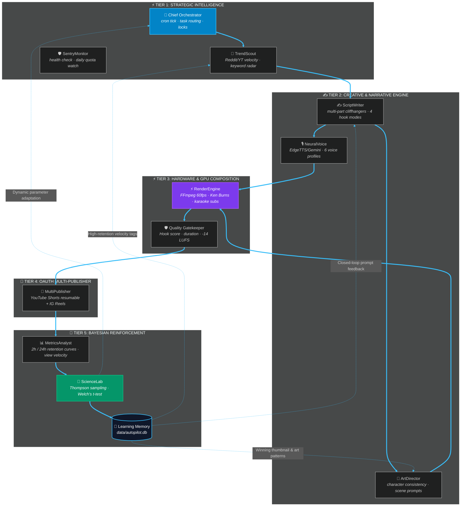

<div align="center">

# 🎬 AUTOPILOT
### *Autonomous 11-Agent Swarm for Viral YouTube Shorts & Instagram Reels*
**Closed-Loop Bayesian Feedback · 60fps GPU Compositing · Real-Time 3D Cyber Control Cockpit**

<br>

[](https://railway.app/template)


<br>

**[⚡ Quickstart](#-quickstart)** · **[🧠 11-Agent Swarm Architecture](#-11-agent-autonomous-swarm-flow)** · **[📊 3D Control Center & Analytics](#-3d-cyber-control-center--analytics)** · **[🚂 Railway & Cloud Deployment](#-railway-deployment-1-click--docker)** · **[🌐 100% Free Live Tunnel](#-100-free-live-tunnel-remote-access)** · **[🛡️ 4-Gate Quality System](#%EF%B8%8F-4-gate-quality--safety-system)**

</div>

---

## ⚡ Quickstart

### Local Setup (100% Free)
```bash
# 1. Clone repository
git clone https://github.com/Abhay73888/autopilot.git
cd autopilot

# 2. Install dependencies
pip install -r requirements.txt

# 3. Test generate your first video (Dry Run, zero API keys required)
python run.py --dry-run

# 4. Launch 3D Cyber Swarm Dashboard
python web/server.py
# Open: http://localhost:8765
```

---

## 🧠 11-Agent Autonomous Swarm Flow

Autopilot does not use monolithic scripts; it deploys an **11-agent decentralized swarm** connected by an asynchronous event bus and closed-loop feedback conduits.



### The 11 Autonomous Agents

| Agent | File | Responsibilities & Models |
| :--- | :--- | :--- |
| **🧠 Chief Orchestrator** | `agents/chief.py` | Swarm state machine, scheduling, process locking, and failure recovery. |
| **🎯 TrendScout** | `agents/trendscout.py` | Identifies breakout Hindi folklore/mystery topics without burning search quota. |
| **🛡️ SentryMonitor** | `agents/chief.py` | Tracks API quotas (Gemini, YouTube Data API), disk health, and memory spikes. |
| **✍️ ScriptWriter** | `agents/writer.py` | Hindi thriller scriptcrafting with viral 3s hooks and multi-part cliffhanger curiosity loops. |
| **🎙️ NeuralVoice** | `agents/voice.py` | Multi-profile Hindi neural audio with sub-80ms syllable timing and dramatic pauses. |
| **🎨 ArtDirector** | `agents/artdirector.py` | Generates cinematic 9:16 vertical character-consistent storyboard prompts. |
| **🖼️ ImageGen Engine** | `agents/imagegen.py` | Multi-tier generation (Pollinations, Gemini Image, with smart Pillow gradient fallback). |
| **⚡ RenderEngine** | `pipeline/render.py` | 60fps FFmpeg engine with Ken Burns motion, dynamic karaoke subtitles, and audio ducking. |
| **🛡️ Quality Gatekeeper** | `pipeline/validate.py` | Strict 4-gate verification: Hook power, video duration, audio LUFS, and quota check. |
| **🚀 MultiPublisher** | `agents/publisher.py` | Automated YouTube Shorts resumable uploader and Instagram Reels publisher. |
| **📊 MetricsAnalyst** | `agents/analyst.py` | 2h/24h retention extraction, drop-off second detection, and view velocity calculation. |
| **🧪 ScienceLab** | `agents/scientist.py` | Continuous A/B Bayesian Thompson Sampling and statistical validation (Welch's t-test). |

---

## 📊 3D Cyber Control Center & Analytics

Autopilot features a custom-engineered **Dark Cyber HUD Dashboard** running on native Python `ThreadingHTTPServer` with zero heavy frameworks:

### 1. Interactive Swarm Architecture Canvas
- **Real-Time Node Rendering**: All 11 agents visualized with glowing cyber borders, status rings, and particle conduits.
- **Sequential Swarm Pulse**: `⚡ Trigger Swarm Pulse` button shoots an interactive laser shockwave through the entire pipeline.
- **Cyber Inspector Modal**: Click any agent on the canvas to inspect its engine model, latency, error metrics, and trigger individual test runs.

### 2. Live Retention Curve & Scrubber
- **Triple-Curve Comparison**:
  - 🟢 **Top 5% Viral Shorts Benchmark** (featuring the 58s cliffhanger re-watch surge).
  - 🔵 **Current Video Retention Curve** (with neon cyan glow fill).
  - ⚪ **Channel Baseline Average**.
- **4 Critical Milestone Gates**:
  - `1s Hook Gate`: Prevents instant swipe-away.
  - `3s Algorithm Gate`: Registers the initial view.
  - `15s Story Valley`: Deep suspense narrative engagement.
  - `55s Cliffhanger Gate`: Drives curiosity loop for Part 3 and immediate replays.
- **High-DPI Mouse Scrubber**: Real-time laser guide calculating exact second, retention %, and baseline delta.

### 3. Projected View Velocity Graph
- **Algorithmic Pickup Projections**: Diagonal-hatched projected trajectory bars for newly minted videos.
- **Benchmark Trajectories**: 8K View Spike and 25K Viral Surge dotted indicator levels.
- **Triple Mode Toggles**: `📊 Video Velocity`, `📈 Growth Curves`, and `🏆 Benchmarks`.

---

## 🚂 Railway Deployment (1-Click & Docker)

Autopilot is built with a production-ready **Dockerfile** that bundles **FFmpeg**, **TrueType Fonts**, and **Python 3.11**.

### Option 1: Deploy with Railway CLI
```bash
# Install Railway CLI
npm i -g @railway/cli

# Login and initialize project
railway login
railway init

# Deploy Autopilot
railway up
```

### Option 2: Deploy via GitHub & Railway Dashboard
1. Push your code to a **Private GitHub Repository**.
2. Open [Railway.app](https://railway.app/) $\rightarrow$ **New Project** $\rightarrow$ **Deploy from GitHub repo**.
3. Select your `autopilot` repository.
4. Railway automatically detects `Dockerfile` and builds the environment.
5. In **Variables**, add your environment variables:
   - `GEMINI_API_KEY`: Your Google Gemini API Key.
   - `MAKE_WEBHOOK_SECRET`: Secure 32+ character secret for webhook triggers.
   - `PORT`: 8765 (Railway assigns this automatically).
   - `HOST`: `0.0.0.0`
6. (Optional) Add a **Persistent Volume** mounted at `/app/data` to persist your SQLite learning database across deploys!

---

## 🌐 100% Free Live Tunnel (Remote Access)

Access your dashboard and trigger video generation from your phone or any external device for **₹0**:

```bash
# Start Autopilot dashboard
python web/server.py &

# Start secure public HTTPS tunnel
python tunnel.py
```
Outputs a secure HTTPS link (e.g. `https://your-name.localhost.run`) that allows you to manage the entire swarm remotely.

---

## 🛡️ 4-Gate Quality & Safety System

Before any video touches YouTube or Instagram, it passes through 4 automated gates:

```
[RENDER COMPLETE]
       │
       ▼
┌─────────────────────────┐
│ Gate 1: Hook Power      │  --> Script must contain strong 3s cognitive disruption
├─────────────────────────┤
│ Gate 2: Duration & Sync │  --> Strict 20s-58s duration; subtitle syllable sync check
├─────────────────────────┤
│ Gate 3: Audio Standard  │  --> Loudness normalized to −14 LUFS (ITU-R BS.1770)
├─────────────────────────┤
│ Gate 4: Quota Safety    │  --> Verifies YouTube 10,000 unit daily limit before upload
└─────────────────────────┘
       │
       ▼
[APPROVED & PUBLISHED]
```

---

## 📁 Repository Structure

```
autopilot/
├── 🐳 Dockerfile               Production Railway/Docker container with FFmpeg
├── ⚙️ railway.json             Railway cloud build & deploy configuration
├── 📄 Procfile                 Web process declaration
├── 🌐 tunnel.py                Free secure public HTTPS tunneling
├── 🚀 run.py                   One-command video producer
├── 🔄 auto_produce_1h.py       Continuous 1-hour autonomous loop
├── 🧪 test_all.py              Complete unit & integration test suite
├── ⚙️ config.yaml              Global swarm configuration
│
├── 🧭 agents/                  Swarm Agent Implementations
│   ├── chief.py                Master orchestrator
│   ├── trendscout.py           Trend radar engine
│   ├── writer.py               Suspense scriptwriter
│   ├── voice.py                Neural voice synthesizer
│   ├── artdirector.py          Visual prompts & continuity
│   ├── imagegen.py             Image generation coordinator
│   ├── publisher.py            YouTube resumable uploader
│   ├── ig_publisher.py         Instagram Reels publisher
│   ├── analyst.py              Metrics & retention auditor
│   └── scientist.py            Bayesian A/B testing lab
│
├── 🎬 pipeline/                Video Engineering
│   ├── render.py               FFmpeg compositor (60fps, Ken Burns)
│   ├── subtitles.py            Karaoke ASS subtitle generator
│   └── validate.py             4-gate audio/video verifier
│
├── 🖥️ web/                     Dashboard Cockpit
│   └── server.py               3D Cyber Swarm Control Center (HTTP server)
│
└── 🧠 data/                    Learning Memory
    └── autopilot.db            SQLite database (ab_tests, videos, learnings)
```

---

## 📜 License

MIT License · Copyright © 2026 Abhay Kumar Maurya.
Built with ❤️ and native Python stdlib.
