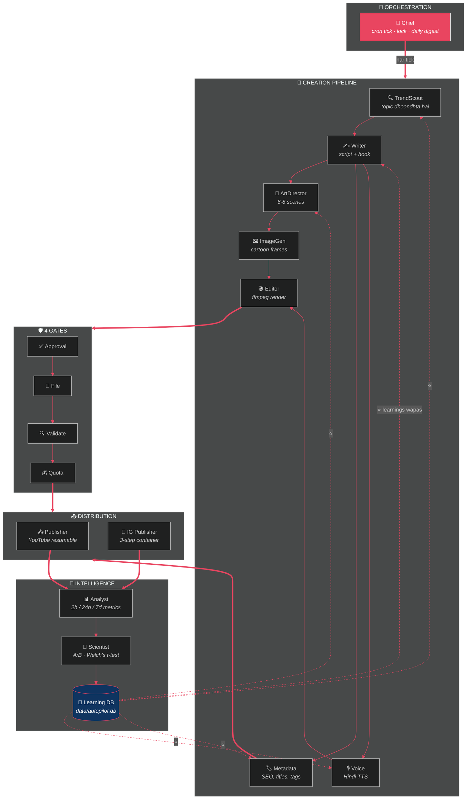
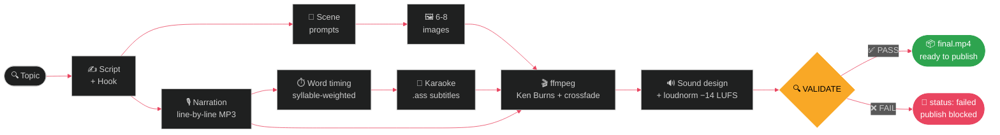
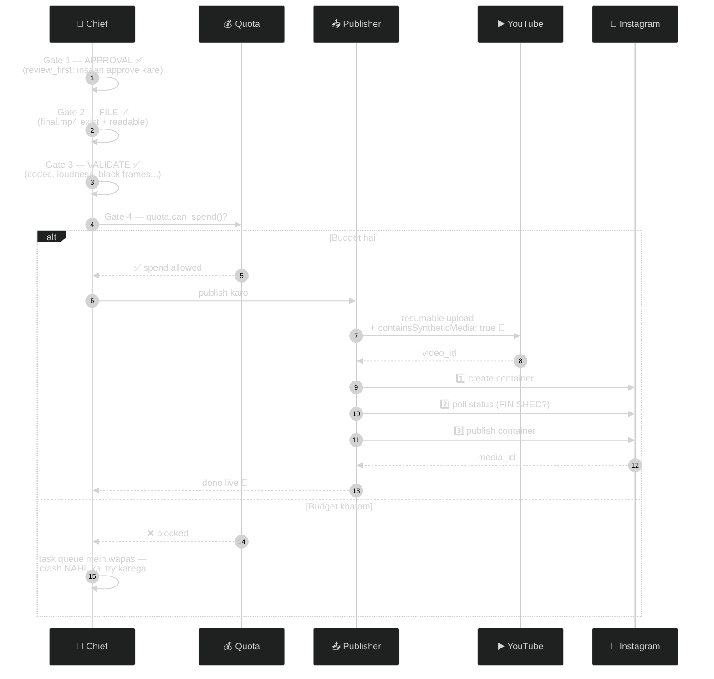

<div align="center">

# 🎬 AUTOPILOT

### *An autonomous agent swarm that generates, publishes, and self-optimizes Hindi cartoon suspense YouTube Shorts and Instagram Reels using closed-loop A/B testing.*
*Ek autonomous agent swarm — cartoon suspense shorts khud banata hai, khud publish karta hai, asli data se seekh kar khud ko behtar karta hai.*

<br>


<br>

**[⚡ Shuru karo](#-shuru-karo)** · **[🗺️ System Map](#%EF%B8%8F-system-map)** · **[🧠 Agents](#-10-agents--ek-swarm)** · **[🔁 Learning Loop](#-learning-loop--ye-band-ho-chuka-hai)** · **[🛡️ Safety](#%EF%B8%8F-safety--yahi-system-ko-zinda-rakhta-hai)** · **[⚠️ Imandari](#%EF%B8%8F-imandari-ki-baatein)**

</div>

> \* **Cost footnote**: Gemini free tier = 15 RPM / 1500 RPD (Flash), Pollinations best-effort. Rate limit aane pe pipeline queue karti hai, crash nahi.

---

## ⚡ Shuru karo

```bash
git clone https://github.com/Abhay73888/autopilot.git && cd autopilot
pip install -r requirements.txt
python run.py --dry-run        # 👈 bina kisi API key ke pehla test video
```

Ek command = **poora video, zero manual steps:**

```bash
python run.py
```

```
🎬 VIDEO READY — #4
   output/video_0004/final.mp4
   5.4 MB · 1080x1920 · 28.3s · h264+aac
   ✅ VALIDATE PASS   -14.5 LUFS · TP -1.5 dBTP
```

Aur ek command se **sab kuch apne aap** chalta hai:

```bash
python -m agents.chief --tick     # cron har ghante isse chalata hai
```

**Pehli baar?** → [`SETUP.md`](SETUP.md) padho — har step ki poori detail, har error ka Hinglish matlab.

---

## 🗺️ System Map

Poora system ek nazar mein — **Chief** orchestrate karta hai, 8 agents kaam karte hain, aur Learning DB sabka dimaag hai:



> ⭐ **Dotted lines hi asli jaadu hain** — data creation mein *wapas* jaata hai. Isi se system har hafte behtar hota hai.

---

## 🎯 Kya banta hai

<div align="center">

```
        ┌─────────────────────┐
        │   █ HOOK OVERLAY █  │  ← pehle 2 sec mein pakad
        │                     │
        │    🎨 CARTOON       │  ← same character, har frame
        │      SCENE          │  ← Ken Burns slow zoom/pan
        │                     │
        │   ♪ Hindi awaaz ♪   │  ← 6 voice profiles rotate
        │                     │
        │  ▶ करोके सबटाइटल ◀  │  ← har shabd highlight
        │                     │
        └─────────────────────┘
          1080 × 1920 · 30fps
          H.264+AAC · −14 LUFS
             22–45 seconds
```

</div>

| | Feature | Detail |
|---|---|---|
| 🎨 | **6-8 cartoon images** | Har image mein **wahi character** — same jacket, same chehra |
| 🎙️ | **Hindi narration** | 6 voice profiles rotate hote hain |
| 🎬 | **Ken Burns motion** | Slow zoom/pan, direction alternate — slideshow nahi lagta |
| 💬 | **Karaoke subtitles** | Har shabd bolte waqt highlight (60% log sound off pe dekhte hain) |
| 🔊 | **Sound design** | Drone ambience + whoosh transitions — **100% generated**, koi copyright nahi |
| 🔁 | **Loop-perfect ending** | Aakhri frame = pehla frame → re-watch spike |

---

## 🧠 10 Agents — Ek Swarm

| Agent | File | Superpower |
|---|---|---|
| 🧭 **Chief** | `agents/chief.py` | Orchestrator — cron tick, lock, daily digest. Sabka boss |
| 🔍 **TrendScout** | `agents/trendscout.py` | Topics — apne winners ke keywords + series + LLM. `search.list` **kabhi nahi** (100 units!) |
| ✍️ **Writer** | `agents/writer.py` | Script + hook. 4 hook types retention ke hisaab se weighted, rotation enforced |
| 🏷️ **Metadata** | `agents/metadata.py` | 547 lines — SEO titles, tags, description, category, thumbnail brief, 0-100 SEO score |
| 🎨 **ArtDirector** | `agents/artdirector.py` | 6-8 scenes. Character description **har prompt mein repeat** = consistency |
| 🖼️ **ImageGen** | `agents/imagegen.py` | Cartoon frames — free tier, Pillow fallback |
| 🎙️ **Voice** | `agents/voice.py` | 6 profiles rotate. Word-level timing, reveal se pehle 300ms dramatic pause |
| 🎬 **Editor** | `pipeline/render.py` | ffmpeg — Ken Burns, crossfade, karaoke subs, sound design, loudnorm |
| 📤 **Publisher** | `agents/publisher.py` + `agents/ig_publisher.py` | YouTube resumable upload + Instagram 3-step container flow |
| 📊 **Analyst** | `agents/analyst.py` | 2h/24h/7d metrics, retention thresholds, drop-off point |
| 🧪 **Scientist** | `agents/scientist.py` | A/B experiments — Welch's t-test, min 5/arm, learning DB |

### 🎬 Video banne ka poora safar



---

## 🔁 Learning Loop — ye band ho chuka hai

Zyada tar "AI content" systems ek hi direction mein chalte hain: *banao → post karo → bhool jao.*
AUTOPILOT ka loop **poora band** hai — data wapas creation mein jaata hai:

```mermaid
%%{init: {'theme':'dark', 'themeVariables': {'primaryColor':'#16213e','primaryTextColor':'#eee','lineColor':'#e94560'}}}%%
flowchart TB
    P["📤 PUBLISH"] --> M["⏱️ 2h metrics<br/><i>velocity window — yahi decisive hai</i>"]
    M --> AN["📊 ANALYST<br/><i>retention kya thi? drop-off kahan?<br/>kaunsa variable responsible?</i>"]
    AN --> SC["🧪 SCIENTIST<br/><i>A/B experiment<br/>auto-start → auto-conclude<br/>Welch's t-test, min 5/arm</i>"]
    SC --> DB[("🧠 LEARNING DB<br/><i>\"pov ne question se +61% better kiya,<br/>n=10, p=0.0004\"</i>")]
    DB ==>|"⭐ LOOP CLOSED"| W["✍️ Writer · 🎙️ Voice · 🎨 ArtDirector<br/><i>agli baar ye padhte hain</i>"]
    W --> P

    style DB fill:#0f3460,stroke:#f9a826,stroke-width:3px,color:#fff
    style P fill:#e94560,stroke:#fff,color:#fff
```

**Asli test output:**

```
'pov' ne 'specific_outcome' se +61% behtar kiya (1437 vs 894 views @2h).
p=0.00038 matlab 99.96% chance ye asli farq hai, luck nahi. Confidence: medium (n=5+5).
➜ 'pov' ko prefer karo, par 'specific_outcome' ko rotation mein rehne do.
```

Uske baad Writer khud `pov` ko **33-38% share** dene lagta hai — **100% nahi**,
kyunki same hook har video mein = duplicate-pattern clustering = throttle. 🧠

---

## 📤 Publish Flow — 4 gates, phir platform

Ek bhi API call se pehle **4 gates** paar karne padte hain:



---

## 🛡️ Safety — yahi system ko zinda rakhta hai

### Quota caps API limits se **kam** hain (jaan-boojh kar)

| Bucket | Hamara cap | Asli limit | Kyun kam |
|---|---|---|---|
| `youtube_uploads` | **5/day** | 6/day (API quota) | Default API quota 10,000 units/day, `videos.insert` = 1,600 units → max 6 uploads/day (documented). Hamara cap 5/day safe margin deta hai |
| `youtube_search` | **5/day** | 100 | Har call **100 units** — poora din barbaad ho sakta hai |
| `ig_publishes` | **20/24h** | 50-100 | Sources disagree — safe margin |
| `ig_calls_hour` | **150/h** | 200 | Container polling bhi isi mein ginti hai |

Har API call se **pehle** `quota.can_spend()`. Budget khatam = task queue mein, **crash nahi**.

### `validate.py` — publish se pehle aakhri gatekeeper

Wo sab pakadta hai jisse platform reject karega:

```
❌ H.264/AAC nahi          ❌ Audio missing            ❌ >90s (IG hard limit)
❌ Placeholder images      ❌ Beech mein kaale frames  ❌ Kaala pehla frame
❌ Loudness off-target     ❌ Resolution galat
```

### 🔐 AI disclosure — non-negotiable

Har YouTube upload mein `status.containsSyntheticMedia: true`. **Test isse enforce karta hai.**
Undisclosed AI content = reduced reach ya removal.

### 🔑 Password kabhi nahi

**Instagram ka password nahi. YouTube ka password nahi.** Sirf OAuth tokens —
limited-permission, jab chaaho cancel. Details: [`DEPLOY.md`](DEPLOY.md)

### 🖼️ Thumbnails (YouTube Shorts desktop feed)

Shorts mobile app player mein auto-frame use hota hai, lekin **desktop feed, search results aur channel page** par custom thumbnail (1280x720 16:9) dikhta hai jo CTR ke liye bohot zaroori hai. Autopilot Pillow + NotoSansDevanagari-Bold se automatic thumbnail generate karta hai aur Publisher `thumbnails.set` (50 units) se upload karta hai.

---

## 🖥️ Dashboard

```bash
python -m web.server        # http://localhost:8765
```

| Panel | Kya dikhta hai |
|---|---|
| ✅ **Approve queue** | Video player ke saath — Validate / Approve / Reject |
| 📊 **Quota bars** | Live — 80% pe 🟡, 90% pe 🔴 |
| 📈 **Analyst** | Baseline, har video ka verdict, variable leaderboard |
| 🧪 **Scientist** | Chal raha experiment + champions |
| ⚠️ **Warnings** | Aaj ke errors |

> 🔒 Server default mein sirf `127.0.0.1:8765` pe chalta hai. Path-traversal protected.
> External automation (Make.com, n8n, cron) ke liye `/api/webhook` endpoint available hai.
> ⚠️ **Nuance**: `/api/webhook` use karne ke liye `.env` mein `MAKE_WEBHOOK_SECRET` (min 32 chars) set hona **zaroori** hai. Jab tak `tunnel.py` na chale ye local hi rehta hai. `tunnel.py` public internet pe URL banata hai — isliye secret ke bina tunnel start hi nahi hoga.

---

## 📦 Sirf 3 dependencies

```
edge-tts        # free neural TTS (Hindi)
Pillow          # fallback placeholder images
imageio-ffmpeg  # sirf agar system pe ffmpeg install na kar sako
```

<details>
<summary><b>🚫 Jo jaan-boojh kar NAHI liye (click karo)</b></summary>
<br>

| Package | Size | Kya kiya iski jagah |
|---|---|---|
| `google-generativeai` | 20+ deps | `urllib` se ek HTTP POST |
| `google-auth-oauthlib` + `google-api-python-client` | 8+ deps | OAuth + resumable upload stdlib se, 400 line |
| `scipy` | 60 MB | t-distribution khud likha, numerically verified |
| `pandas` | 50 MB | `statistics` + SQL `GROUP BY` |
| `flask` / `fastapi` | — | `http.server` (Range requests ke saath) |
| `requests` | — | `urllib` (multipart bhi) |
| `mutagen` | — | 40-line MP3 frame parser |
| `pyyaml` | — | 30-line parser (optional use hota hai) |

</details>

---

## 🧪 Tests

```bash
python test_all.py       # 301 tests passing, ZERO API keys chahiye
```

<details>
<summary><b>⭐ Highlights (click karo)</b></summary>
<br>

- ⭐ Quota manager galat time pe call **block** karta hai
- ⭐ Dry-run mein quota kharch **nahi** hota (ye ek asli bug tha)
- ⭐ 5 consecutive videos mein 5 **alag voices** + ≥4 alag templates
- ⭐ Character description **har** image prompt mein repeat hoti hai
- ⭐ Beech mein **kaale frames nahi** (`fadeblack` bug regression)
- ⭐ t-test z-test se **conservative** hai (warna jhoothi learnings save hongi)
- ⭐ Koi significant farq na ho to **koi learning save nahi** hoti
- ⭐ Champion **100% share nahi** leta (clustering se bachav)
- ⭐ `search.list` **kahin use nahi** hota
- ⭐ Poora loop: publish → metrics → experiment → learning → next video

</details>

---

## 📁 Structure

```
autopilot/
├── 🚀 run.py               ek command = poora video
├── 🚀 run_phase2.py        script → images → narration
├── 🖥️ app.py               desktop launcher (web server + browser open)
├── ⚡ Autopilot.bat         Windows double-click launcher
├── 🌐 tunnel.py            Make.com public URL (⚠️ MAKE_WEBHOOK_SECRET zaroori)
├── 🔑 authorize_youtube.py  ek baar OAuth
├── 🧪 test_all.py          301 tests
├── ⚙️ config.yaml          poore system ka control panel
│
├── 🧭 agents/              chief · trendscout · writer · artdirector
│                           imagegen · voice · metadata · publisher
│                           ig_publisher · analyst · scientist
├── 🔧 core/                config · db · ffmpeg · hosting · llm
│                           logbook · mp3 · oauth · quota · stats
├── 🎬 pipeline/            render · subtitles · validate
├── 🖥️ web/                 server (dashboard + /api/webhook)
├── 🧠 data/                autopilot.db  ← system ka dimaag, DELETE MAT KARNA
└── 🔤 assets/fonts/        Noto Sans Devanagari
```

---

## 📚 Docs

| File | Kis liye |
|---|---|
| [**SETUP.md**](SETUP.md) | 👈 **pehle ye** — har step ki poori detail + har error ka Hinglish matlab |
| [DEPLOY.md](DEPLOY.md) | Security (password kyun nahi dena) + server pe daalna |
| [ACCEPTANCE.md](ACCEPTANCE.md) | Kya-kya bana, kya verify hua |

---

## ⚠️ Imandari ki baatein

> Ye cheezein main chhupaunga nahi:

<details>
<summary><b>1. Text-to-video free mein available nahi hai</b></summary>
<br>

Veo, Sora, Runway — sab paid. Isliye ye system **image + TTS + ffmpeg** wala
rasta leta hai. Cartoon suspense content ke liye ye actually **behtar** hai
(style consistent rehti hai), par ye "AI video generation" nahi hai.
</details>

<details>
<summary><b>2. edge-tts ke word timestamps dead hain</b></summary>
<br>

Maine test kiya — `WordBoundary` event ab khaali aata hai. Isliye har line ki
alag MP3 banti hai aur uski **exact duration measure** hoti hai; words ko
syllable-weight se distribute karte hain. Line boundaries **exact**, word
timing **±80ms**. Karaoke ke liye kaafi hai; frame-perfect chahiye to `pip install faster-whisper` (system auto-detect kar lega).
</details>

<details>
<summary><b>3. Hindi mein sirf 2 base voices hain</b></summary>
<br>

edge-tts pe `Swara` + `Madhur`, bas. 6 **profiles** banaye (rate/pitch se) —
sunne mein alag lagte hain, par 6 alag *voice actors* jitna alag nahi.
</details>

<details>
<summary><b>4. `zoompan` use nahi kiya</b></summary>
<br>

ffmpeg ka standard Ken Burns filter is machine pe **4 second ke clip pe 180+
second** le raha tha. `scale=eval=frame` + constant crop se **2.9 second** —
**60× tez**. Trade-off: zoom+pan simultaneously kam smooth, isliye alag motions.
</details>

<details>
<summary><b>5. Instagram per-second retention curve nahi deta</b></summary>
<br>

YouTube deta hai, Meta nahi. IG ka exact drop-off point pata nahi chalta.
</details>

<details>
<summary><b>6. Instagram scheduling "asli" nahi hai</b></summary>
<br>

Container 24h mein expire hota hai → pehle se schedule possible hi nahi.
Matlab **cron chalu rehna zaroori hai**, warna IG post nahi jayega.
</details>

<details>
<summary><b>7. A/B experiments dheere hain</b></summary>
<br>

10 videos per experiment ÷ 2/day = **5 din per experiment**. Koi shortcut nahi —
`videos_per_day` badhane se clustering risk badhta hai.
</details>

<details>
<summary><b>8. Predicted scores heuristics hain, ML nahi</b></summary>
<br>

Aur code ye chhupata nahi — data kam ho to score **0.5 (neutral) ki taraf
khisak jaata hai**, kyunki bina data ke confident hona jhooth hai.
</details>

<details>
<summary><b>9. Ye system abhi asli published data pe test nahi hua</b></summary>
<br>

Statistics numerically verified hai, pipeline end-to-end kaam karti hai, par
**asli YouTube data ka variance simulation se zyada hoga**. Isliye
`review_first` default hai — pehle 20 videos tum khud dekhoge.
</details>

<details>
<summary><b>10. Sandbox/office network pe edge-tts block ho sakta hai</b></summary>
<br>

`edge-tts` Microsoft ke WebSocket endpoint `speech.platform.bing.com:443` pe connect karta hai. Office ya firewall wale networks pe ye block ho sakta hai. Aise mein fallback ke liye `gTTS` (`pip install gTTS`) ya `espeak-ng` system package hona chahiye. Agar saare TTS fail hon to video mein silent audio clips banti hain aur validation us video ko **FATAL: silent_narration** se reject karke publish hone se rok deta hai.
</details>

---

## 🚫 Ye kabhi mat karna

| ❌ | Kyun |
|---|---|
| Engagement pods, view bots, fake comments | Detect hota hai → permanent ban |
| Multiple Cloud projects se quota multiply | YouTube ToS violation → saare projects ka access jaata hai |
| Undisclosed AI content | Reduced recommendations ya removal |
| Watermark wala same file dono platforms pe | Turant downrank |
| `.env` GitHub pe push | Bots 60 second mein tokens chura lete hain |
| `data/autopilot.db` delete | Isme saari learnings hain — system ka dimaag |

> ⚡ Ye guardrails moral lecture nahi hain — inhe todne se growth **rukti** hai.
> Ban hua account = zero growth.

---

<div align="center">

## 🚀 Abhi shuru karo

```bash
python run.py --dry-run
```

<br>

**Banaya gaya ❤️ aur `urllib` se — kyunki 3 dependencies kaafi hain.**

MIT License · Copyright © 2026 Abhay Kumar Maurya

⭐ *Star karo agar ye project pasand aaya!* ⭐

</div>

