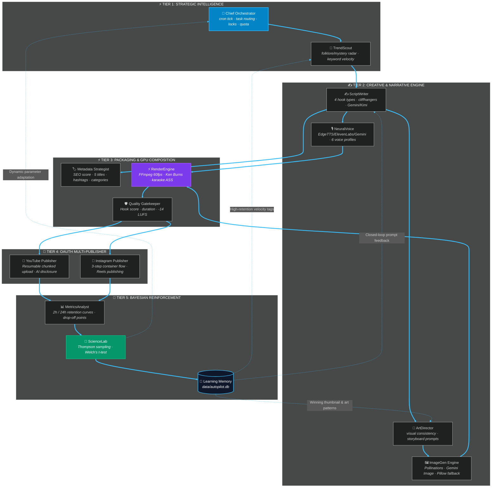

<div align="center">

# 🎬 AUTOPILOT
### *Autonomous 11-Agent Swarm for Viral YouTube Shorts & Instagram Reels*
**Closed-Loop Bayesian Feedback · 60fps GPU Compositing · Real-Time 3D Cyber Control Cockpit**

<br>

[](https://autopilot-t9ku.onrender.com)
[](https://render.com/deploy)


-10B981?style=for-the-badge&logo=pytest&logoColor=white)


<br>

**[⚡ Quickstart](#-quickstart)** · **[🌐 Live Deployed Site](#-live-deployed-site)** · **[🧠 11-Agent Swarm Architecture](#-11-agent-autonomous-swarm-flow)** · **[📊 3D Control Center](#-3d-cyber-control-center--analytics)** · **[🚀 Cloud Deployment (Render & Docker)](#-cloud-deployment-render--docker)** · **[🛡️ 4-Gate Quality System](#%EF%B8%8F-4-gate-quality--safety-system)** · **[📁 Repository Structure](#-repository-structure)**

</div>

---

## ⚡ Quickstart

### Local Setup (100% Free & Zero-API Safe)
```bash
# 1. Clone repository
git clone https://github.com/Abhay73888/autopilot.git
cd autopilot

# 2. Install dependencies (standard minimal: edge-tts, Pillow, imageio-ffmpeg)
pip install -r requirements.txt

# 3. Run complete test suite (260 passing tests in mock mode, zero API keys required)
python test_all.py

# 4. Generate your first video (Dry Run, offline test)
python run.py --dry-run

# 5. Launch 3D Cyber Swarm Dashboard
python web/server.py
# Open in browser: http://localhost:8765
```

---

## 🌐 Live Deployed Site

Autopilot is containerized with **Docker** and actively deployed on **Render**:

- **Live URL**: [https://autopilot-t9ku.onrender.com](https://autopilot-t9ku.onrender.com)
- **Infrastructure**: Docker Web Service running Python 3.11, pre-bundled with FFmpeg and DejaVu TTF fonts.
- **Automation Endpoint**: Includes a secure `/api/webhook` with HMAC SHA-256 signature verification and IP rate limiting for Make.com / n8n workflows.

---

## 🧠 11-Agent Autonomous Swarm Flow

Autopilot does not rely on monolithic scripts; it deploys an **11-agent decentralized swarm** coupled with an FFmpeg GPU pipeline, closed-loop Bayesian feedback, and learning memory.



### The 11 Autonomous Agents & Core Pipeline

| Agent / Engine | Source File | Responsibilities & Capabilities |
| :--- | :--- | :--- |
| **🧠 Chief Orchestrator** | [`agents/chief.py`](file:///agents/chief.py) | Master swarm coordinator, cron scheduling (`--tick`), daily digest, and process locking. |
| **🎯 TrendScout** | [`agents/trendscout.py`](file:///agents/trendscout.py) | Discovers viral mystery/folklore topics from historical patterns without burning search quota. |
| **✍️ ScriptWriter** | [`agents/writer.py`](file:///agents/writer.py) | Crafts high-retention Hindi suspense scripts with 4 hook rotations and cliffhanger loops. |
| **🎙️ NeuralVoice** | [`agents/voice.py`](file:///agents/voice.py) | Synthesizes neural Hindi speech across 6 voice profiles (EdgeTTS, ElevenLabs, Gemini TTS). |
| **🎨 ArtDirector** | [`agents/artdirector.py`](file:///agents/artdirector.py) | Generates storyboard prompts and maintains character/palette consistency across scenes. |
| **🖼️ ImageGen Engine** | [`agents/imagegen.py`](file:///agents/imagegen.py) | Multi-tier generation (Pollinations AI free, Gemini Image, with smart Pillow gradient fallback). |
| **🏷️ Metadata Strategist** | [`agents/metadata.py`](file:///agents/metadata.py) | Generates 5 title variations, SEO descriptions, ranked tags (<500 chars), category ID, and SEO score /100. |
| **🚀 YouTube Publisher** | [`agents/publisher.py`](file:///agents/publisher.py) | Resumable chunked video uploader with automated AI synthetic media disclosure. |
| **📸 Instagram Publisher** | [`agents/ig_publisher.py`](file:///agents/ig_publisher.py) | Handles Meta Graph API 3-step Reels container creation, status polling, and publishing. |
| **📊 MetricsAnalyst** | [`agents/analyst.py`](file:///agents/analyst.py) | Analyzes 2h/24h retention graphs, drop-off seconds, and view velocity curves. |
| **🧪 ScienceLab** | [`agents/scientist.py`](file:///agents/scientist.py) | Runs Bayesian A/B tests using Thompson Sampling and Welch's t-test to identify winning patterns. |
| **⚡ RenderEngine** | [`pipeline/render.py`](file:///pipeline/render.py) | GPU-composited 60fps FFmpeg rendering with Ken Burns animation and procedural audio design. |
| **📝 SubtitleEngine** | [`pipeline/subtitles.py`](file:///pipeline/subtitles.py) | High-precision syllable-synced karaoke subtitles using Advanced SubStation Alpha (`.ass`). |
| **🛡️ Quality Gatekeeper** | [`pipeline/validate.py`](file:///pipeline/validate.py) | Enforces 4 strict quality checks: Hook strength, 20-58s duration, -14 LUFS loudness, and quota verification. |

---

## 🤖 Multimodal AI & Provider Integrations

Autopilot is built on a resilient fallback-chain architecture. If any external API fails, the system automatically falls back to the next tier without crashing:

| Category | Primary Provider | Fallback 1 | Fallback 2 | Offline Mode |
| :--- | :--- | :--- | :--- | :--- |
| **LLM Reasoning** | Google Gemini (`gemini-2.0-flash`) | Moonshot AI / Kimi K3 | Deterministic Heuristics | `MockLLM` (Zero API Keys) |
| **Speech (TTS)** | ElevenLabs | Gemini TTS | Microsoft Edge-TTS (Free) | gTTS / eSpeak |
| **Image Generation** | Pollinations AI (Free, 0-Key) | Google Gemini Image | Smart Color Gradients (Pillow) | BMP/Color Card |
| **Public Hosting** | GitHub Releases (2GB/file CDN) | Cloudflare R2 | Catbox | Local FS |
| **Sound Design** | Procedural Synthesized Audio | Custom Tension FX | Master Limiter & Ducking | Clean Audio Mix |

---

## 📊 3D Cyber Control Center & Analytics

Autopilot features a custom-engineered **Dark Cyber HUD Dashboard** powered by Python's native `ThreadingHTTPServer` (zero bulky frameworks):

1. **Interactive Swarm Node Canvas**:
   - Real-time visualization of all 11 agents with pulsing status rings and active task conduits.
   - Laser swarm pulse trigger and interactive inspector modals for individual agent diagnostics.

2. **Video Approval Queue & Player**:
   - Built-in video player for rendered videos (`autonomy: review_first`).
   - One-click **Approve & Publish** or **Reject & Learn** actions.

3. **Live Retention Curve & 4-Gate Scrubber**:
   - Compares current video performance against top 5% viral shorts benchmarks.
   - Visualizes critical drop-off thresholds: 1s Hook, 3s Register, 15s Story Valley, and 55s Re-watch loop.

4. **Quota & API Health Monitor**:
   - Live quota tracking for Google Gemini, YouTube Data API v3 (10,000 units/day limit), and Meta Graph API.
   - Prevents accidental quota exhaustion and unexpected billing.

5. **External Automation Webhook (`/api/webhook`)**:
   - Trigger runs or retrieve system status remotely via Make.com, n8n, or Zapier.
   - Secured with constant-time HMAC SHA-256 secret verification and sliding-window rate limiting.

---

## 🚀 Cloud Deployment (Render & Docker)

Autopilot is production-ready and optimized for containerized deployment.

### 1. Render Deployment (Recommended)
This repository includes a native [`render.yaml`](file:///render.yaml) blueprint:

1. Fork or push this repository to GitHub.
2. Sign in to [Render.com](https://render.com) and click **New +** $\rightarrow$ **Blueprint**.
3. Connect your repository. Render will automatically read `render.yaml` and configure the Docker Web Service.
4. Set your environment variables in the Render Dashboard:
   - `GEMINI_API_KEY`: Your Google AI Studio API key (free).
   - `HOST`: `0.0.0.0`
   - `MAKE_WEBHOOK_SECRET`: Secure 32+ character random string.
5. Render builds the Docker container and launches your dashboard at `https://<your-app>.onrender.com`.

### 2. Docker Self-Hosted
```bash
# Build the Docker image
docker build -t autopilot .

# Run container
docker run -d \
  -p 8765:8765 \
  -e GEMINI_API_KEY="your_api_key_here" \
  -e MAKE_WEBHOOK_SECRET="your_32_char_secret" \
  -v $(pwd)/data:/app/data \
  --name autopilot-instance \
  autopilot
```

### 3. Railway / VPS Deployment
You can also deploy to Railway, Oracle Cloud Always Free VM, or a home Raspberry Pi:
```bash
# Test complete acceptance suite on server
python test_all.py

# Launch headless server with custom port
python web/server.py --host 0.0.0.0 --port 8765 --no-browser
```

---

## 🌐 100% Free Live Tunnel (Remote Access)

Access your local dashboard from your smartphone anywhere in the world for **₹0** without port-forwarding:

```bash
# 1. Start Autopilot dashboard
python web/server.py &

# 2. Start secure public HTTPS tunnel
python tunnel.py
```
Outputs a temporary secure HTTPS link (e.g. `https://your-name.localhost.run`) to monitor your swarm on the go.

---

## 🛡️ 4-Gate Quality & Safety System

Before any video touches YouTube Shorts or Instagram Reels, it must pass through 4 automated gates:

```
[RENDER COMPLETE]
       │
       ▼
┌─────────────────────────┐
│ Gate 1: Hook Power      │  --> Script must contain strong 3s cognitive disruption hook
├─────────────────────────┤
│ Gate 2: Duration & Sync │  --> Strict 20s-58s duration; subtitle syllable sync check
├─────────────────────────┤
│ Gate 3: Audio Standard  │  --> Loudness normalized to −14 LUFS (ITU-R BS.1770)
├─────────────────────────┤
│ Gate 4: Quota Safety    │  --> Verifies YouTube 10,000 unit daily limit before upload
└─────────────────────────┘
       │
       ▼
[APPROVED & PUBLISHED]
```

---

## 📁 Repository Structure

```
autopilot/
├── 🐳 Dockerfile               Production multi-stage Docker container with FFmpeg & fonts
├── ⚙️ render.yaml               Render Cloud Infrastructure-as-Code blueprint
├── ⚙️ railway.json             Railway cloud deploy configuration
├── 📄 Procfile                 Process declaration for cloud environments
├── 🌐 tunnel.py                Zero-setup HTTPS reverse tunneling
├── 🚀 run.py                   One-command end-to-end video producer CLI
├── 🔄 auto_produce_1h.py       Autonomous cron production loop
├── 🧪 test_all.py              Full test suite (260 passing unit & integration tests)
├── ⚙️ config.yaml              Global swarm parameters & channel configuration
├── 📋 requirements.txt         Python dependencies
│
├── 🧠 core/                    Foundational Framework (Zero External Heavy Frameworks)
│   ├── config.py               Hierarchical YAML & ENV config parser
│   ├── db.py                   SQLite state store & video lifecycle tracking
│   ├── ffmpeg.py               FFmpeg binary detection, capability & error parser
│   ├── hosting.py              Public video asset hosting (GitHub Releases / R2 / Catbox)
│   ├── llm.py                  Unified LLM client (Gemini, Moonshot/Kimi, MockLLM)
│   ├── logbook.py              Structured JSONL logging & retry with exponential backoff
│   ├── mp3.py                  MP3 duration & audio metadata inspector
│   ├── oauth.py                Google & YouTube OAuth 2.0 token manager
│   ├── quota.py                Daily API quota guardian & rate limiter
│   └── stats.py                Bayesian Thompson sampling & Welch's t-test math
│
├── 🧭 agents/                  Autonomous Swarm Agents
│   ├── chief.py                Master orchestrator & cron scheduler
│   ├── trendscout.py           Folklore & mystery trend discovery
│   ├── writer.py               Suspense scriptwriter with 4 hook rotations
│   ├── voice.py                Multi-profile neural voice synthesizer
│   ├── artdirector.py          Visual prompts & character continuity
│   ├── imagegen.py             Multi-tier image generator (Pollinations / Gemini)
│   ├── metadata.py             SEO titles, tags, descriptions & category strategist
│   ├── publisher.py            YouTube Shorts resumable uploader
│   ├── ig_publisher.py         Instagram Reels 3-step container publisher
│   ├── analyst.py              Metrics, retention curves & drop-off auditor
│   └── scientist.py            A/B experiment designer & Bayesian learning lab
│
├── 🎬 pipeline/                Hardware & Compositing Engines
│   ├── render.py               FFmpeg 60fps compositor (Ken Burns, color grade, audio ducking)
│   ├── subtitles.py            Karaoke ASS subtitle generator with Devanagari styling
│   └── validate.py             4-gate audio/video compliance verifier
│
├── 🖥️ web/                     Dashboard Cockpit
│   └── server.py               3D Cyber Control Center & Webhook server (ThreadingHTTPServer)
│
└── 🧠 data/                    Persistent Learning Memory
    └── autopilot.db            SQLite database (videos, ab_tests, learnings, jobs)
```

---

## 🧪 Testing

To run the complete test suite:
```bash
python test_all.py
```
> **260/260 tests pass** completely offline in mock mode without requiring live API keys or cloud credentials.

---

## 📜 License

MIT License · Copyright © 2026 Abhay Kumar Maurya.
Built with ❤️ and native Python stdlib.
