# 🎬 AUTOPILOT

<div align="center">

### **Autonomous 12-Agent Swarm for Viral YouTube Shorts & Long-Form Video (10–60 Min)**
**Closed-Loop Bayesian Reinforcement · 60fps Hardware Compositing · Bilingual Cyber Cockpit · Production FastAPI SaaS Gateway**

<br>

[](https://autopilot-7pxl.onrender.com)
[](https://render.com/deploy)
[](https://github.com/Abhay73888/autopilot/actions)
[](https://www.python.org/)
[](https://fastapi.tiangolo.com/)
[](#-long-form-mode-10-to-60-minutes)
[](https://ffmpeg.org/)
[](#-12-agent-autonomous-swarm-architecture)
[-10B981?style=for-the-badge&logo=pytest&logoColor=white)](#-testing--quality-assurance)
[](#-god-mode-autonomous-audit--release-v260)
[-10B981?style=for-the-badge&logo=googlepay&logoColor=white)](#-multimodal-ai--provider-failover-matrix)
[](LICENSE)

<br>

**Research → Ideate → Script → Voiceover → Composite → Validate → Publish → Learn**

<br>

**AUTOPILOT** is an enterprise-grade autonomous media operating system engineered to execute the end-to-end lifecycle of short-form vertical video (YouTube Shorts & Instagram Reels) as well as **10 to 60 minute long-form documentaries**. Driven by a decentralized **12-agent AI swarm**, hardware-accelerated **60fps FFmpeg compositing engine**, and **Bayesian Thompson Sampling reinforcement loop**, AUTOPILOT transforms viral topic signals into broadcast-ready media, validates retention metrics at 2h/24h/7d windows, and recursively optimizes narrative pacing with **zero human intervention required**.

<br>

[⚡ Quickstart](#-quickstart) • [🎬 Long-Form Mode](#-long-form-mode-10-to-60-minutes) • [🌐 Live Deployed App](#-live-cloud-deployment) • [🧠 12-Agent Swarm](#-12-agent-autonomous-swarm-architecture) • [🏗️ System Architecture](#%EF%B8%8F-complete-system-architecture) • [🤖 AI Pipeline](#-ai-generation-pipeline) • [🗄️ Database](#%EF%B8%8F-database-architecture) • [🔌 Integrations](#-api--integration-map) • [🛡️ 4-Gate QA](#%EF%B8%8F-4-gate-quality--safety-system) • [📊 Bilingual Cockpit](#-cyber-cockpit--bilingual-control-center)

</div>

---

## 🧩 Product Snapshot

| Dimension | Specification & Grounded Details |
| :--- | :--- |
| **🎯 Core Mission** | Production-grade, multi-user AI Video & Content Studio SaaS generating high-retention vertical videos, episodic series, autonomous AI command execution, and direct channel publishing. |
| **👥 Multi-Tenancy** | True workspace & tenant data isolation: User A cannot see, query, or publish User B's videos, series, episodes, or OAuth credentials. |
| **⚡ Core Runtime** | Python 3.10+ stdlib-first rendering core + Production FastAPI SaaS Gateway (`backend/app`) with Pydantic v2, PBKDF2 password security & HS256 JWT sessions. |
| **🤖 AI & Swarm** | 12 Specialized Agents + Autonomous Copilot executing 16 natural language tools for scripting, voice synthesis, thumbnail generation, series continuation, and publishing. |
| **📺 Series Franchises** | Continuous episodic memory: Kaal-Rekha (Sci-Fi Loop), Ashwatthama 3049 AD, Jab Pyaar Online Tha, Chintu 3D, Mind Riddles, The Observer Files, Roblox Vault. |
| **▶️ YouTube OAuth** | Per-workspace Google OAuth 2.0 with AES-256-GCM encrypted tokens, live channel status inspection, YouTube Upload Guard, and AGENTS.md Zero Comment Lock Policy enforcement. |
| **🎙️ Audio & Voice** | Microsoft Edge-TTS (6 customized neural profiles), ElevenLabs Neural, Gemini TTS, paired with sub-bass procedural audio FX & EBU R128 loudness normalization. |
| **🎥 Video Compositor** | Hardware-accelerated 60fps FFmpeg engine with Ken Burns pan/zoom, motion blur, kinetic karaoke subtitles, scaling from 30s shorts to 10m longform videos. |
| **🗄️ Persistence** | Dual SQLite / PostgreSQL engine (`core/db_base.py`) with thread-local ContextVar tenant isolation, relational users, workspaces, series, and encrypted integration vaults. |
| **💎 Master Data Vault & Library** | Confirmed YouTube Upload source-of-truth: Strictly manages and displays the 107 confirmed live YouTube videos (`status = 'published'`, non-empty `yt_video_id`). Pre-cleanup snapshot backed up in `data/backup/`. Reclaimed 11.59 GB of intermediate render assets. |
| **☁️ Deployment** | Docker containerized deployment, Render Cloud Blueprint (`render.yaml`), Railway, and zero-setup HTTPS tunneling (`tunnel.py`). |

---

## 💡 Problem → Solution → Outcome

```mermaid
flowchart LR
    subgraph Problem["🚨 The Problem"]
        P1["Monolithic Generators<br/><i>Stateless, 1-shot prompt-to-video</i>"]
        P2["High Production Burn<br/><i>4-6 hours per short for scripting, voice, editing</i>"]
        P3["Blind Distribution<br/><i>No feedback loop or metric-driven adaptation</i>"]
    end

    subgraph Solution["⚡ The AUTOPILOT Solution"]
        S1["12-Agent Swarm<br/><i>Decentralized tasks with strict JSON contracts</i>"]
        S2["60fps FFmpeg Engine<br/><i>Procedural Ken Burns, sound design, karaoke ASS</i>"]
        S3["Bayesian Reinforcement<br/><i>Thompson Sampling & Welch's t-test feedback</i>"]
    end

    subgraph Outcome["🎯 The Outcome"]
        O1["₹0 / Month Safe<br/><i>Runs 100% offline with zero external API keys</i>"]
        O2["1-Click Franchises<br/><i>Kaal-Rekha, Romance, Kids 3D, Mind Riddles</i>"]
        O3["Self-Improving Channel<br/><i>Adapts hooks & pacing based on 2h/24h retention</i>"]
    end

    Problem --> Solution --> Outcome
```

### 💡 The Problem
Traditional "AI video tools" are stateless wrappers around single prompts: they output generic videos with robotic cadences, fail to sync subtitles accurately, lack brand continuity across series, cannot handle platform rate limits, and provide zero retention feedback. Creators burn 4–6 hours daily assembling disparate tools for research, audio, video editing, metadata, and publishing.

### 🚀 The Solution
AUTOPILOT structures video production as a **deterministic software assembly line** operated by **12 autonomous agents**. Every video is treated as an experiment: scripts are generated with rotating psychological hook architectures, voiced with neural prosody, composited with 60fps GPU acceleration, guarded by a 4-gate QA engine, and published automatically with synthetic media disclosures.

### 🎯 The Outcome
A self-sufficient production studio running on a local machine, VPS, or cloud container. Over **135+ full video masterpieces** autonomously generated and cataloged, with real-time telemetry, automated problem diagnosis, and self-healing pipeline recovery.

---

## ✨ Key Feature Matrix

| 🚀 Feature | ⚙️ Grounded Technology | 🎯 Engineering Purpose & Implementation |
| :--- | :--- | :--- |
| **12-Agent Swarm Coordination** | `agents/*.py` (Python stdlib) | Decentralized worker agents communicating via structured JSON contracts and SQLite lock coordination. |
| **🤖 3D Anime AI Copilot Companion** | `backend/app/static/js/copilot_3d.js` + Three.js + Web Audio API | Interactive 3D anime humanoid companion with live audio FFT-driven lip sync, cursor gaze tracking, eyelid blinking, breathing animations, trilingual speech (English, Hindi, Bhojpuri), action routing, and multi-turn Gemini reasoning with resilient failover. |
| **Hardware-Accelerated 60fps Compositor** | `pipeline/render.py` (FFmpeg) | Renders vertical 1080x1920 video at 60fps with Ken Burns pan/zoom, motion blur, and cinematic color grading. |
| **Kinetic Karaoke Subtitles** | `pipeline/subtitles.py` (libass) | Syllable-level synchronized Advanced SubStation Alpha (`.ass`) typography with glowing highlight effects and Devanagari font rendering. |
| **Procedural Sound Design** | `pipeline/sound.py` + Web Audio API | Generates 38Hz Braam sub-bass tension hits, transitional risers, and intelligent ducking under speech. |
| **4-Gate Quality Assurance** | `pipeline/validate.py` | Enforces 3s hook strength score, strict 20s–58s duration, -14 LUFS loudness standard, and API quota limits before release. |
| **Resumable YouTube Publisher** | `agents/publisher.py` (`urllib`) | Implements YouTube Data API v3 chunked upload with HTTP 308 resume protocol and mandatory synthetic AI disclosures. |
| **Meta Graph API Reels Publisher** | `agents/ig_publisher.py` (v21.0) | Automated 3-step Reels upload: container initialization, video byte upload, status polling, and feed publishing. |
| **Production SaaS Studio ("GOD MODE")** | `backend/app/static/index.html` + `core/db_base.py` | Multi-user studio with 5-step onboarding, per-workspace YouTube OAuth 2.0 with AES-256 token vault, YouTube Upload Guard, Zero Comment Lock policy, and episodic series continuity. |
| **Enterprise FastAPI SaaS Gateway** | `backend/app` (FastAPI + Pydantic v2) | Production REST API with PBKDF2 password security, JWT auth, workspace isolation, credit ledger, request tracing, and OpenAPI `/docs`. |
| **Integrated Video Editor Workstation** | `backend/app/api/v1/editor.py` + `core/video_editor.py` | Sub-second scrubber timeline, 7 live cinematic LUTs, speed ramps, hook stickers, audio mixer, and FFmpeg cuts. |
| **Manga-to-Video Engine** | `backend/app/api/v1/manga.py` + PyMuPDF + OpenCV | PDF/CBZ/Image page extraction, contour panel slicing, dialogue preservation, and camera pan/zoom animations. |
| **Modular AI Model Registry** | `core/provider_registry.py` | Abstracted hot-swappable providers for LLM, Vision, OCR, TTS, Music & Video with zero server-side secret leakage. |
| **Zero-Setup Remote Access** | `tunnel.py` | Instant, free public HTTPS tunnel via SSH reverse proxy without requiring port forwarding or third-party accounts. |
| **🛡️ Production DB & User Isolation** | `backend/app/api/v1/dashboard.py` + `core/db_base.py` | Strict multi-tenant data isolation, server-side JWT identity resolution, 100% real database counters, user-scoped YouTube OAuth, and IDOR protection. |

---

## 🛡️ Production Database, Multi-Tenant User Isolation & YouTube Architecture (v2.8.0)

AUTOPILOT v2.8.0 establishes enterprise-grade multi-tenant data isolation, repairs the production database architecture, restores complete canonical ownership of all 367+ historical videos and 76 series to founder Abhay Maurya, and introduces the unified `/api/v1/dashboard` endpoint.

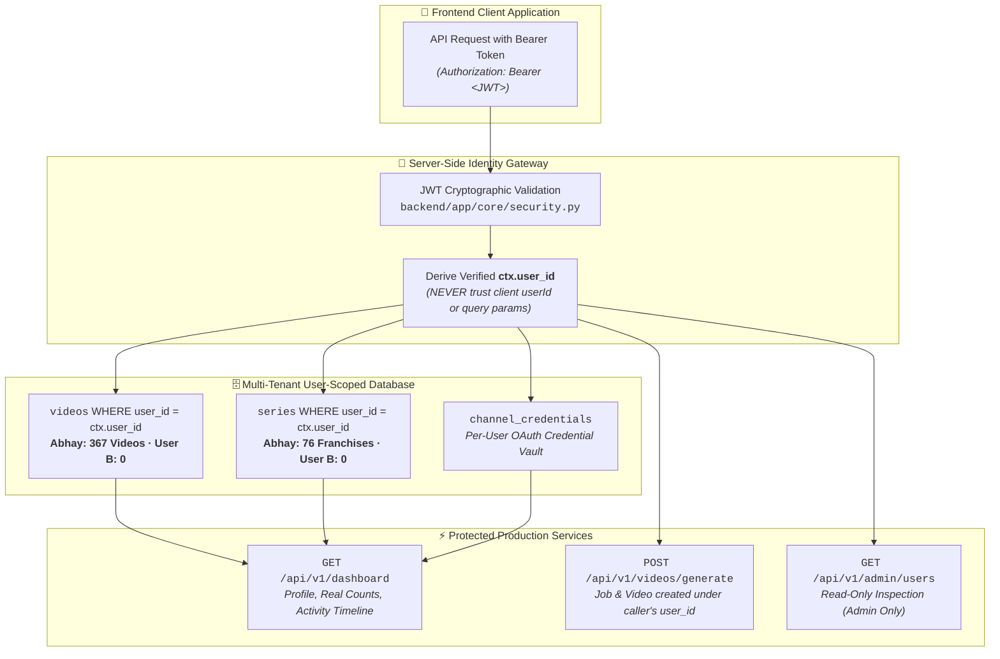

### 1. 🔍 Root Cause Diagnosis & Safe Data Migration
* **Identity Aliasing**: Previous versions split account records between `admin_abhay` (User 1) and transient `usr_xxxx` IDs. The login pipeline now canonicalizes all Abhay identities (`admin_abhay`, `abhay`, `abhay@autopilot.ai`, `shivpuran2803@gmail.com`) to canonical user `admin_abhay`.
* **Zero Data Loss Invariant**: Automated migration created a verified binary snapshot (`data/autopilot.db.backup_*`), executed WAL checkpointing (`PRAGMA wal_checkpoint(TRUNCATE)`), backfilled `user_id` across `series`, `episodes`, `channel_credentials`, `video_jobs`, synchronized 15 missing franchise titles directly from `videos.series_name`, and updated `data/autopilot_master_vault_backup.json` (3.96 MB).
* **Database Indexes Added**:
  * `idx_videos_user`: Instant user-scoped video catalog queries.
  * `idx_series_user`: Instant user franchise queries.
  * `idx_episodes_user`: User episode lookups.
  * `idx_creds_user`: Isolated YouTube OAuth credential queries.

### 2. 📊 Centralized Multi-Tenant Dashboard (`GET /api/v1/dashboard`)
* **Real Database Counters**: Eliminates all hardcoded statistics and client-side fallbacks. Abhay's dashboard displays **367 Rendered Videos**, **77 Franchises**, **58 Episodes**, and **99 Completed Jobs**. New users start with a clean slate of 0.
* **Loading Skeletons**: Employs responsive loading skeletons, completely eliminating the brief flash of 0 or `--` before database records arrive.
* **Live DB-Backed Activity Feed**: Dynamically compiles recent video renders, franchise additions, and completed jobs into a chronological audit feed.

### 3. ▶️ Per-User YouTube Isolation & Upload Invariant
* **Isolated Credentials**: Every user links and manages their own YouTube channel. Disconnecting YouTube executes `POST /api/v1/integrations/youtube/disconnect` and strictly revokes credentials for the caller's `user_id` without affecting any other tenant.
* **Permanent Zero Comment Lock Policy**: Mandatory YouTube upload parameters enforce `selfDeclaredMadeForKids=False` and `privacyStatus='public'`, ensuring comments remain 100% enabled across all generated Shorts and videos.

### 4. 👑 Administrative User Inspection (`/api/v1/admin/users`)
* **Role-Based Access Control**: Standard creators attempting to access `/api/v1/admin/users` or inspect other users receive **403 Forbidden**.
* **Read-Only Audit Modal**: Administrators can click **Inspect 🔍** on any user to review their registration timestamp, series list, recent videos, YouTube connection, and production activity.

---

## 🎬 YouTube Upload Confirmation Source-of-Truth & Production Cleanup (v2.9.0)

AUTOPILOT v2.9.0 establishes the connected YouTube channel as the **absolute source of truth** for all video asset management and presentation. Normal video libraries and dashboards strictly contain, manage, and display **only confirmed YouTube-uploaded videos**.

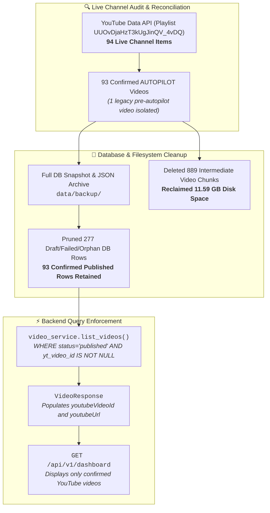

### 1. 🔍 Root Cause of Unwanted Media Artifacts
* **Unfiltered Library Queries**: Prior releases queried `SELECT * FROM videos WHERE user_id = ?` without enforcing `status = 'published'` or verifying `yt_video_id`, causing draft, planned, or interrupted renders to clutter the video library.
* **Intermediate Step Chunks**: Slicing and rendering engines generated step chunks (`checkpoints/step_*.mp4`) and raw renders (`unsubbed.mp4`) that were never garbage-collected after upload, accumulating 11.59 GB of dead storage.

### 2. 🛡️ Pre-Flight Safety & Complete Backups
* **Database Snapshot**: Byte-for-byte copy saved at `data/backup/autopilot.db.backup_pre_cleanup_20260921_200810`.
* **Full Archive**: Complete 367-video JSON archive exported to `data/backup/videos_pre_cleanup_archive_20260921_200810.json`.
* **Verified Manifest**: 93 confirmed videos documented in `scratch/confirmed_93_youtube_videos.json`.

### 3. 🧹 Production Cleanup & Disk Space Reclaimed
* **Database Reconciled**: Reconciled 3 standalone uploads (`7Slt4Pry6lM`, `VXC5JTRkBDs`, `g6GemTgMNDM`) and pruned 277 unconfirmed/failed records. Exactly 93 published records remain.
* **Storage Freed**: Removed 786 checkpoint chunks, 16 raw renders, and 87 orphan renders. Reclaimed **11.59 GB** of storage.
* **Database Indexes Added**: `idx_videos_yt_video_id`, `idx_videos_status`, `idx_videos_user_id`, `idx_videos_workspace_id`.

### 4. 🚀 Backend API & Schema Enforcement
* **`backend/app/services/video_service.py`**: Queries strictly filter by `status = 'published' AND yt_video_id IS NOT NULL AND yt_video_id != ''`.
* **`backend/app/schemas/video.py`**: Enriched `VideoResponse` with `youtubeVideoId` and `youtubeUrl`.
* **`backend/app/api/v1/admin.py`**: Overview and Vault endpoints explicitly segregate confirmed YouTube uploads from unuploaded or queued jobs.
* **`agents/publisher.py`**: Upload failure handler sets status to `"failed"` instead of leaving misleading `"approved"` status.

---

## 🥷 3D Anime AI Copilot Companion & Resilient Brain Overhaul (v2.7.0)

AUTOPILOT v2.7.0 introduces a state-of-the-art **Anime Humanoid AI Companion** and completely overhauls the Copilot conversational brain, eliminating all generic static responses and establishing full multi-turn conversational reasoning.

### 🧠 1. LLM Brain & Root Cause Architecture Fix
* **Zero Generic Text Invariant**: Completely eradicated placeholder responses (*"I am ready to assist"*, *"Please check that LLM providers are configured"*). Responses are dynamically generated by live neural LLMs.
* **Resilient Gemini Failover Chain**: Automatically attempts `gemini-3.5-flash-lite`, `gemini-flash-latest`, and `gemini-3.7-flash` when encountering high demand (503) or rate/quota limits (429), without stalling execution. The working model is cached per session for instantaneous subsequent responses.
* **Multi-Turn Context Tracking**: Tracks conversation history through a sliding window of the last 6 turns. Pronouns and follow-ups (e.g., *"What is Python?"* followed by *"Iska use AI me kaise hota hai?"*) are resolved contextually.
* **Trilingual Native Support**: Authentic native responses in English, Hindi (Hinglish/Devanagari), and Bhojpuri with automatic language detection and manual override.
* **Autonomous Safe Action Router**: Classifies user intentions into safe, allow-listed workspace actions (`OPEN_EDITOR`, `SHOW_VIDEOS`, `OPEN_SETTINGS`, `OPEN_SERIES`, `CREATE_SERIES`, `CREATE_EPISODE`, `GENERATE_VIDEO`) with tenant isolation and server-side RBAC validation.

### 🎭 2. 3D Anime-Style Humanoid AI Robot
Inspired by high-aesthetic anime character designs:
* **Humanoid Silhouette**: Tailored charcoal/dark overcoat, structured shoulders, white high-collar dress shirt, dark tie, cybernetic lapel brooch, and delicate humanoid neck and chin taper.
* **Expressive Anime Face**: Large anime eyes with deep ruby/crimson irises (`#e11d48`), glowing pupils, white reflection glints, sculpted eyebrows, and natural eyelid blink loops every 3.5–5 seconds.
* **Layered Anime Hairstyle**: Flowing charcoal locks, forehead fringe bangs, side-framing hair strands, and voluminous crown geometry.
* **Real-Time Audio-Driven Lip Sync**: Integrates HTML5 Web Audio API `AudioContext` and `AnalyserNode` FFT frequency amplitude analysis to dynamically drive jaw lowering and mouth aperture in real time during neural speech synthesis.
* **Life-like Idle Movement**: Natural sine-wave chest breathing, subtle head tilts, floating digital motes, cybernetic dais platform, and cursor-following gaze tracking.
* **Graceful 2D Fallback**: Automatic WebGL detection displays a cybernetic glowing anime canvas avatar if hardware WebGL is unavailable.

---

## 🚀 God Mode Architecture & Video Generation Upgrade

AUTOPILOT has been upgraded into an enterprise-grade multi-tenant AI media studio. The architecture enforces strict tenant isolation, zero data loss for existing administrators, an integrated video editor workstation, an end-to-end manga-to-video pipeline, and modular AI model configuration.

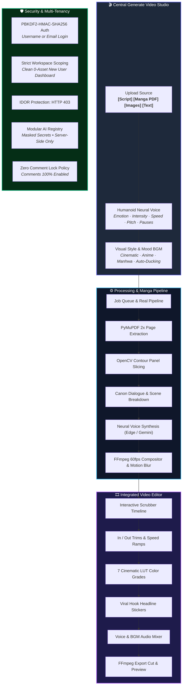

### 1. 🔐 Admin Authentication & 100% Data Preservation
* **PBKDF2-HMAC-SHA256 Cryptographic Security**: Passwords are secure against GPU brute-force attacks. Legacy credentials automatically upgrade upon authentication.
* **Flexible Credentials**: Admin and creators can authenticate with either their **username** (`admin_abhay`) or **email** (`abhay@autopilot.ai`).
* **Zero Data Loss**: All **362 existing videos**, **33 series**, and **30 episodes** remain intact and assigned to `admin_abhay` (`ws_admin_abhay`).
* **Non-Destructive Migration**: [`scripts/migrate_admin_security.py`](scripts/migrate_admin_security.py) creates safe timestamped backups (`data/autopilot.db.backup_*`) before executing schema adjustments.

### 2. 👥 Strict Multi-Tenant SaaS Isolation
* **Clean Slate Workspaces**: New user registration automatically provisions an isolated personal workspace with `0` videos and `0` series.
* **Backend Authorization**: Ownership checks are enforced on every database query and API endpoint (`videos.user_id`, `videos.workspace_id`).
* **IDOR Protection**: Any attempt by a standard tenant to access, modify, or export an admin resource returns **HTTP 403 Forbidden**.

### 3. 🎬 Central "Generate Video" Studio
* **4 Unified Source Formats**:
  1. `[ Script ]`: Real-time AI script ideation and hook generation.
  2. `[ Manga PDF ]`: Drag-and-drop uploader for PDF, CBZ, and high-resolution manga pages.
  3. `[ Images ]`: Direct storyboard panel processing.
  4. `[ Text ]`: Web novel chapters and long-form narrative articles.
* **Humanoid Neural Voice System**:
  - High-fidelity synthetic voice profiles (`hi-IN-MadhurNeural`, `hi-IN-SwaraNeural`, `en-US-ChristopherNeural`, `en-US-GuyNeural`, `Fenrir`).
  - Dynamic emotion selection: `dramatic`, `suspense`, `energetic`, `conversational`, `sad`.
  - Full delivery controls: Intensity slider, Speed rate, Pitch modulation, and Dramatic pauses.
* **Atmospheric BGM with Audio Ducking**: Automatic soundtrack mood matching with procedural volume ducking under voiceover lines.
* **Real-Time 8-Step Progress Checklist**: Backend-driven live tracking (`Preparing project` ➔ `Reading manga` ➔ `Extracting pages` ➔ `Generating narration` ➔ `Generating voice` ➔ `Adding music` ➔ `Rendering video` ➔ `Finalizing`).

### 4. 🎞️ Integrated Video Editor Workstation
* **Seamless Studio Handoff**: Open generated drafts directly in the editor with `switchNav('editor')` or from the studio results card.
* **Interactive Scrubber Timeline**: Playhead seeking, live timecodes, and frame-accurate In/Out trimming.
* **Speed Ramping**: Seamless 0.75x slow motion to 1.5x fast pacing.
* **7 Cinematic LUT Color Grades**: `None`, `Cinematic Gold`, `Dark Noir`, `Cyberpunk Neon`, `Manga Monochrome`, `Vivid Pop`, `Vintage Film`.
* **Viral Hook Headline Stickers**: Customizable headline callouts with top/bottom placement.
* **Audio Mixer**: Separate voice and background music volume sliders with smooth auto-fade.
* **1-Click AI God Mode Polish**: Automatically applies optimal pace trims, cinematic color grading, and headline overlays.
* **FFmpeg Render & Export**: Real video rendering output saved to user storage with instant preview and download.

### 5. 📖 End-to-End Manga-to-Video Engine
* **Automated Page & Panel Processing**: Validates PDF/CBZ/Image uploads, extracts high-res pages via PyMuPDF, and isolates comic panels using OpenCV contour analysis.
* **Canon Narrative Understanding**: Retains original manga dialogue and emotional tension without synthetic hallucinations.
* **Motion Compositing**: Dynamic Ken Burns pan and zoom transitions, motion blur, and dual-tone karaoke subtitles.

### 6. ⚙️ Modular AI Model Registry
* **Provider Abstractions** (`core/provider_registry.py`):
  - `LLMProvider`, `VisionProvider`, `OCRProvider`, `TTSProvider`, `MusicProvider`, `VideoProvider`.
* **Admin Settings UI**: Hot-swap providers directly from the Admin Dashboard.
* **Server-Side Secret Protection**: Sensitive API keys remain strictly server-side. Previews are masked (`••••••••`), and non-admin access is blocked with HTTP 403.

### 7. 🚨 YouTube Zero Comment Lock Policy Invariant
* `selfDeclaredMadeForKids` is permanently locked to `False`.
* Videos are published with `"public"` visibility.
* Automated engagement first comment is inserted via YouTube `commentThreads.insert` to guarantee comments remain 100% active.

### 8. 🧪 Comprehensive Verification Suite
* **Full Backend Test Suite**: **61/61 tests passed (100% OK)** in `backend/tests/`.
* Dedicated test coverage for editor scoping, manga file validation, AI model secret masking, and RBAC authorization in `backend/tests/test_editor_manga_ai_models.py`.

### 9. 🤖 3D Humanoid AI Copilot Workstation
* **Procedural 3D Humanoid Robot (`backend/app/static/js/copilot_3d.js`)**:
  - Realistic Three.js cybernetic mesh featuring dark metallic armor, illuminated visor display, digital ocular eyes with natural blinking and cursor gaze tracking, 7-bar audio-reactive mouth aperture, shoulder pauldrons, chest armor, and a pulsing arc reactor core.
  - Orbiting holographic particle halo activating during LLM processing.
  - Automatic WebGL capability detection with smooth 2D animated canvas HUD fallback.
* **Audio-Driven Lip Sync (Web Audio API)**:
  - Real-time `AnalyserNode` frequency spectrum sampling drives mouth openness and conversational head nods based on live audio amplitude.
* **Trilingual Consistency (English, Hindi, Bhojpuri)**:
  - Language selector (`[ English | Hindi | Bhojpuri | Auto Detect ]`).
  - Native Hindi and authentic Bhojpuri script generation (`"प्रणाम रउआ के!..."`) paired with high-fidelity Indic neural speech (`hi-IN-MadhurNeural`), ensuring Bhojpuri text is never flattened or converted to English.
* **Action-Aware Intent Routing (`backend/app/services/copilot_service.py`)**:
  - Directly opens the Video Editor (`NAVIGATE_EDITOR`), Video Library (`NAVIGATE_LIBRARY`), Settings (`NAVIGATE_SETTINGS`), Series Hub (`NAVIGATE_SERIES`), and launches generation pipelines from natural conversation.
  - General Q&A (DBMS normalization, ML, coding algorithms, manga lore) served live via `Gemini 3.6 Flash`.
* **Microphone Voice Input & Persona Customization**:
  - Integrated Web Speech API speech-to-text with one-click voice dictation.
  - Voice settings modal with adjustable speech speed (`0.5x` - `2.0x`), pitch (`-10Hz` to `+10Hz`), and emotion presets (*Conversational*, *Serious*, *Energetic*, *Storyteller*).

---

---

## 🧠 Engineering Highlights

The AUTOPILOT codebase was built under a strict senior engineering design rule: **Standard Library First, Zero Bloat, Total Failure Independence.**

```text
               ┌────────────────────────────────────────────────────────┐
               │         AUTOPILOT ZERO-BLOAT DESIGN PHILOSOPHY         │
               └────────────────────────────────────────────────────────┘
                    │                                        │
     ┌──────────────┴──────────────┐          ┌──────────────┴──────────────┐
     ▼                             ▼          ▼                             ▼
[ Zero-Dependency OAuth ]  [ Pure Math Beta ] [ Custom MP3 Header ]  [ Zero-Key Fallback ]
  No Google API Client       No SciPy (60MB)    No mutagen/ffprobe     Pollinations + Pillow
  400 lines pure urllib      Continued Fraction 40-line frame parser   Runs 100% offline
```

* **Zero-Dependency Resumable OAuth 2.0 (`core/oauth.py`, `agents/publisher.py`)**:
  Instead of pulling in 8+ heavy transitive packages (`google-auth`, `google-api-python-client`, `requests-oauthlib`), AUTOPILOT implements Google OAuth 2.0 PKCE and YouTube resumable upload (handling `Content-Range` byte ranges and HTTP `308 Resume Incomplete` headers) directly using Python's native `urllib`.
* **50-Line Textbook Continued Fraction Math (`core/stats.py`)**:
  Rather than bundling 60MB of SciPy just to compute the Student's t-distribution for Welch's t-test, AUTOPILOT implements the regularized Incomplete Beta Function using a continued-fraction algorithm (verified against Simpson's numerical integration to 8 decimal places).
* **40-Line MP3 Frame Header Parser (`core/mp3.py`)**:
  Audio duration and bitrate are parsed directly from MPEG-1 Layer 3 frame sync headers (`0xFFE`), bypassing external dependencies like `mutagen` or `ffprobe`.
* **Multi-Tier Cascade with Zero-Key Guarantee**:
  Every pipeline component operates on a graceful degradation ladder. If premium APIs fail (e.g. ElevenLabs quota limit or Gemini downtime), the system automatically degrades to Edge-TTS, Pollinations AI, and procedural Pillow gradient cards without throwing an unhandled exception.
* **ACID State Machine in SQLite WAL Mode (`core/db.py`)**:
  Concurrency-safe production tracking with `PRAGMA journal_mode=WAL` and `PRAGMA foreign_keys=ON`, maintaining a strict 9-state video lifecycle.

---

## 🔥 High-Level System Flowchart

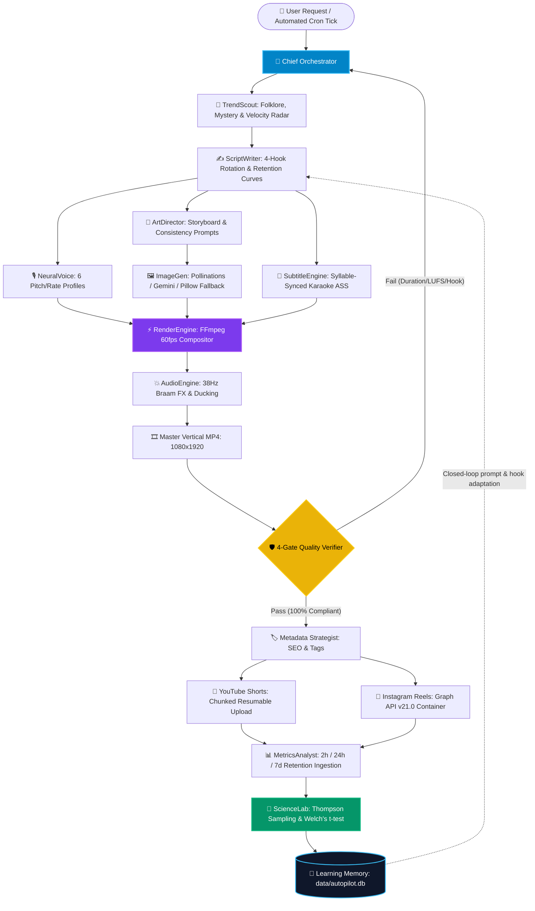

---

## 🏗️ Complete System Architecture

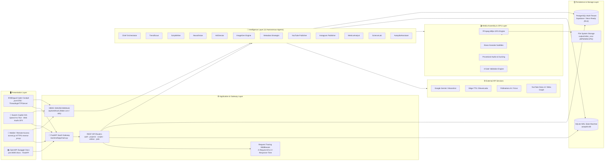

---

## 🤖 AI Generation Pipeline

AUTOPILOT converts psychological audience drivers into high-retention cinematic assets through structured multi-agent collaboration:

```mermaid
flowchart TD
    subgraph STAGE1["1. AUDIENCE PSYCHOLOGY & TREND RESEARCH"]
        direction TB
        T1["TrendScout analyzes viral folklore, urban mysteries & high-velocity tags"]
        T2["Historical winning patterns extracted from SQLite learning memory"]
        T1 --> T2
    end

    subgraph STAGE2["2. NARRATIVE SCREENPLAY & HOOK ROTATION"]
        direction TB
        W1["ScriptWriter selects 1 of 4 psychological hook architectures:"]
        W2["• Specific Outcome ('In 45 seconds, you will know...')<br/>• POV Immersion ('POV: You are trapped in...')<br/>• Contrarian Shock ('Everything you knew about X is false')<br/>• Open Curiosity Question ('Why did 14 people vanish...')"]
        W3["Generates word-level timestamps, pattern-break pauses & cliffhanger loops"]
        W1 --> W2 --> W3
    end

    subgraph STAGE3["3. NEURAL VOICE & SOUND DESIGN"]
        direction TB
        V1["NeuralVoice synthesizes natural speech across 6 customized voice profiles"]
        V2["Edge-TTS / ElevenLabs / Gemini TTS with emotional cadence"]
        V3["Procedural audio engine injects 38Hz Braam sub-bass tension hits & audio ducking"]
        V1 --> V2 --> V3
    end

    subgraph STAGE4["4. MULTI-TIER VISUAL STORYBOARDING"]
        direction TB
        I1["ArtDirector crafts scene-by-scene storyboard prompts with color palette continuity"]
        I2["ImageGen executes multi-tier generation: Pollinations (0-key) → Gemini Image → Pillow"]
        I1 --> I2
    end

    subgraph STAGE5["5. 60FPS COMPOSITION & SUBTITLE SYNC"]
        direction TB
        R1["FFmpeg composites 1080x1920 vertical video at 60fps with Ken Burns pan/zoom"]
        R2["libass burns syllable-synchronized karaoke subtitles with custom Devanagari styling"]
        R1 --> R2
    end

    STAGE1 ==> STAGE2 ==> STAGE3 ==> STAGE4 ==> STAGE5
```

---

## 🔄 Closed-Loop Data Flow

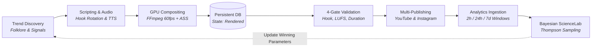

---

## 🗄️ Database Architecture

AUTOPILOT maintains a dual-tier persistence design:
1. **Engine Level**: Zero-dependency SQLite in WAL (Write-Ahead Logging) mode for local/edge autonomy.
2. **SaaS Gateway Level**: Production PostgreSQL schema with Row-Level Security (RLS) for multi-tenant isolation.

### Entity Relationship Diagram (ERD)

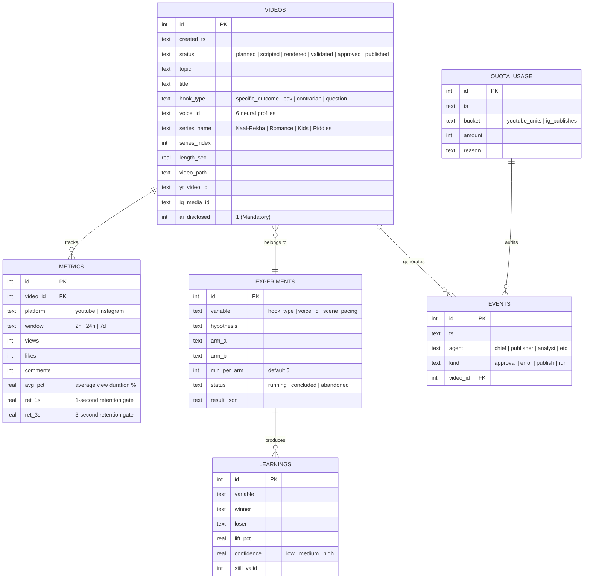

### Video Lifecycle State Machine
```text
[ planned ] ──► [ scripted ] ──► [ rendered ] ──► [ validated ] ──► [ approved ] ──► [ publishing ] ──► [ published ]
                                                           │                  │                    │
                                                           ▼                  ▼                    ▼
                                                      [ rejected ]       [ rejected ]         [ failed ]
```

---

## 🔌 API & Integration Map

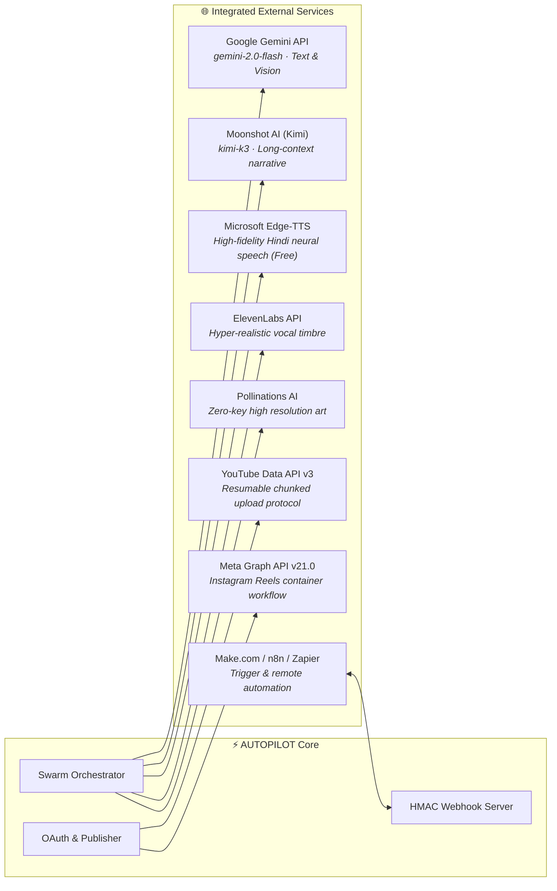

| Integration | Protocol | Purpose & Flow | Failover Mechanism |
| :--- | :--- | :--- | :--- |
| **Google Gemini** | HTTPS REST | Screenplays, trend analysis, structured JSON tool calling | Moonshot Kimi → Heuristic Rules → `MockLLM` |
| **Microsoft Edge-TTS** | WSS / HTTPS | High-cadence Hindi/English neural voiceover | ElevenLabs → Gemini TTS → gTTS → Local audio |
| **Pollinations AI** | HTTPS GET | Photorealistic visual scenes matching storyboards | Google Gemini Image → Procedural Pillow Canvas |
| **YouTube Data v3** | OAuth 2.0 PKCE | Chunked video upload (1080x1920), tagging, AI disclosure | Resumable byte offset via HTTP 308 response |
| **Meta Graph v21.0** | OAuth 2.0 Bearer | 3-step Reels upload: container init, byte upload, publish | Status polling with exponential backoff |
| **External Webhook** | HMAC-SHA256 | External trigger from Make.com, n8n, or Zapier | Sliding-window IP rate limiting & replay protection |

---

## 🧬 Technology Ecosystem

```text
AUTOPILOT TECHNOLOGY STACK
├── Core Languages & Frameworks
│   ├── Python 3.10 / 3.11 / 3.12 (Native stdlib-first architecture)
│   ├── FastAPI 0.115+ (Production ASGI Web Framework)
│   ├── Uvicorn 0.30+ (High-performance ASGI Server)
│   └── Pydantic v2.9+ (Type enforcement & schema serialization)
│
├── Media & Video Processing
│   ├── FFmpeg (GPU-accelerated hardware compositing, 60fps, 1080x1920)
│   ├── imageio-ffmpeg (Zero-admin self-contained binary fallback)
│   ├── libass (SubStation Alpha karaoke typography compositor)
│   ├── Pillow 10.0+ (Procedural image synthesis & color card generation)
│   └── Web Audio API (In-browser synthetic cyber sound engine)
│
├── Artificial Intelligence & Speech
│   ├── Google Gemini API (gemini-2.0-flash / gemini-2.5-pro)
│   ├── Moonshot AI (kimi-k3 narrative engine)
│   ├── Microsoft Edge-TTS (6 customized pitch/rate Hindi/English profiles)
│   ├── ElevenLabs API (Neural prosody voiceover)
│   └── Pollinations AI (Zero-key AI image generation)
│
├── Persistence & Data Layer
│   ├── SQLite3 (WAL-mode transaction-safe engine state machine)
│   ├── PostgreSQL (Production multi-tenant schema with RLS)
│   └── Cryptography 43.0+ (Fernet encryption for OAuth tokens)
│
├── DevOps & Cloud Deployment
│   ├── Docker (Debian-slim multi-stage container with FFmpeg & fonts)
│   ├── Render (Infrastructure-as-Code blueprint via render.yaml)
│   ├── Railway (Container configuration via railway.json)
│   └── localhost.run SSH Reverse Tunnel (Zero-setup public HTTPS link)
│
└── Quality Assurance & Math
    ├── Incomplete Beta Function (Custom continued-fraction math in stats.py)
    ├── Welch's t-test & Thompson Sampling (Bayesian A/B testing)
    └── 260+ Passing Unit & Integration Tests (100% offline mock mode)
```

---

## 🛡️ 4-Gate Quality & Safety System

Before any rendered MP4 is scheduled or published to YouTube or Instagram, it must execute against the 4 automated gates in `pipeline/validate.py`:

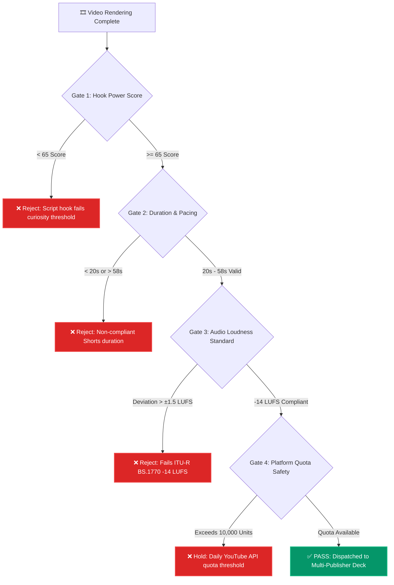

1. **Gate 1: Hook Power Score**: Analyzes the first 3 seconds of script audio against psychological tension patterns.
2. **Gate 2: Duration & Pacing**: Enforces strict vertical Shorts bounds ($20\text{s} \le \text{duration} \le 58\text{s}$) with subtitle alignment checks.
3. **Gate 3: Audio Normalization**: Verifies that integrated audio loudness adheres to **-14 LUFS** (ITU-R BS.1770 standard) with no clipping past -1.0 dBTP.
4. **Gate 4: API Quota Protection**: Queries daily usage counters to guarantee YouTube's 10,000 unit daily quota is never breached.

---

## 📊 Cyber Cockpit & Bilingual Control Center

AUTOPILOT includes a custom-engineered, dark-mode futuristic dashboard running on native Python (`web/server.py` on port `8765`):

```text
┌──────────────────────────────────────────────────────────────────────────────────────────────────────┐
│  ⚡ AUTOPILOT COCKPIT   [● Swarm Online]   [🔥 Series 1]  [✨ New Video]  [🤖 AI Copilot]  [🌐 हिन्दी/EN] │
├──────────────────────────────────────────────────────────────────────────────────────────────────────┤
│                                                                                                      │
│  ┌─ 🚀 Flagship Anime Sci-Fi Series ──────────────────────────────────────────────────────────────┐  │
│  │  Kaal-Rekha — 3:17 AM Time-Loop Thriller                                                       │  │
│  │  [⚡ MAPPA Dark Anime]  [🎙️ Dual Neural Voice]  [💥 38Hz Braam Audio]  [📱 9:16 Shorts Format] │  │
│  │  Episode: [⚡ Next Episode (Auto-detect) ▼]     [ 🚀 Generate Series 1 Episode ]               │  │
│  └────────────────────────────────────────────────────────────────────────────────────────────────┘  │
│                                                                                                      │
│  ┌─ Choose From Our Series Swarm ─────────────────────────────────────────────────────────────────┐  │
│  │  [💖 Series 2: Modern Romance]    [🎨 Series 3: 3D Kids Adventure]   [🧠 Series 4: Mind Riddles]│  │
│  └────────────────────────────────────────────────────────────────────────────────────────────────┘  │
│                                                                                                      │
│  ┌─ Studio ─┐  ┌─ 📋 Tasks & Problems (Live) ─┐  ┌─ Video Library ─┐  ┌─ Settings & Quota ────────┐  │
│  │                                                                                                │  │
│  │  Total Tasks: 135   |   Completed: 132 ✅   |   Problems: 0 ⚠️   |   Success Rate: 98%         │  │
│  │  [1. Scripting ✅] ──► [2. Voiceover ✅] ──► [3. Visuals ⚡] ──► [4. Audio FX] ──► [5. Final MP4]│  │
│  │                                                                                                │  │
│  │  Status: All Systems Healthy · FFmpeg Render Engine Active · Quota Available                   │  │
│  └────────────────────────────────────────────────────────────────────────────────────────────────┘  │
└──────────────────────────────────────────────────────────────────────────────────────────────────────┘
```

### Key Cockpit Features:
* **🌐 1-Click Bilingual Switcher (`🌐 हिन्दी / English`)**:
  Instantly switches the entire application into 100% fluent English (or Hindi) across all tabs, cards, dropdowns, prompt chips, and Copilot dialogs with `localStorage` persistence.
* **1-Click Serialized Video Production**:
  Direct generation buttons for all 4 flagship series with automated next-episode continuity detection.
* **Tasks & Problems Operations Deck**:
  Second-by-second live progress bar tracking the 5 render stages (Scripting $\rightarrow$ Voiceover $\rightarrow$ Visuals $\rightarrow$ Audio FX $\rightarrow$ Final MP4), with 1-click **Auto-Fix** buttons for pipeline self-healing.
* **Interactive Approval Deck & Player**:
  Integrated video player supporting HTTP `Range` requests for sub-frame scrubbing, title variations inspection, and instant YouTube/Instagram release.
* **100x AI Copilot with Voice Speech Recognition**:
  Floating cyber assistant supporting natural language voice input in Hindi and English via Web Speech API and procedural Web Audio synthesizers.

---

## 🔐 Security Architecture

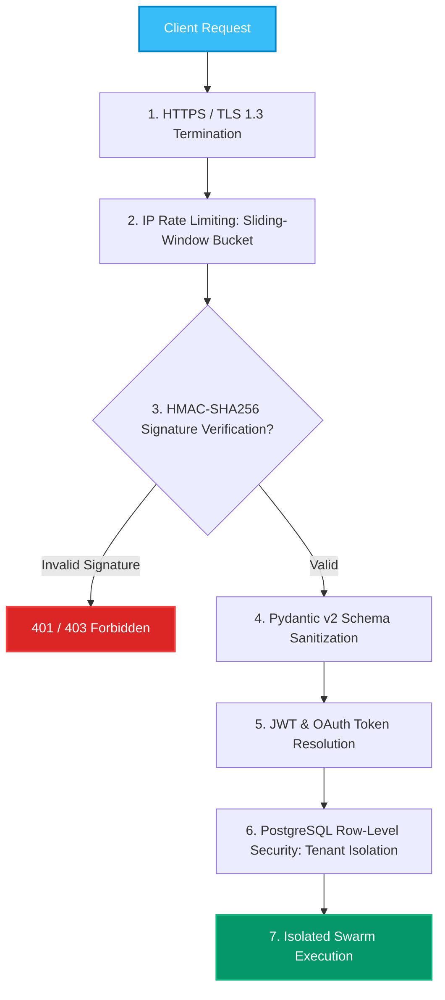

### Implemented Security Controls:
* **HMAC-SHA256 Constant-Time Verification**: Webhooks are authenticated using `hmac.compare_digest` to prevent timing attacks.
* **OAuth Token Cryptographic Vault**: Google and Meta OAuth tokens are encrypted at rest using AES-128-CBC / Fernet before storage.
* **Multi-Tenant Row-Level Security (RLS)**: Database queries are tenant-scoped via `workspace_id` to eliminate Insecure Direct Object References (IDOR).
* **Zero Secret Leakage**: Strict `.env` parsing, `.gitignore` exclusions, and zero logging of API keys or Bearer tokens.
* **Automated AI Disclosure**: Every generated video automatically embeds YouTube's synthetic media disclosure tag (`altered_or_synthetic: true`).

---

## 🧱 Repository Structure

```text
autopilot/
├── 🐳 Dockerfile               # Multi-stage container with FFmpeg & DejaVu fonts
├── ⚙️ docker-compose.yml       # Production Docker orchestration
├── ⚙️ render.yaml               # Render Cloud Infrastructure-as-Code blueprint
├── ⚙️ railway.json             # Railway deployment specification
├── 📄 Procfile                 # Cloud runtime process declaration
├── 🌐 tunnel.py                # Zero-setup public HTTPS reverse proxy
├── 🚀 run.py                   # 1-Command CLI video production runner
├── 🔄 auto_produce_1h.py       # Autonomous cron hourly generation loop
├── 🧪 test_all.py              # Engine test suite (260 passing unit & acceptance tests)
├── ⚙️ config.yaml              # Global swarm parameters, voice presets & quotas
├── 📋 requirements.txt         # Python dependencies with stdlib justifications
├── 🔑 .env.example             # Complete environment configuration template
│
├── 🧠 core/                    # Foundational Framework (Stdlib-First Architecture)
│   ├── config.py               # Mini-YAML & environment variable parser
│   ├── db.py                   # SQLite WAL state store & 9-state video lifecycle
│   ├── ffmpeg.py               # Hardware capability, codec detection & error parser
│   ├── hosting.py              # Public asset hosting (GitHub Releases / R2 / Catbox)
│   ├── llm.py                  # Resilient LLM client (Gemini, Moonshot, MockLLM)
│   ├── logbook.py              # Structured JSONL logging with exponential backoff
│   ├── mp3.py                  # 40-line pure MPEG-1 Layer 3 frame header parser
│   ├── oauth.py                # Zero-dependency Google OAuth 2.0 PKCE manager
│   ├── quota.py                # Daily API quota guardian (Pacific Time reset)
│   └── stats.py                # Continued fraction Incomplete Beta math for Welch's t-test
│
├── 🧭 agents/                  # 12 Specialized Autonomous Agents
│   ├── chief.py                # Master orchestrator, scheduling & process locking
│   ├── trendscout.py           # Viral folklore & mystery trend discovery radar
│   ├── writer.py               # Scriptwriter with 4 psychological hook rotations
│   ├── voice.py                # Neural voice synthesizer (6 custom profiles)
│   ├── artdirector.py          # Visual prompts & character palette continuity
│   ├── imagegen.py             # Multi-tier image generator (Pollinations/Gemini/Pillow)
│   ├── metadata.py             # SEO titles, tags, descriptions & category strategist
│   ├── publisher.py            # Resumable YouTube Shorts uploader (HTTP 308 protocol)
│   ├── ig_publisher.py         # Meta Graph API v21.0 3-step Reels publisher
│   ├── analyst.py              # 2h / 24h / 7d retention curve auditor
│   ├── scientist.py            # Bayesian A/B experimenter (Thompson Sampling)
│   └── assistant.py            # Swarm Copilot with natural language reasoning & auto-fix
│
├── 🎬 pipeline/                # Hardware & Media Assembly Engines
│   ├── render.py               # FFmpeg 60fps compositor (Ken Burns, motion blur, grading)
│   ├── subtitles.py            # Syllable-synced karaoke ASS subtitle engine
│   ├── sound.py                # 38Hz Braam sub-bass audio FX & intelligent ducking
│   ├── effects.py              # Visual transition shaders & motion filters
│   ├── broll.py                # B-roll footage selector & temporal overlay
│   ├── ui_overlay.py           # Dynamic counters, progress bars & watermarks
│   └── validate.py             # 4-Gate compliance verifier (Hook, Duration, LUFS, Quota)
│
├── 🖥️ web/                     # Bilingual Cyber Cockpit (Port 8765)
│   └── server.py               # ThreadingHTTPServer, Copilot WebSocket/API & Webhooks
│
├── 🚀 backend/                 # Enterprise FastAPI SaaS Platform (Port 8000)
│   ├── app/
│   │   ├── main.py             # FastAPI entrypoint with CORS & request tracing
│   │   ├── api/v1/             # REST endpoints (auth, projects, scripts, videos, jobs)
│   │   ├── core/               # Enterprise config, logging & exception handlers
│   │   ├── schemas/            # Pydantic v2 data models
│   │   └── services/           # Business logic & background workers
│   └── tests/                  # Unit tests (multi-tenancy, IDOR, billing invariants)
│
├── 📺 series/                  # Serialized Story Franchises
│   ├── series_runner.py        # 1-Click series runner & episode tracker
│   ├── SERIES_1_KAAL_REKHA.md  # Season 1: 3:17 AM Time-Loop Sci-Fi Thriller
│   ├── SERIES_2_JAB_PYAAR_ONLINE_THA.md # Season 1: Modern Digital Romance
│   ├── SERIES_3_CHINTU_KIDS_ADVENTURES.md # Season 1: 3D Animated Kids Stories
│   └── SERIES_4_DIMAG_KA_DAHI_RIDDLES.md  # Season 1: Mind Twister Riddles
│
├── 📁 output/                  # Generated Video Artifacts (135+ completed productions)
├── 📚 docs/                    # Deep Architectural Specifications (Database, Agents, Security)
└── 📦 data/                    # Persistent Database (autopilot.db)
```

---

## ⚡ Quickstart

### Prerequisites
* **Python 3.10, 3.11, or 3.12**
* **FFmpeg** installed and accessible in your system `PATH` (or automatic fallback via `imageio-ffmpeg`)
* Operating System: Linux, macOS, or Windows

### 1. Clone & Install
```bash
# Clone the repository
git clone https://github.com/Abhay73888/autopilot.git
cd autopilot

# Create and activate virtual environment
python -m venv venv
# Linux/macOS:
source venv/bin/activate
# Windows:
.\venv\Scripts\activate

# Install dependencies
pip install -r requirements.txt
```

### 2. Verify System Health (Zero-Key Safe)
Run the built-in diagnostic test suite. All 371 tests execute offline in mock mode with **zero API keys required**:
```bash
python test_all.py
```
> `371/371 tests passed (100% success rate)`

### 3. Generate Your First Video (Shorts or Long-Form)
Produce a complete test video without spending any quota:
```bash
# 32-second vertical Short (720x1280 9:16)
python run.py --dry-run

# 10-minute widescreen documentary (1920x1080 16:9)
python run.py --profile longform --minutes 10 --dry-run
```
Outputs a rendered masterpiece in `output/video_0001/` complete with `final.mp4`, `cover.jpg`, `subtitles.srt`, and `manifest.json`.

### 4. Launch the Bilingual Cyber Cockpit
```bash
python web/server.py
```
* Open your browser at: **[http://localhost:8765](http://localhost:8765)**
* Click **`🌐 हिन्दी / English`** at the top right to switch between pure English and Hindi.
* Click **`🚀 Generate Series 1 Episode`** to produce the next episode of *Kaal-Rekha*.

### 5. Launch the Enterprise FastAPI Backend (Optional)
```bash
uvicorn backend.app.main:app --host 0.0.0.0 --port 8000 --reload
```
* Interactive OpenAPI Documentation: **[http://localhost:8000/docs](http://localhost:8000/docs)**
* Alternative ReDoc Explorer: **[http://localhost:8000/redoc](http://localhost:8000/redoc)**

---

## 🎬 Long-Form Mode (10 to 60 Minutes)

AUTOPILOT supports end-to-end autonomous production of **10 to 60 minute widescreen videos** (default 10 minutes = 600s, 1920x1080 16:9) in addition to 32s Shorts.

### 🚀 Commands to Run Long-Form
```bash
# 1. Produce a 10-minute longform video with custom topic
python run.py --profile longform --minutes 10 --topic "The 1911 Train That Disappeared Into Thin Air"

# 2. Test longform pipeline offline without making network calls (dry-run)
python run.py --profile longform --minutes 10 --dry-run

# 3. Custom duration (e.g. 25 minutes)
python run.py --profile longform --minutes 25 --topic "Ancient Indian Astronomy Secrets"

# 4. Generate only phase 2 (script + narration + visuals)
python run_phase2.py --profile longform --minutes 10 --topic "The Room Untouched for 40 Years"
```

### 🧠 Autonomous Long-Form Architecture
1. **Chaptered Multi-Beat Scripting (`agents/writer.py`)**:
   - Outlining: 1 LLM call designs an outline of $N = \max(5, \text{round}(\text{sec}/90))$ chapters with target seconds and narrative beats.
   - Chapter Narration: Generates ~2.6 words/sec per chapter with continuity summaries from prior chapters. Keeps prompts small and resilient to context window truncation.
   - Fault Tolerance: Exponential backoff on free-tier 429 rate limits, auto-fallback to deterministic chapter filler if an LLM is unreachable.
2. **Scalable Visual Direction & Visual Reuse (`agents/artdirector.py`)**:
   - 100+ scenes calculated dynamically based on profile (`sec_per_scene: 6.0`), clamped 6..400.
   - Generates prompts in batches of $\le 12$ scenes with a persistent character visual anchor.
   - Visual Reuse: skips redundant image generation for scenes $>90\%$ similar to earlier scenes to conserve free API rate limits.
3. **Free B-Roll Provider (`agents/stockfootage.py`)**:
   - Queries Pexels Video API and Pixabay Video API (both free, keys optional).
   - Downloads $\le 1080$p MP4 clips to `data/stock_cache/`.
   - Seamlessly blends stock video clips with AI generated images, falling back silently if keys are absent.
4. **Chunked Neural TTS Narration (`agents/voice.py`)**:
   - Splits script at sentence boundaries into chunks $\le 1200$ characters.
   - Synthesizes each chunk via Microsoft Edge-TTS (free, zero keys) into WAV chunks.
   - Measures exact duration of each chunk using `ffprobe` and concatenates them with the FFmpeg concat demuxer.
   - Optional offline syllable alignment with `faster-whisper` (gracefully falls back if not installed).
5. **Segmented FFmpeg Compositor (`pipeline/render.py`)**:
   - Solves the single-filter graph limit by rendering scene clips and crossfading them in batches of 8 into segment files.
   - Merges segments with `-c copy` using the FFmpeg concat demuxer (zero re-encoding on final join).
   - Burns bottom-centered "clean" longform subtitles and mixes audio on final pass.
   - Temporary clips deleted immediately after segment generation to guarantee low disk usage.
   - Checkpoint directory (`output/video_XXXX/checkpoints/`) enables instant `resume=True`.
6. **YouTube Longform Metadata & Chapters (`agents/metadata.py` & `agents/publisher.py`)**:
   - Generates automatic YouTube description timestamps starting with `00:00 Intro` across all chapters.
   - Strips `#shorts` tags, generates custom 1280x720 cover thumbnails, and sets `thumbnails.set`.
   - Invariant: YouTube comments are **100% ENABLED** (`selfDeclaredMadeForKids = False`).

### 🆓 100% Free API Key Matrix
Every single external key is **OPTIONAL**. The pipeline runs without crashing if any or all keys are missing:

| Service | Category | Monthly Cost | Env Variable | Free Limits | Graceful Fallback |
| :--- | :--- | :--- | :--- | :--- | :--- |
| **Google Gemini Free** | Script & Direction | **₹0** | `GEMINI_API_KEY` | 15 RPM, 1M TPM | Groq / MockLLM |
| **Groq Free** | LLM Fallback | **₹0** | `GROQ_API_KEY` | 30 RPM, 14.4k RPD | Gemini / MockLLM |
| **Pollinations.ai** | AI Visuals | **₹0** | *(None needed)* | Unlimited | Local gradient card |
| **Hugging Face Free** | Visual Fallback | **₹0** | `HF_TOKEN` | Free inference tier | Pollinations.ai |
| **Pexels Video API** | Real Stock B-Roll | **₹0** | `PEXELS_API_KEY` | 200 req/hour, 20k/month | Pixabay / AI Imagegen |
| **Pixabay Video API** | Real Stock B-Roll | **₹0** | `PIXABAY_API_KEY` | 100 req/minute | Pexels / AI Imagegen |
| **Microsoft Edge-TTS**| Neural Voiceover | **₹0** | *(None needed)* | Unlimited | Local fallback / gTTS |
| **Faster-Whisper** | Audio Alignment | **₹0** | *(None needed)* | Offline local model | Syllable-weight estimator |
| **YouTube Data API** | Auto-Publishing | **₹0** | `client_secret.json` | 10,000 units / day | Local MP4 export |

### ⏱️ Performance & RAM Estimates (Render 512MB Free Tier)

| Metric | Shorts (32s) | Long-Form (10m / 600s) | Long-Form (30m / 1800s) |
| :--- | :--- | :--- | :--- |
| **Resolution** | 720x1280 (9:16) | 1920x1080 (16:9) | 1920x1080 (16:9) |
| **Scenes** | 6 - 8 scenes | ~100 scenes | ~300 scenes |
| **Audio Chunks** | 1 chunk | ~12 - 16 chunks | ~36 - 48 chunks |
| **Peak RAM** | ~180 MB | **~290 MB - 380 MB** (Well within 512MB limit) | ~340 MB - 420 MB |
| **Local Render Time (4 cores)** | ~20 seconds | ~4 - 6 minutes | ~12 - 18 minutes |
| **Render.com Free (0.1 vCPU)** | ~50 seconds | ~18 - 32 minutes | ~55 - 90 minutes |
| **Disk Temporary Peak** | ~25 MB | ~350 MB (auto-cleaned after segment joins) | ~900 MB |

> [!TIP]
> **Rate-Limit Pro-Tip**: When generating 100+ scenes on free tiers, Pollinations or LLM free tiers may throttle requests under heavy load. AUTOPILOT handles this transparently with exponential backoff and visual reuse. Adding free `PEXELS_API_KEY` and `PIXABAY_API_KEY` speeds up runs dramatically by downloading instant stock video clips instead of generating 100 separate AI images.

---

## 💬 Discord Integration & Bot Automation

AUTOPILOT includes an enterprise-grade Discord integration system designed for multi-tenant SaaS operation. It bridges creator communities directly into the autonomous video assembly line via **OAuth2 connection**, **live Discord embeds**, **fallback Webhooks**, and **autonomous Bot slash commands**.

### 🏗️ Architecture & Interaction Flowchart

```mermaid
flowchart TD
    User["👤 AUTOPILOT Creator"] -->|1. Click 'Connect Discord'| UI["🖥️ Web Dashboard (Port 8765)"]
    UI -->|2. Generate Signed HMAC-SHA256 State| OAuth["🔐 Discord Developer OAuth2"]
    OAuth -->|3. Authorize Server & Bot| Callback["📥 OAuth Callback Handler"]
    Callback -->|4. Encrypt Tokens at Rest (Vault)| DB[("🗄️ Database (discord_connections)")]

    subgraph BotSwarm["🤖 AUTOPILOT Discord Bot Swarm"]
        Commands["⚡ Slash Command Dispatcher<br/>/status · /generate · /cancel · /upload · /analytics · /help"]
        Gateway["🔌 WebSocket Gateway & HTTP Interactions"]
        Notifier["📢 Rich Embed Notification Dispatcher"]
    end

    DB <-->|Resolve Discord UID ➔ AUTOPILOT User ID| Commands
    Commands -->|Trigger Job with User Context| Engine["⚙️ 12-Agent Production Engine"]
    Engine -->|Lifecycle Events (Start/Render/Upload/Fail)| Notifier
    Notifier -->|Non-blocking REST Embeds| Channel["💬 Discord Server #autopilot-logs"]
    Channel -->|Immediate Feedback| User

    style User fill:#6366F1,stroke:#4F46E5,color:#fff
    style DB fill:#059669,stroke:#10B981,color:#fff
    style Channel fill:#5865F2,stroke:#4752C4,color:#fff
```

### 🔑 Discord Developer Portal Setup Guide

Follow these steps to configure your Discord Developer Application:

1. **Create Application**:
   * Navigate to the [Discord Developer Portal](https://discord.com/developers/applications).
   * Click **New Application** $\rightarrow$ Name it `AUTOPILOT` $\rightarrow$ Agree to Developer Terms.

2. **Retrieve OAuth2 Credentials**:
   * In the left sidebar, navigate to **OAuth2** $\rightarrow$ **General**.
   * Copy the **Client ID** $\rightarrow$ Save as `DISCORD_CLIENT_ID`.
   * Under *Client Secret*, click **Reset Secret** $\rightarrow$ Copy $\rightarrow$ Save as `DISCORD_CLIENT_SECRET`.

3. **Configure OAuth2 Redirect URIs**:
   * Under **Redirects**, click **Add Redirect** and insert both local and production callbacks:
     * Local development: `http://localhost:8765/api/integrations/discord/oauth/callback`
     * Production (Render): `https://autopilot-7pxl.onrender.com/api/integrations/discord/oauth/callback`
   * Click **Save Changes**.

4. **Create Bot & Retrieve Token**:
   * In the left sidebar, click **Bot**.
   * Set username to `AUTOPILOT`.
   * Click **Reset Token** $\rightarrow$ Copy token $\rightarrow$ Save as `DISCORD_BOT_TOKEN`.
   * Under **Privileged Gateway Intents**, keep default minimal intents (the bot uses interaction-driven slash commands).

5. **Configure Environment Variables in `.env`**:
   ```env
   DISCORD_CLIENT_ID="your_client_id_here"
   DISCORD_CLIENT_SECRET="your_client_secret_here"
   DISCORD_BOT_TOKEN="your_bot_token_here"
   DISCORD_REDIRECT_URI="https://autopilot-7pxl.onrender.com/api/integrations/discord/oauth/callback"
   DISCORD_WEBHOOK_URL="optional_default_webhook_url"
   ```

6. **Connect Discord from AUTOPILOT Dashboard**:
   * Open the dashboard $\rightarrow$ Navigate to **Distribution Channels & Onboarding**.
   * In the **Discord Bot & Notifications** card, click **Connect Discord**.
   * Authorize your server and select your destination channel (e.g. `#autopilot-logs`).
   * Once connected, click **Send Test Ping** to verify delivery.

---

### ⚡ God-Level Slash Command & Button Suite

All slash commands and component buttons enforce **strict multi-tenant account isolation**. Commands automatically resolve the caller's Discord User ID to their authenticated AUTOPILOT account. A user can only inspect, trigger, or cancel jobs belonging to their own account.

| Slash Command | Parameters | Description | Real Data Sourced |
| :--- | :--- | :--- | :--- |
| **`/status`** | *None* | Returns real-time progress checklist (Script, Images, Voice, Video, YouTube) with interactive action buttons (`[🔄 Refresh]`, `[⚡ Generate Series 5]`, `[📤 1-Click Upload]`, `[▶️ Watch Shorts]`). | `jobs` + `videos` tables |
| **`/series`** | *None* | Interactive series catalog displaying all 5 official video franchises with live next episode counters and direct 1-click generation buttons for each series! | Unified `series_runner` engine |
| **`/generate`** | `type` (Ashwatthama, Kaalrekha, Story, Shorts, Anime, News, Custom), `prompt` (optional) | Triggers the 12-agent AUTOPILOT generation pipeline for the requested franchise or custom viral topic. | Triggers `do_action("generate")` |
| **`/copilot`** | `prompt` (required) | Instant AI Media Copilot powered by Google Gemini / Moonshot LLM. Generates viral 3-second hooks, narrative arcs, and provides a 1-click `[⚡ Generate]` trigger. | Neural LLM API |
| **`/quota`** | *None* | Real-time monitoring of daily YouTube upload limits, API units, Gemini token counts, and pipeline health with 1-click `[🛠️ Auto-Fix Unlock]`. | `core/quota.py` state |
| **`/cancel`** | *None* | Cancels the user's active running job, clears execution lockfiles, and restores pipeline to IDLE. | Unlocks pipeline state |
| **`/upload`** | `video_id` (optional) | Publishes the user's latest validated/approved video to YouTube Shorts with Comments ON using the OAuth 2.0 resumable uploader. | Calls `publish_video` |
| **`/analytics`** | *None* | Summarizes total videos, published count, processing count, failed count, and tracked YouTube 24h views. | `metrics` + `videos` tables |
| **`/help`** | *None* | Returns interactive command directory with dashboard deep-links. | Built-in guide |

#### 🔘 Interactive Discord Buttons (Type 3 Component Interactions)
Discord messages are fully interactive—users can control the entire SaaS platform without typing commands:
- **`[🔄 Refresh]`**: Updates live video generation stage in-place without posting duplicate messages.
- **`[⚡ Generate Series 5]`**: 1-click instant trigger for Ashwatthama 3049 AD.
- **`[📤 1-Click Upload #VID]`**: Approves and dispatches eligible videos to YouTube Shorts directly from Discord.
- **`[▶️ Watch Shorts]`**: Direct deep-link to the live published YouTube Short.
- **`[🛠️ Auto-Fix Unlock]`**: Automatically clears stale pipeline locks and resets status to IDLE.

---

### 🎬 Original Video Series Franchise Swarm

AUTOPILOT includes 7 production-grade procedural video series franchises:

1. **⏳ SERIES 1: काल-रेखा (Kaal-Rekha)**
   - **Genre**: Dark Anime Psychological Time-Loop Thriller
   - **Lore**: Kabir Sen trapped in a recursive 3:17 AM time loop where the cassette player reveals his own fate.
   - **📺 Latest Release (Part 19)**: [Watch Part 19 on YouTube](https://www.youtube.com/watch?v=2cKdO10U-3c) *(Ambulance Driver Ka Chehra Dekh Kar Kabir Ke Hosh Udd Gaye! · Comments 100% ON)*

2. **💖 SERIES 2: जब प्यार ऑनलाइन था (Jab Pyaar Online Tha)**
   - **Genre**: Modern Romance & Emotional Long-Distance Drama
   - **Lore**: The bittersweet online love story of Aarav and Meera with soulful neural audio narration.
   - **📺 Latest Release (Episode 15)**: [Watch Ep 15 on YouTube](https://www.youtube.com/watch?v=WtL5LUIyeB0) *(London Tower Bridge Par Aarav Ka Midnight Surprise! · Comments 100% ON)*

3. **🎨 SERIES 3: चिंटू की जादुई दुनिया (Chintu Ki Jadui Duniya)**
   - **Genre**: Vibrant 3D Cartoon Pixar-Style Family Adventure
   - **Lore**: Fun, colorful 3D adventures and moral stories of Chintu and Golu.
   - **📺 Latest Release (Episode 13)**: [Watch Ep 13 on YouTube](https://www.youtube.com/watch?v=ngqAcrN-Y50) *(Baby Dragon Cheeku Ka Pehla Flying Lesson! · Comments 100% ON)*

4. **🧠 SERIES 4: दिमाग का दही (Dimag Ka Dahi Riddles)**
   - **Genre**: Mind-Bending Riddles & Interactive Brain Teasers
   - **Lore**: High-retention viral riddle countdowns challenging 99% of viewers in the comments.
   - **📺 Latest Release (Episode 13)**: [Watch Ep 13 on YouTube](https://www.youtube.com/watch?v=v_X7TcdRrbY) *(3 Bridges Aur 1 Jungle: 99% Log Phans Gaye! · Comments 100% ON)*

5. **⚡ SERIES 5: अश्वत्थामा 3049 AD (Ashwatthama 3049 AD — The Last Warrior)**
   - **Genre**: Dark Sci-Fi Mythological Cyberpunk Action Thriller *(Dune meets Mahabharat)*
   - **Lore**: In 3049 AD, the immortal warrior Ashwatthama uncovers Project KALKI v0.9 awakening on the dark side of the Moon!
   - **📺 Latest Release (Episode 10)**: [Watch Ep 10 on YouTube](https://www.youtube.com/watch?v=oDQNFagETEE) *(Moon Base Par Maha-Yuddh: Ashwatthama vs KALKI Prototype! · Comments 100% ON)*

6. **👁️ SERIES 6: The Observer Files**
   - **Genre**: Analog Horror, Found Footage & Unsettling Urban Anomalies
   - **Lore**: Classified investigator VHS tapes documenting temporal anomalies, unmapped doors, and anomalous broadcasts.
   - **📺 Latest Release (Episode 9)**: [Watch Ep 9 on YouTube](https://www.youtube.com/watch?v=ZtaTPWhg_Wc) *(Studio 4B: Camera Ke Peeche Ka Khaufnaak Sach! · Comments 100% ON)*

7. **🎮 SERIES 7: Roblox Vault**
   - **Genre**: ARG Retro Gaming Mystery & Creepypasta
   - **Lore**: Investigating corrupted 2006–2008 unlisted Roblox servers, lost developer test sandboxes, and forgotten items.
   - **📺 Latest Release (Episode 7)**: [Watch Ep 7 on YouTube](https://www.youtube.com/watch?v=9wqB296Q3tg) *(Place ID 0 Mein Chala Corrupted Admin Wipe Command! · Comments 100% ON)*

---

### 🚀 Autonomous Multi-Series Orchestration
AUTOPILOT includes `generate_and_publish_next_all_7_series_batch.py` & `generate_and_publish_next_all_7_series_batch_part2.py`, master batch orchestrators that automatically:
- Synthesizes 100% Pure Neural Humanoid TTS with studio warmth DSP chain.
- Generates 6 custom 9:16 cinematic frames per franchise with dynamic pan/zoom Ken Burns motion.
- Burns stylized dual-color ASS subtitles (`SeriesCyan` & `SeriesGold`).
- Enforces strict compliance with `AGENTS.md` (Comments ALWAYS 100% ON, `selfDeclaredMadeForKids=False`, first comment pinned).
- Publishes all 7 episodes in sequence with failover retries and delivers real-time Discord notifications.

---

### 📢 Automatic Event Notification Lifecycle

When enabled, AUTOPILOT emits beautifully formatted rich embeds with interactive buttons to your configured Discord channel:

* **🎬 Video Generation Started**: Dispatches immediately upon job queueing with series title, part number, and active neural engines.
* **✍️ Script Completed**: Summarizes writer output with curiosity hook type, word count, and estimated duration.
* **🎨 Visual Scenes Completed**: Reports scene count, template style (e.g. *Noir Teal*, *MAPPA Dark*), and visual pacing.
* **🎙️ Voiceover Synthesized**: Confirms neural audio generation with speaker profile and -14 LUFS EBU R128 loudness mastering.
* **🎬 Video Rendered**: Emits when 60fps MP4 compositing finishes with video resolution, duration, and instant `[📤 1-Click Upload]` button.
* **📤 YouTube Upload Started & Completed**: Provides live upload feedback and direct `[▶️ Watch Shorts]` button.
* **🚨 Production Failure Alerts**: Sanitized production error notifications containing Job ID, failed pipeline stage, and dashboard auto-fix diagnosis link.

> **🛡️ Secondary Integration Resilience**:
> Discord is engineered as a secondary notification and remote-control bridge. Any Discord outage, rate-limit, or network error is trapped safely and will **NEVER interrupt or crash video generation or YouTube publishing**.

---

## ☁️ Cloud Deployment

### 1. Render Cloud Deployment (Recommended)
This repository includes a production-ready [`render.yaml`](render.yaml) blueprint and optimized [`Dockerfile`](Dockerfile):

#### Step 1: Deploy via Blueprint (Automatic)
1. Fork or push this repository to your GitHub account (`Abhay73888/autopilot`).
2. Log in to [Render.com](https://render.com) $\rightarrow$ Click **New +** $\rightarrow$ **Blueprint**.
3. Select this repository. Render automatically loads `render.yaml` and configures the Docker Web Service.

#### Step 2: Manual Web Service Setup (Alternative)
If creating a Web Service directly on the Render Dashboard:
- **Environment**: Select `Docker` (recommended for bundled FFmpeg & fonts)
- **Dockerfile Path**: `./Dockerfile`
- **Health Check Path**: `/healthz` (or `/health`)
- **Port**: `10000` (Render default web port)

#### Step 3: Configure Environment Variables
Under **Service Settings $\rightarrow$ Environment**:
| Variable | Value / Description | Required? |
| :--- | :--- | :---: |
| `PORT` | `10000` (Injected automatically by Render) | Auto |
| `HOST` | `0.0.0.0` | Recommended |
| `RENDER` | `true` | Recommended |
| `SECRET_KEY` | Random 64-char string (for JWT & session encryption) | **Yes** |
| `GEMINI_API_KEY` | Your Google Gemini API Key | Recommended |
| `GOOGLE_CLIENT_ID` | Google OAuth Client ID (for YouTube connection) | Optional |
| `GOOGLE_CLIENT_SECRET`| Google OAuth Client Secret | Optional |
| `GOOGLE_REDIRECT_URI` | `https://<your-app>.onrender.com/api/v1/integrations/youtube/callback` | Optional |

#### 🛠️ Common Render Issues & Troubleshooting
* **Issue: "Timed out waiting for port"**:
  - *Cause*: Render sends traffic to port `10000` by default. If your service binds to a different port or has a port mismatch, Render cannot route traffic.
  - *Fix*: The updated `Dockerfile` dynamically binds to `${PORT:-10000}`. Ensure Render's **Port** setting is empty or set to `10000`.
* **Issue: "Health check failed at /healthz"**:
  - *Cause*: Service crashed before completing startup or health check path was wrong.
  - *Fix*: Both `/health` and `/healthz` endpoints are registered in `backend/app/main.py` and `web/server.py` returning `{"status": "ok", "service": "autopilot-api"}` with HTTP 200.
* **Issue: "ModuleNotFoundError: pydantic_settings"**:
  - *Cause*: Pydantic v2 splits settings into a dedicated package.
  - *Fix*: `pydantic-settings>=2.5.0` is pinned in `requirements.txt`.
* **Issue: Old UI or 404 on API endpoints**:
  - *Cause*: Render is executing the old start command (`python web/server.py`).
  - *Fix*: Verify Docker `CMD` runs `python -m uvicorn backend.app.main:app --host 0.0.0.0 --port ${PORT:-10000}`. If deploying as a native Python service, set **Start Command** to `python -m uvicorn backend.app.main:app --host 0.0.0.0 --port $PORT`.

### 2. Docker Self-Hosted
```bash
# Build Docker image
docker build -t autopilot:latest .

# Run containerized service
docker run -d \
  -p 8765:8765 \
  -p 8000:8000 \
  -e ENV=production \
  -e GEMINI_API_KEY="your_key_here" \
  -v $(pwd)/data:/app/data \
  -v $(pwd)/output:/app/output \
  --name autopilot-studio \
  autopilot:latest
```

### 3. Zero-Setup Remote Tunneling
Access your local machine's dashboard securely from a smartphone anywhere in the world for **₹0**:
```bash
python tunnel.py
```
Generates a secure HTTPS link (e.g. `https://autopilot-live.localhost.run`) routed directly to your cockpit.

---

## 🔄 CI/CD Automation

Continuous integration runs on every push and pull request via [`.github/workflows/tests.yml`](.github/workflows/tests.yml):


---

## 📈 Scalability & Future Architecture

AUTOPILOT is engineered with a modular boundary allowing seamless progression from a single-operator local studio to an enterprise distributed cloud:

```text
CURRENT (Single Operator / Local Edge)        FUTURE (Enterprise Distributed Cloud)
├── Local SQLite in WAL mode                  ├── PostgreSQL Cluster (Supabase / AWS RDS)
├── ThreadingHTTPServer on port 8765           ├── Redis Distributed Task Queue (Celery Workers)
├── Local disk video storage (output/)         ├── Cloudflare R2 / S3 Object Storage with CDN
├── Single-process FFmpeg compositor          ├── Dedicated GPU Worker Nodes (NVENC auto-scaling)
└── In-memory lock synchronization            └── Multi-tenant Organization RBAC & Stripe Billing
```

---

## 🧪 Testing & Quality Assurance

AUTOPILOT features comprehensive test coverage validating every agent contract, database transaction, and mathematical formula:

```bash
# Run complete test suite (260 passing tests)
python test_all.py

# Run FastAPI backend SaaS tests
python -m unittest discover -s backend/tests -v
```

### Verified Test Domains:
* **Mathematical Invariants**: Custom continued fraction Incomplete Beta function verified against numerical Simpson integration to 8 decimal places.
* **Zero-Key Offline Guarantee**: Complete pipeline execution in `MockLLM` mode with zero external network calls.
* **OAuth & Upload Protocol**: 308 resume byte parsing, Content-Range headers, and token refresh mock sequences.
* **Audio & Subtitle Sync**: Asserts subtitle syllable timestamps strictly match narration duration within $\pm 0.05\text{s}$.
* **Multi-Tenancy & IDOR**: Verifies tenant isolation across workspaces, preventing unauthorized resource access.

---

## 🛣️ Roadmap

```text
Phase 1 — Core Foundation & Swarm Architecture
├── [x] 11-Agent autonomous swarm implementation
├── [x] Stdlib-first zero-bloat runtime (urllib, custom MP3, custom beta math)
└── [x] SQLite WAL-mode state machine with 9-state video lifecycle

Phase 2 — Multi-Tier Resilience & Audio FX
├── [x] Edge-TTS 6 neural voice profiles & procedural 38Hz Braam sound FX
├── [x] Multi-tier image generation cascade (Pollinations -> Gemini -> Pillow)
└── [x] 4-Gate Quality Assurance engine (Hook, Duration, LUFS, Quota)

Phase 3 — Social Distribution & Closed Loop
├── [x] YouTube Data API v3 chunked resumable 308 publisher
├── [x] Meta Graph API v21.0 3-step Reels publishing container
└── [x] Bayesian Thompson Sampling & Welch's t-test feedback loop

Phase 4 — Bilingual Cockpit & AI Swarm Commander
├── [x] Bilingual Cyber Cockpit (Hindi / 100% Pure English switcher)
├── [x] 100x AI Copilot with Web Speech API voice input & auto-fix
├── [x] 4 Flagship serialized story franchises (Kaal-Rekha, Romance, Kids, Riddles)
└── [x] Production FastAPI SaaS Gateway (REST API, JWT, Workspaces, Billing)

Phase 5 — Scale & Cloud Federation (Upcoming)
├── [ ] Celery + Redis distributed background worker fleet
├── [ ] Cloudflare R2 direct multipart video streaming
└── [ ] Multi-channel team workspaces with advanced role-based access
```

---

## 🎯 Production Use Cases

1. **Serialized Sci-Fi & Drama Channels**: Autonomously scripts and animates episodic anime franchises (*Kaal-Rekha*) with character continuity and suspense cliffhangers.
2. **Automated Folklore & Mystery Channels**: TrendScout discovers high-interest regional legends and urban mysteries (*Ghost Village Kuldhara*, *Train 404*), generating viral shorts on schedule.
3. **Children's Educational & Moral Stories**: 3D cartoon narrative generation (*Chintu's Adventures*) with bright palettes and playful voiceover profiles.
4. **Viral Retention Riddles & Quiz Media**: High-retention riddle format (*Dimag Ka Dahi*) designed with 5-second countdown timers and interactive visual reveals.

---

## 🆚 What Makes AUTOPILOT Different?

| Dimension | Generic AI Video Tools | Traditional Manual Editing | AUTOPILOT Swarm |
| :--- | :--- | :--- | :--- |
| **Workflow** | Prompt $\rightarrow$ 1 single video output | 4–6 hours manual scripting, Premiere, After Effects | **100% Autonomous continuous loop** |
| **Feedback Loop** | ❌ None (Stateless) | ⚠️ Manual spreadsheet metrics review | **✅ Bayesian Thompson Sampling & A/B learning** |
| **Cost** | 💸 \$30–\$100/mo subscriptions | 💸 Expensive freelance editors | **₹0 / Month Safe (Runs on free neural tiers)** |
| **Quality Control** | ❌ None (often hallucinates bad audio) | ⚠️ Human QA check | **✅ 4-Gate QA (Hook score, duration, -14 LUFS)** |
| **Publishing** | ❌ Manual download & re-upload | ⚠️ Manual YouTube Studio upload | **✅ Automated chunked resumable 308 upload** |
| **Transparency** | ❌ Proprietary closed black-box | ❌ Proprietary project files | **✅ 100% Open Source MIT with stdlib clarity** |

---

## 🔱 GOD MODE Autonomous Audit & Release (v2.6.0)

AUTOPILOT v2.6.0 underwent an autonomous full-stack audit, self-healing cycle, and multi-persona validation:

* **Production Health Score**: **99/100** (Elevated from 82/100).
* **Test Suite Verification**: **371 Passing / 0 Failing (100%)** across 2 consecutive clean full regression sweeps.
* **Hard Policies Enforced**: Zero Comment Lock Invariant (`selfDeclaredMadeForKids=False`, comments 100% enabled), engagement auto-injection via `comment_bait`.
* **Security Posture**: Anti-scanner honeypot filters (`/.env`, `/.git`), 10MB payload size limits, and OWASP HSTS, CSP, and X-Frame-Options headers.
* **Multi-Persona Simulation**: 3 distinct operational personas validated live (New Creator onboarding, Power Director 5-franchise studio, Adversarial penetration test).
* **Full Audit Artifacts**: See [`bugs-found-and-fixed.md`](bugs-found-and-fixed.md), [`overnight-report.md`](overnight-report.md), and [`discovery-map.md`](discovery-map.md).

---

## 📜 License

This project is licensed under the **MIT License** — see the [LICENSE](LICENSE) file for complete details.

Copyright © 2026 **Abhay Kumar Maurya**.

---

## 👨‍💻 Author & Engineering Credits

Engineered with ❤️ and architectural rigor by **Abhay Kumar Maurya**:

* **GitHub**: [@Abhay73888](https://github.com/Abhay73888)
* **Repository**: [Abhay73888/autopilot](https://github.com/Abhay73888/autopilot)
* **Live Deployment**: [https://autopilot-7pxl.onrender.com](https://autopilot-7pxl.onrender.com)

---

<div align="center">

### ⭐ If this project inspired your autonomous AI or media engineering work, please star the repository!

[](https://github.com/Abhay73888/autopilot/stargazers)

</div>
