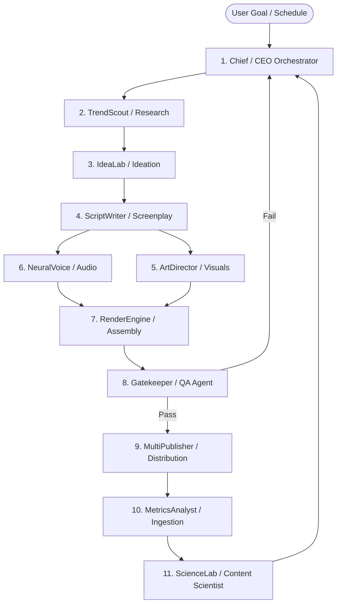

# AUTOPILOT — MULTI-AGENT SWARM SPECIFICATION & CONTRACTS

This document defines the specialized agent contracts, input/output schemas, prompt strategies, failover behavior, and inter-agent communication topologies that drive the AUTOPILOT Autonomous AI Media Operating System.

---

## 1. AGENT SWARM ARCHITECTURE

AUTOPILOT does not rely on a monolithic LLM prompt. Instead, it utilizes **11 specialized autonomous agents**, each operating as a deterministic function with strict JSON validation, retry backoffs, and fallback providers.



---

## 2. AGENT SPECIFICATIONS & CONTRACTS

### 2.1 Chief (CEO / Orchestrator Agent)
* **Role**: Campaign strategist, execution coordinator, exception handler, and budget supervisor.
* **Input**:
  - `workspace_id`: Tenant boundary
  - `project_settings`: Niche, target duration, posting cadence, tone
  - `insights_context`: Active learnings from `ScienceLab`
  - `credit_budget`: Available credits
* **Output**:
  - `execution_plan`: Ordered list of tasks dispatched to worker queues
* **Failover / Recovery**:
  - If downstream agents fail repeatedly, Chief initiates self-healing (e.g., switches LLM from Claude 3.5 Sonnet to GPT-4o, or switches TTS from ElevenLabs to Edge TTS).

---

### 2.2 TrendScout (Research Agent)
* **Role**: Searches high-velocity trends, viral patterns, competitor gaps, and audience interest vectors.
* **Input**:
```json
{
  "niche": "Artificial Intelligence & Coding",
  "searchKeywords": ["local LLMs", "Claude 3.5", "v0 dev"],
  "targetPlatform": "youtube_shorts",
  "historicalWinners": ["comparison hooks", "tool teardowns"]
}
```
* **Output Schema**:
```json
{
  "topics": [
    {
      "topic": "Running DeepSeek-R1 100% Offline on a Laptop",
      "trendScore": 96,
      "competitionScore": 52,
      "viralPotential": 94,
      "recommendedAngle": "Expose that you don't need cloud GPUs anymore",
      "hookAngle": "Nobody tells you this about running local AI..."
    }
  ]
}
```

---

### 2.3 IdeaLab (Scoring & Ideation Agent)
* **Role**: Generates multiple distinct concepts for a topic, scoring each on curiosity, retention potential, and production feasibility.
* **Scoring Dimensions**:
  - `viral_score` (0-100)
  - `trend_score` (0-100)
  - `competition_score` (0-100)
  - `retention_potential` (0-100)
  - `curiosity_score` (0-100)

---

### 2.4 ScriptWriter (Screenplay & Retention Agent)
* **Role**: Writes high-retention short-form scripts adhering to proven retention curves:
  1. **0s - 3s (The Hook)**: Aggressive visual/verbal pattern interrupt; curiosity gap.
  2. **3s - 12s (The Context & Problem)**: Stakes identification.
  3. **12s - 30s (The Twist / Core Value)**: Fast-paced facts with pattern breaks every 4 seconds.
  4. **30s - 40s (The Payoff)**: Resolution of the curiosity gap.
  5. **40s - 45s (The CTA)**: High-converting, frictionless call to action.
* **Output Contract**:
```json
{
  "title": "The Offline AI Tool Replacing Cloud Subscriptions",
  "hook": "Stop paying 20 dollars a month for AI subscriptions.",
  "body": "Because right now, you can run an uncensored reasoning model directly on your laptop. Here is the exact setup...",
  "payoff": "Download Ollama, run deepseek-r1 in terminal, and you get unlimited reasoning for zero dollars.",
  "cta": "Follow for daily open-source AI workflows.",
  "fullText": "Stop paying 20 dollars a month...",
  "estimatedDuration": 38,
  "wordCount": 98
}
```

---

### 2.5 ArtDirector (Visual Director Agent)
* **Role**: Breaks down the script line by line, generating precise prompt sequences for image generators (SDXL/Flux), B-roll video search queries, and transition markers.
* **Output Contract**:
```json
{
  "scenes": [
    {
      "sceneIndex": 1,
      "startSecond": 0.0,
      "endSecond": 3.2,
      "scriptSnippet": "Stop paying 20 dollars a month for AI subscriptions.",
      "visualType": "ai_generated_image",
      "generationPrompt": "Cinematic 8k close-up shot of a credit card being shredded by glowing digital laser beams, dark moody cyber aesthetic, 9:16 vertical ratio",
      "motionEffect": "zoom_in_slow",
      "bRollKeywords": ["credit card", "money burning", "cyberpunk"]
    },
    {
      "sceneIndex": 2,
      "startSecond": 3.2,
      "endSecond": 8.5,
      "scriptSnippet": "Because right now, you can run an uncensored reasoning model...",
      "visualType": "ai_generated_image",
      "generationPrompt": "Futuristic laptop glowing with neon green code in a dark modern developer office, photorealistic, 9:16 vertical ratio",
      "motionEffect": "pan_left"
    }
  ]
}
```

---

### 2.6 NeuralVoice (Audio & TTS Agent)
* **Role**: Synthesizes studio-grade voiceover audio with word-level timestamp alignment for karaoke subtitle synchronization.
* **Provider Chain**:
  1. Primary: ElevenLabs (Multilingual v2)
  2. Secondary: Edge TTS (Free, high-speed fallback)
  3. Tertiary: Local Coqui / Piper TTS
* **Output**:
  - `audio_url`: Clean 44.1kHz MP3/WAV
  - `word_timestamps`: Array of `[{word: "Stop", start: 0.12, end: 0.45}, ...]`

---

### 2.7 RenderEngine (FFmpeg Compositor Agent)
* **Role**: Asynchronously renders vertical video (1080x1920) at 30/60fps:
  - Stitches generated visual keyframes or video clips.
  - Applies Ken Burns camera motion (pan/zoom).
  - Dynamically overlays subtitles matching the brand kit font, colors, and word-highlighting.
  - Normalizes audio to -14 LUFS standard with subtle background music ducking.
* **Preset Standards**:
  - YouTube Shorts: 1080x1920, H.264, AAC 192kbps, faststart flags
  - TikTok: 1080x1920, H.264, high profile
  - Instagram Reels: 1080x1920, max bitrate 5 Mbps

---

### 2.8 Gatekeeper (Quality Control Agent)
* **Role**: Verifies that every rendered asset satisfies strict production and safety thresholds.
* **Automated QA Check Matrix**:
  - [x] **Audio Clipping**: Max true peak <= -1.0 dBFS
  - [x] **Loudness**: Integrated loudness within -14.0 ± 1.5 LUFS
  - [x] **Black Frame Detection**: 0 black frame sequences > 150ms
  - [x] **Subtitle Sync Drift**: Difference between word voice end and caption display <= 50ms
  - [x] **Aspect Ratio**: Exact 1080x1920 (9:16)
  - [x] **Duration**: Within project target limits (e.g., 30s to 60s)
  - [x] **Content Safety**: No copyright-flagged music, no prohibited PII or hate speech

---

### 2.9 MultiPublisher (Autonomous Distribution Agent)
* **Role**: Connects to OAuth 2.0 authorized APIs (YouTube Data API v3, Instagram Graph API, TikTok Content Posting API) to schedule or publish videos with optimized metadata (clicky titles, SEO descriptions, high-CTR hashtags).

---

### 2.10 MetricsAnalyst (Telemetry Ingestion Agent)
* **Role**: Periodically polls and ingests performance telemetry:
  - 1 hour after posting
  - 24 hours after posting
  - 7 days after posting
* Ingests: Views, average view duration (AVD), retention at second 3, likes, shares, comments, subscriber conversion rate.

---

### 2.11 ScienceLab (Content Scientist & Self-Improvement Agent)
* **Role**: Formulates hypotheses, executes statistical A/B test analysis, and updates the workspace's **Content Intelligence Layer**.
* **Example Insight Generation**:
  - *"Videos using curiosity-based hook angles achieved 78.4% average retention compared to 52.1% for direct question hooks (p < 0.01). Updating default ScriptWriter guidelines to prioritize curiosity loops."*

---

## 3. INTER-AGENT PROTOCOL & IDEMPOTENCY

1. **Job Tracing**: Every agent run includes `job_id`, `trace_id`, and `workspace_id`.
2. **Idempotent Retries**: If `NeuralVoice` crashes midway, the job re-executes with identical seed/parameters; previous partial audio files are garbage-collected.
3. **Structured Schemas**: All agent outputs must validate against Pydantic models prior to being committed to PostgreSQL or passed to the next worker.
