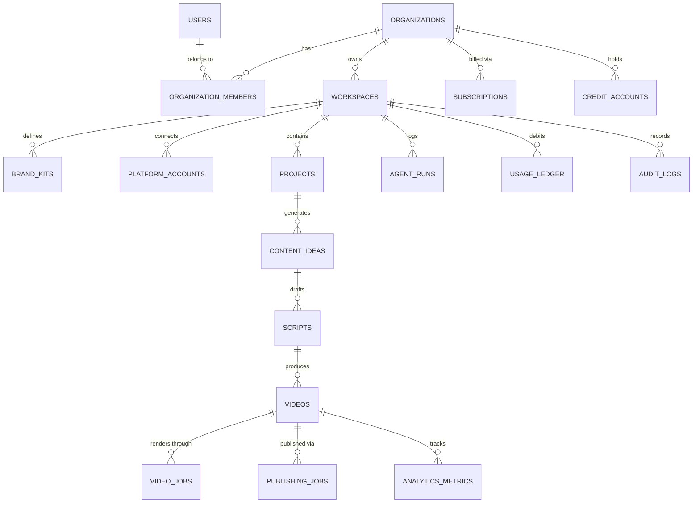

# AUTOPILOT — DATABASE ARCHITECTURE & SCHEMA SPECIFICATION

This document outlines the production-ready, multi-tenant database design for the AUTOPILOT Autonomous AI Media Operating System, targeting **PostgreSQL (Supabase / AWS RDS / Neon)** with full Row Level Security (RLS), connection pooling, audit logging, and tenant isolation.

---

## 1. DESIGN PHILOSOPHY & OBJECTIVES

1. **Strict Multi-Tenancy**: Every entity belongs to an `organization_id` or `workspace_id`. Cross-workspace queries are impossible at the database engine level via PostgreSQL Row-Level Security (RLS).
2. **UUID Primary Keys**: `gen_random_uuid()` avoids sequential ID enumeration, preventing IDOR vulnerabilities.
3. **Audit Trail & Immutable Ledgers**: Financial transactions, credit allocations, and critical actions are written to append-only ledgers (`usage_ledger`, `audit_logs`).
4. **JSONB Flexibility with Typed Constraints**: Complex, rapidly evolving payloads (e.g., agent generation trace, subtitle styles, platform metadata) utilize indexed `JSONB` columns while preserving strong relational consistency for IDs, timestamps, and foreign keys.
5. **Soft Deletes**: Key resources (projects, videos, channels) feature `deleted_at` timestamps to ensure safety against accidental deletion and preserve audit integrity.

---

## 2. ENTITY RELATIONSHIP DIAGRAM (ERD)



---

## 3. CORE POSTGRESQL DDL (MIGRATION READY)

### 3.1 Extensions & Utilities
```sql
-- Enable necessary extensions
CREATE EXTENSION IF NOT EXISTS "uuid-ossp";
CREATE EXTENSION IF NOT EXISTS "pgcrypto";

-- Enum types for strict validation
CREATE TYPE user_role AS ENUM ('owner', 'admin', 'editor', 'viewer');
CREATE TYPE subscription_status AS ENUM ('trialing', 'active', 'past_due', 'canceled', 'unpaid');
CREATE TYPE job_status AS ENUM ('queued', 'processing', 'completed', 'failed', 'canceled', 'retrying');
CREATE TYPE video_status AS ENUM ('idea', 'scripted', 'voiceover_ready', 'rendering', 'rendered', 'qa_passed', 'qa_failed', 'scheduled', 'publishing', 'published', 'failed');
CREATE TYPE platform_type AS ENUM ('youtube', 'instagram', 'tiktok', 'twitter', 'linkedin');
CREATE TYPE autopilot_mode AS ENUM ('manual', 'assisted', 'full_autopilot');
CREATE TYPE billing_interval AS ENUM ('month', 'year');
```

---

### 3.2 Tenancy & Users Hierarchy

```sql
-- 1. Users (Syncs with Supabase Auth or Clerk)
CREATE TABLE users (
    id UUID PRIMARY KEY DEFAULT gen_random_uuid(),
    auth_id VARCHAR(128) UNIQUE NOT NULL, -- Supabase auth.users.id or Clerk user_id
    email VARCHAR(255) UNIQUE NOT NULL,
    full_name VARCHAR(128),
    avatar_url TEXT,
    is_superadmin BOOLEAN DEFAULT FALSE,
    created_at TIMESTAMPTZ DEFAULT CURRENT_TIMESTAMP,
    updated_at TIMESTAMPTZ DEFAULT CURRENT_TIMESTAMP
);

-- 2. Organizations (Billing & Enterprise Boundary)
CREATE TABLE organizations (
    id UUID PRIMARY KEY DEFAULT gen_random_uuid(),
    name VARCHAR(128) NOT NULL,
    slug VARCHAR(64) UNIQUE NOT NULL,
    billing_email VARCHAR(255) NOT NULL,
    created_at TIMESTAMPTZ DEFAULT CURRENT_TIMESTAMP,
    updated_at TIMESTAMPTZ DEFAULT CURRENT_TIMESTAMP
);

-- 3. Organization Memberships (RBAC)
CREATE TABLE organization_members (
    id UUID PRIMARY KEY DEFAULT gen_random_uuid(),
    organization_id UUID NOT NULL REFERENCES organizations(id) ON DELETE CASCADE,
    user_id UUID NOT NULL REFERENCES users(id) ON DELETE CASCADE,
    role user_role NOT NULL DEFAULT 'editor',
    created_at TIMESTAMPTZ DEFAULT CURRENT_TIMESTAMP,
    UNIQUE(organization_id, user_id)
);

-- 4. Workspaces (Sub-divisions: Projects, Content Teams, Brands)
CREATE TABLE workspaces (
    id UUID PRIMARY KEY DEFAULT gen_random_uuid(),
    organization_id UUID NOT NULL REFERENCES organizations(id) ON DELETE CASCADE,
    name VARCHAR(128) NOT NULL,
    slug VARCHAR(64) NOT NULL,
    autopilot_mode autopilot_mode NOT NULL DEFAULT 'assisted',
    is_autopilot_active BOOLEAN NOT NULL DEFAULT FALSE,
    emergency_stop_triggered BOOLEAN NOT NULL DEFAULT FALSE,
    max_daily_renders INT DEFAULT 5,
    monthly_budget_usd NUMERIC(10, 2) DEFAULT 50.00,
    created_at TIMESTAMPTZ DEFAULT CURRENT_TIMESTAMP,
    updated_at TIMESTAMPTZ DEFAULT CURRENT_TIMESTAMP,
    UNIQUE(organization_id, slug)
);
```

---

### 3.3 Brand Kits & Connected Platforms

```sql
-- 5. Brand Kits
CREATE TABLE brand_kits (
    id UUID PRIMARY KEY DEFAULT gen_random_uuid(),
    workspace_id UUID NOT NULL REFERENCES workspaces(id) ON DELETE CASCADE,
    name VARCHAR(128) NOT NULL,
    logo_url TEXT,
    primary_color VARCHAR(16) DEFAULT '#6366F1',
    secondary_color VARCHAR(16) DEFAULT '#EC4899',
    accent_color VARCHAR(16) DEFAULT '#10B981',
    font_family VARCHAR(64) DEFAULT 'Inter',
    caption_style JSONB NOT NULL DEFAULT '{
        "font": "Inter Bold",
        "size": 72,
        "color": "#FFFFFF",
        "stroke_color": "#000000",
        "stroke_width": 3,
        "highlight_color": "#FFCC00",
        "animation": "word_highlight",
        "position": "bottom_center"
    }',
    voice_preference JSONB NOT NULL DEFAULT '{
        "provider": "edge",
        "voice_id": "en-US-ChristopherNeural",
        "speed": 1.05,
        "pitch": 0.0
    }',
    intro_video_url TEXT,
    outro_video_url TEXT,
    watermark_url TEXT,
    watermark_position VARCHAR(32) DEFAULT 'top_right',
    created_at TIMESTAMPTZ DEFAULT CURRENT_TIMESTAMP,
    updated_at TIMESTAMPTZ DEFAULT CURRENT_TIMESTAMP
);

-- 6. Platform Accounts (OAuth Connected Tokens)
CREATE TABLE platform_accounts (
    id UUID PRIMARY KEY DEFAULT gen_random_uuid(),
    workspace_id UUID NOT NULL REFERENCES workspaces(id) ON DELETE CASCADE,
    platform platform_type NOT NULL,
    channel_name VARCHAR(255) NOT NULL,
    channel_id VARCHAR(255) NOT NULL,
    channel_avatar_url TEXT,
    access_token_encrypted TEXT NOT NULL, -- AES-256-GCM Encrypted
    refresh_token_encrypted TEXT,
    token_expires_at TIMESTAMPTZ,
    scopes JSONB NOT NULL DEFAULT '[]',
    is_active BOOLEAN DEFAULT TRUE,
    created_at TIMESTAMPTZ DEFAULT CURRENT_TIMESTAMP,
    updated_at TIMESTAMPTZ DEFAULT CURRENT_TIMESTAMP,
    UNIQUE(workspace_id, platform, channel_id)
);
```

---

### 3.4 Projects, Ideas, Scripts & Videos

```sql
-- 7. Projects (Niche & Campaign Core)
CREATE TABLE projects (
    id UUID PRIMARY KEY DEFAULT gen_random_uuid(),
    workspace_id UUID NOT NULL REFERENCES workspaces(id) ON DELETE CASCADE,
    brand_kit_id UUID REFERENCES brand_kits(id) ON DELETE SET NULL,
    name VARCHAR(255) NOT NULL,
    niche VARCHAR(128) NOT NULL,
    target_audience TEXT,
    tone VARCHAR(64) DEFAULT 'cinematic',
    target_duration INT DEFAULT 45, -- seconds
    target_platforms JSONB DEFAULT '["youtube", "instagram", "tiktok"]',
    posting_frequency_per_week INT DEFAULT 5,
    deleted_at TIMESTAMPTZ,
    created_at TIMESTAMPTZ DEFAULT CURRENT_TIMESTAMP,
    updated_at TIMESTAMPTZ DEFAULT CURRENT_TIMESTAMP
);

-- 8. Content Ideas (Ideation Lab)
CREATE TABLE content_ideas (
    id UUID PRIMARY KEY DEFAULT gen_random_uuid(),
    project_id UUID NOT NULL REFERENCES projects(id) ON DELETE CASCADE,
    workspace_id UUID NOT NULL REFERENCES workspaces(id) ON DELETE CASCADE,
    topic VARCHAR(255) NOT NULL,
    angle TEXT,
    viral_score INT CHECK (viral_score BETWEEN 0 AND 100),
    trend_score INT CHECK (trend_score BETWEEN 0 AND 100),
    competition_score INT CHECK (competition_score BETWEEN 0 AND 100),
    retention_potential INT CHECK (retention_potential BETWEEN 0 AND 100),
    recommended_hook TEXT,
    status VARCHAR(32) DEFAULT 'pending', -- pending, approved, rejected, scripted
    approved_by UUID REFERENCES users(id),
    approved_at TIMESTAMPTZ,
    created_at TIMESTAMPTZ DEFAULT CURRENT_TIMESTAMP
);

-- 9. Scripts
CREATE TABLE scripts (
    id UUID PRIMARY KEY DEFAULT gen_random_uuid(),
    idea_id UUID REFERENCES content_ideas(id) ON DELETE SET NULL,
    project_id UUID NOT NULL REFERENCES projects(id) ON DELETE CASCADE,
    workspace_id UUID NOT NULL REFERENCES workspaces(id) ON DELETE CASCADE,
    title VARCHAR(255) NOT NULL,
    hook TEXT NOT NULL,
    body TEXT NOT NULL,
    payoff TEXT NOT NULL,
    call_to_action TEXT NOT NULL,
    full_text TEXT NOT NULL,
    estimated_duration INT NOT NULL,
    scenes_breakdown JSONB NOT NULL DEFAULT '[]', -- Visual director scene cuts
    tone VARCHAR(64),
    status VARCHAR(32) DEFAULT 'draft', -- draft, reviewed, approved
    created_at TIMESTAMPTZ DEFAULT CURRENT_TIMESTAMP,
    updated_at TIMESTAMPTZ DEFAULT CURRENT_TIMESTAMP
);

-- 10. Videos (The Master Asset Record)
CREATE TABLE videos (
    id UUID PRIMARY KEY DEFAULT gen_random_uuid(),
    workspace_id UUID NOT NULL REFERENCES workspaces(id) ON DELETE CASCADE,
    project_id UUID NOT NULL REFERENCES projects(id) ON DELETE CASCADE,
    script_id UUID REFERENCES scripts(id) ON DELETE SET NULL,
    title VARCHAR(255) NOT NULL,
    description TEXT,
    tags JSONB DEFAULT '[]',
    aspect_ratio VARCHAR(16) DEFAULT '9:16',
    duration_seconds NUMERIC(6, 2),
    status video_status NOT NULL DEFAULT 'idea',
    qa_report JSONB DEFAULT '{}',
    thumbnail_url TEXT,
    audio_url TEXT,
    subtitles_url TEXT,
    video_url TEXT, -- Primary R2/S3 storage URL
    filesize_bytes BIGINT,
    metadata JSONB DEFAULT '{}',
    deleted_at TIMESTAMPTZ,
    created_at TIMESTAMPTZ DEFAULT CURRENT_TIMESTAMP,
    updated_at TIMESTAMPTZ DEFAULT CURRENT_TIMESTAMP
);
```

---

### 3.5 Asynchronous Execution: Jobs & Queues

```sql
-- 11. Video Render Jobs
CREATE TABLE video_jobs (
    id UUID PRIMARY KEY DEFAULT gen_random_uuid(),
    workspace_id UUID NOT NULL REFERENCES workspaces(id) ON DELETE CASCADE,
    video_id UUID NOT NULL REFERENCES videos(id) ON DELETE CASCADE,
    job_type VARCHAR(64) NOT NULL, -- render_full, generate_voice, generate_visuals, qa_check
    status job_status NOT NULL DEFAULT 'queued',
    priority INT DEFAULT 50, -- 100 = urgent, 0 = low
    progress INT DEFAULT 0,
    current_step VARCHAR(128),
    worker_id VARCHAR(128),
    retry_count INT DEFAULT 0,
    max_retries INT DEFAULT 3,
    error_message TEXT,
    logs TEXT,
    started_at TIMESTAMPTZ,
    completed_at TIMESTAMPTZ,
    created_at TIMESTAMPTZ DEFAULT CURRENT_TIMESTAMP
);

-- 12. Publishing Jobs (Scheduled / Multi-Platform)
CREATE TABLE publishing_jobs (
    id UUID PRIMARY KEY DEFAULT gen_random_uuid(),
    workspace_id UUID NOT NULL REFERENCES workspaces(id) ON DELETE CASCADE,
    video_id UUID NOT NULL REFERENCES videos(id) ON DELETE CASCADE,
    platform_account_id UUID NOT NULL REFERENCES platform_accounts(id) ON DELETE CASCADE,
    scheduled_for TIMESTAMPTZ NOT NULL,
    published_at TIMESTAMPTZ,
    status job_status NOT NULL DEFAULT 'queued',
    external_post_id VARCHAR(255),
    external_post_url TEXT,
    error_log TEXT,
    created_at TIMESTAMPTZ DEFAULT CURRENT_TIMESTAMP
);
```

---

### 3.6 Analytics, Learning & Self-Improvement

```sql
-- 13. Video Analytics Metrics
CREATE TABLE analytics_metrics (
    id UUID PRIMARY KEY DEFAULT gen_random_uuid(),
    video_id UUID NOT NULL REFERENCES videos(id) ON DELETE CASCADE,
    workspace_id UUID NOT NULL REFERENCES workspaces(id) ON DELETE CASCADE,
    platform platform_type NOT NULL,
    views INT DEFAULT 0,
    likes INT DEFAULT 0,
    comments INT DEFAULT 0,
    shares INT DEFAULT 0,
    watch_time_seconds NUMERIC(12, 2) DEFAULT 0,
    avg_view_duration_seconds NUMERIC(6, 2) DEFAULT 0,
    retention_percent NUMERIC(5, 2) DEFAULT 0,
    subscribers_gained INT DEFAULT 0,
    ctr_percent NUMERIC(5, 2) DEFAULT 0,
    captured_at TIMESTAMPTZ DEFAULT CURRENT_TIMESTAMP
);

-- 14. Experiments (A/B Testing Framework)
CREATE TABLE experiments (
    id UUID PRIMARY KEY DEFAULT gen_random_uuid(),
    workspace_id UUID NOT NULL REFERENCES workspaces(id) ON DELETE CASCADE,
    project_id UUID NOT NULL REFERENCES projects(id) ON DELETE CASCADE,
    name VARCHAR(255) NOT NULL,
    hypothesis TEXT,
    variant_type VARCHAR(64) NOT NULL, -- hook, voice, caption_style, thumbnail
    variant_a_video_id UUID REFERENCES videos(id),
    variant_b_video_id UUID REFERENCES videos(id),
    winner_video_id UUID REFERENCES videos(id),
    confidence_score NUMERIC(5, 2),
    status VARCHAR(32) DEFAULT 'running', -- running, concluded, inconclusive
    created_at TIMESTAMPTZ DEFAULT CURRENT_TIMESTAMP,
    concluded_at TIMESTAMPTZ
);

-- 15. Content Scientist Insights & Learnings
CREATE TABLE content_insights (
    id UUID PRIMARY KEY DEFAULT gen_random_uuid(),
    workspace_id UUID NOT NULL REFERENCES workspaces(id) ON DELETE CASCADE,
    project_id UUID REFERENCES projects(id) ON DELETE CASCADE,
    category VARCHAR(64) NOT NULL, -- hook_optimization, timing, retention, pacing
    observation TEXT NOT NULL,
    recommendation TEXT NOT NULL,
    confidence_score NUMERIC(5, 2) NOT NULL,
    applied_count INT DEFAULT 0,
    is_active BOOLEAN DEFAULT TRUE,
    created_at TIMESTAMPTZ DEFAULT CURRENT_TIMESTAMP
);
```

---

### 3.7 Billing, Subscriptions & Cost Accounting

```sql
-- 16. Subscription Plans
CREATE TABLE plans (
    id VARCHAR(64) PRIMARY KEY, -- starter, pro, agency, enterprise
    name VARCHAR(128) NOT NULL,
    monthly_price_usd NUMERIC(10, 2) NOT NULL,
    annual_price_usd NUMERIC(10, 2) NOT NULL,
    monthly_credits INT NOT NULL,
    max_workspaces INT DEFAULT 1,
    max_channels INT DEFAULT 1,
    max_team_members INT DEFAULT 1,
    features JSONB NOT NULL DEFAULT '{}',
    is_active BOOLEAN DEFAULT TRUE
);

-- 17. Organization Subscriptions
CREATE TABLE subscriptions (
    id UUID PRIMARY KEY DEFAULT gen_random_uuid(),
    organization_id UUID NOT NULL REFERENCES organizations(id) ON DELETE CASCADE,
    plan_id VARCHAR(64) NOT NULL REFERENCES plans(id),
    billing_provider VARCHAR(32) NOT NULL, -- stripe, lemonsqueezy, dodo
    provider_customer_id VARCHAR(128) NOT NULL,
    provider_subscription_id VARCHAR(128) NOT NULL UNIQUE,
    status subscription_status NOT NULL DEFAULT 'active',
    billing_interval billing_interval NOT NULL DEFAULT 'month',
    current_period_start TIMESTAMPTZ NOT NULL,
    current_period_end TIMESTAMPTZ NOT NULL,
    cancel_at_period_end BOOLEAN DEFAULT FALSE,
    canceled_at TIMESTAMPTZ,
    created_at TIMESTAMPTZ DEFAULT CURRENT_TIMESTAMP,
    updated_at TIMESTAMPTZ DEFAULT CURRENT_TIMESTAMP
);

-- 18. Credit Accounts (Real-time balance)
CREATE TABLE credit_accounts (
    id UUID PRIMARY KEY DEFAULT gen_random_uuid(),
    organization_id UUID NOT NULL REFERENCES organizations(id) ON DELETE CASCADE UNIQUE,
    balance INT NOT NULL DEFAULT 0,
    lifetime_purchased INT NOT NULL DEFAULT 0,
    lifetime_used INT NOT NULL DEFAULT 0,
    updated_at TIMESTAMPTZ DEFAULT CURRENT_TIMESTAMP
);

-- 19. Usage Ledger (Append-Only Cost & Credit Accounting)
CREATE TABLE usage_ledger (
    id UUID PRIMARY KEY DEFAULT gen_random_uuid(),
    organization_id UUID NOT NULL REFERENCES organizations(id) ON DELETE CASCADE,
    workspace_id UUID REFERENCES workspaces(id) ON DELETE SET NULL,
    video_id UUID REFERENCES videos(id) ON DELETE SET NULL,
    operation_type VARCHAR(64) NOT NULL, -- llm_script, tts_audio, sd_image, video_render, storage
    provider VARCHAR(64) NOT NULL,        -- openai, anthropic, elevenlabs, fal_ai, modal
    units_consumed NUMERIC(12, 4) NOT NULL, -- tokens, characters, seconds
    raw_cost_usd NUMERIC(10, 6) NOT NULL,    -- exact provider charge
    credits_debited INT NOT NULL,           -- user credit deduction
    balance_after INT NOT NULL,
    created_at TIMESTAMPTZ DEFAULT CURRENT_TIMESTAMP
);
```

---

### 3.8 Security, Auditing & Agent Observability

```sql
-- 20. Agent Execution Runs (Complete Autonomous Audit Trail)
CREATE TABLE agent_runs (
    id UUID PRIMARY KEY DEFAULT gen_random_uuid(),
    workspace_id UUID NOT NULL REFERENCES workspaces(id) ON DELETE CASCADE,
    job_id UUID REFERENCES video_jobs(id) ON DELETE SET NULL,
    agent_name VARCHAR(64) NOT NULL, -- Chief, TrendScout, ScriptWriter, NeuralVoice, etc.
    status VARCHAR(32) NOT NULL,     -- started, success, failed, retried
    input_summary TEXT,
    output_summary TEXT,
    tokens_used INT DEFAULT 0,
    duration_ms INT,
    cost_usd NUMERIC(8, 5) DEFAULT 0,
    error_details TEXT,
    created_at TIMESTAMPTZ DEFAULT CURRENT_TIMESTAMP
);

-- 21. System Audit Logs
CREATE TABLE audit_logs (
    id UUID PRIMARY KEY DEFAULT gen_random_uuid(),
    organization_id UUID REFERENCES organizations(id) ON DELETE CASCADE,
    workspace_id UUID REFERENCES workspaces(id) ON DELETE CASCADE,
    user_id UUID REFERENCES users(id) ON DELETE SET NULL,
    action VARCHAR(128) NOT NULL, -- e.g. "autopilot.emergency_stop", "channel.connected", "billing.plan_upgraded"
    ip_address VARCHAR(45),
    user_agent TEXT,
    details JSONB DEFAULT '{}',
    created_at TIMESTAMPTZ DEFAULT CURRENT_TIMESTAMP
);

-- 22. API Keys (Developer & Webhook access)
CREATE TABLE api_keys (
    id UUID PRIMARY KEY DEFAULT gen_random_uuid(),
    workspace_id UUID NOT NULL REFERENCES workspaces(id) ON DELETE CASCADE,
    name VARCHAR(128) NOT NULL,
    key_hash VARCHAR(64) NOT NULL UNIQUE, -- SHA-256 hash of plaintext key
    prefix VARCHAR(16) NOT NULL,          -- e.g. "auto_live_..."
    scopes JSONB NOT NULL DEFAULT '["videos:read", "videos:write"]',
    last_used_at TIMESTAMPTZ,
    expires_at TIMESTAMPTZ,
    revoked_at TIMESTAMPTZ,
    created_at TIMESTAMPTZ DEFAULT CURRENT_TIMESTAMP
);
```

---

## 4. ROW-LEVEL SECURITY (RLS) POLICIES

To prevent cross-tenant data leaks, PostgreSQL RLS is enforced on all tenant-specific tables.

```sql
-- Enable RLS across tenant tables
ALTER TABLE workspaces ENABLE ROW LEVEL SECURITY;
ALTER TABLE projects ENABLE ROW LEVEL SECURITY;
ALTER TABLE videos ENABLE ROW LEVEL SECURITY;
ALTER TABLE video_jobs ENABLE ROW LEVEL SECURITY;
ALTER TABLE usage_ledger ENABLE ROW LEVEL SECURITY;

-- Helper function: Get authenticated user's organization memberships
CREATE OR REPLACE FUNCTION get_user_org_ids()
RETURNS TABLE(org_id UUID) AS $$
    SELECT organization_id
    FROM organization_members
    WHERE user_id = auth.uid()::UUID;
$$ LANGUAGE sql SECURITY DEFINER;

-- RLS Policy: Users can only select workspaces belonging to their organization
CREATE POLICY workspace_tenant_isolation_policy ON workspaces
    FOR ALL
    USING (organization_id IN (SELECT get_user_org_ids()));

-- RLS Policy: Videos access restricted by workspace's organization
CREATE POLICY video_tenant_isolation_policy ON videos
    FOR ALL
    USING (
        workspace_id IN (
            SELECT w.id FROM workspaces w
            WHERE w.organization_id IN (SELECT get_user_org_ids())
        )
    );
```

---

## 5. PERFORMANCE INDEXES

```sql
CREATE INDEX idx_organization_members_user ON organization_members(user_id);
CREATE INDEX idx_workspaces_org ON workspaces(organization_id);
CREATE INDEX idx_projects_workspace ON projects(workspace_id);
CREATE INDEX idx_videos_workspace_status ON videos(workspace_id, status);
CREATE INDEX idx_videos_created_at ON videos(created_at DESC);
CREATE INDEX idx_video_jobs_status_priority ON video_jobs(status, priority DESC, created_at ASC);
CREATE INDEX idx_publishing_jobs_scheduled ON publishing_jobs(scheduled_for) WHERE status = 'queued';
CREATE INDEX idx_usage_ledger_workspace ON usage_ledger(workspace_id, created_at DESC);
CREATE INDEX idx_agent_runs_workspace ON agent_runs(workspace_id, created_at DESC);
CREATE INDEX idx_audit_logs_workspace ON audit_logs(workspace_id, created_at DESC);
```
