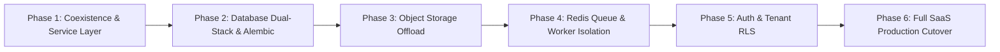

# AUTOPILOT — INCREMENTAL BACKEND MIGRATION PLAN

**Author:** SaaS CTO & Systems Architect  
**Objective:** Migrate AUTOPILOT from a single-tenant local prototype to a multi-tenant cloud SaaS without breaking existing workflows or losing operational continuity.

---

## 1. MIGRATION PRINCIPLES

1. **Zero Destructive Rewrites**: Existing local commands (`python run.py`, `python -m web.server`) must continue working throughout every migration phase.
2. **Dual-Stack Capability**: The codebase dynamically adapts to its environment—using local SQLite and local file serving when offline, and transitioning to PostgreSQL, Redis, and Cloudflare R2 when cloud credentials are provided.
3. **Data Integrity**: Video records, historical performance analytics, and A/B test learnings stored in SQLite are migrated to PostgreSQL using automated migration scripts.

---

## 2. PHASED MIGRATION SCHEDULE

### Phase 1: Service Layer Extraction & Coexistence (Current)
* Extract core business logic from monolithic handlers into clean, reusable service classes (`ProjectService`, `ScriptService`, `RenderService`, `PublishingService`, `BillingService`).
* Create FastAPI application structure under `backend/app/` to serve `/api/v1/*` alongside existing `web/server.py`.

### Phase 2: Database Dual-Stack & Schema Migration
* Implement unified database interface (`core/db_base.py`) supporting both PostgreSQL and SQLite.
* Set up Alembic migration environment (`backend/alembic/`) targeting the multi-tenant PostgreSQL schema.
* Provide an automated data migration utility (`scripts/migrate_sqlite_to_pg.py`) to copy legacy videos and metrics into the default organization/workspace.

### Phase 3: Media Storage Offload to Cloudflare R2
* Wrap media asset writing in `StorageProvider` interface (`core/provider_registry.py`).
* Direct new video renders, thumbnails, and audio tracks to S3/R2 presigned upload paths.
* Implement a background backfill script to upload existing local files from `output/` to the cloud bucket.

### Phase 4: Job Queue & Worker Decoupling
* Shift heavy execution from background Python threads to Redis task queues.
* Spin up standalone worker processes (`workers/render_worker.py`, `workers/agent_worker.py`).
* Add Server-Sent Events (SSE) `/api/v1/jobs/{job_id}/stream` endpoint in FastAPI to deliver live progress updates.

### Phase 5: Authentication & Multi-Tenant Row Level Security
* Integrate JWT validation middleware extracting `user_id` and `organization_id`.
* Enforce PostgreSQL Row Level Security (RLS) policies across all queries.
* Mount the Credit Ledger and transactional billing enforcement.

### Phase 6: Production Cutover & Cloud Deployment
* Deploy containerized FastAPI API gateway to Render / Railway.
* Deploy worker pods with GPU acceleration on Modal / RunPod.
* Run end-to-end integration and smoke test suite across all 11 autonomous agents.
