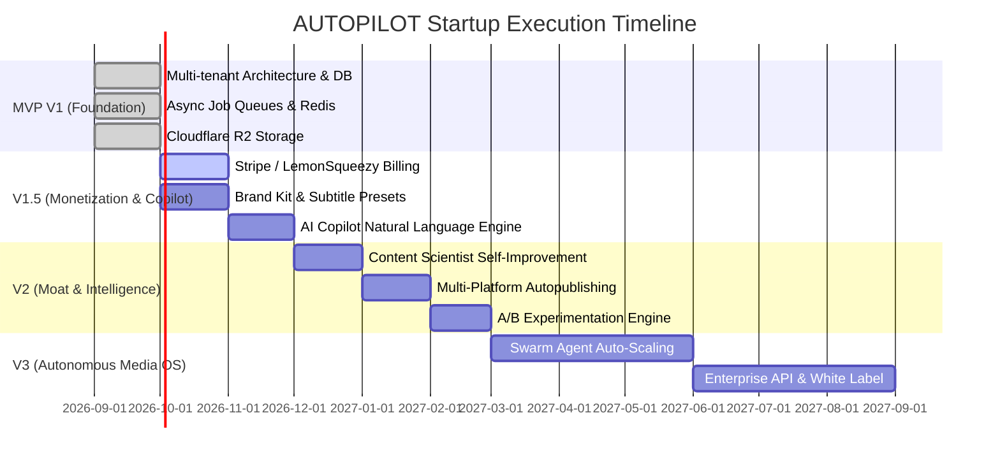

# AUTOPILOT — PRODUCT ROADMAP, MILESTONES & UNIT ECONOMICS

This document defines the strategic commercial roadmap, phase gates, subscription monetization tiers, and financial unit economics for scaling AUTOPILOT into a category-defining SaaS enterprise.

---

## 1. PHASED ROLLOUT ROADMAP



---

## 2. PHASE MILESTONES BREAKDOWN

### Phase 1: Local Foundation & Hardening (Completed)
* Direct video links across monitor, queue, and publishing sections.
* Comprehensive architectural and database specifications.
* Multi-provider abstraction contracts (`LLMProvider`, `TTSProvider`, `StorageProvider`, `BillingProvider`).

### Phase 2: Multi-Tenant Cloud Architecture (Current Phase)
* PostgreSQL DDL migration with Supabase Row Level Security (RLS).
* Decouple monolithic video rendering from API thread into Celery + Redis workers.
* Cloudflare R2 presigned S3 upload/download streaming.
* Dual database connector (`core/db_base.py`) supporting local SQLite & production PostgreSQL.

### Phase 3: Monetization & Cost Control
* Credit accounting ledger (`usage_ledger`) tracking exact token, TTS, and rendering raw costs.
* Stripe & LemonSqueezy subscription integration with webhook idempotency.
* Workspace-level daily render caps and monthly autonomy spend limits.

### Phase 4: Autonomous Intelligence (The Moat)
* `MetricsAnalyst` YouTube / Instagram / TikTok telemetry sync.
* `ScienceLab` self-improving content optimization loop.
* Automated weekly creator intelligence report.

---

## 3. COMMERCIAL MONETIZATION & PRICING PLANS

| Feature | Starter Tier ($29/mo) | Pro Tier ($79/mo) | Agency Tier ($199/mo) |
|---|---|---|---|
| **Monthly Video Credits** | 30 Shorts (~300 credits) | 90 Shorts (~1,000 credits) | 300 Shorts (~3,500 credits) |
| **Connected Channels** | 1 Channel (YouTube) | 3 Channels (YT, IG, TikTok) | Unlimited Channels |
| **Workspaces / Brands** | 1 Brand Kit | 3 Brand Kits | 10 Brand Kits + Custom Fonts |
| **Voice Options** | Standard Edge / HD TTS | Studio ElevenLabs Voices | Custom Voice Cloning |
| **Rendering Concurrency** | 1 Concurrent Worker | 3 Concurrent Workers | 8 Dedicated Priority Workers |
| **AI Copilot** | Basic Chat | Full Autonomous Commands | Custom Workflow Automations |
| **Analytics & Moat** | Standard View Counters | Retention & Content Scientist | Multi-Brand A/B Testing & API |

---

## 4. UNIT ECONOMICS & MARGIN ANALYSIS

### 4.1 Production Cost per 45-Second Vertical Short

| Component | Provider Used | Raw Unit Cost | Credits Charged |
|---|---|---|---|
| **Ideation & Research** | GPT-4o-mini / Groq Llama-3 | $0.002 | 1 credit ($0.10) |
| **Script Generation** | Claude 3.5 Sonnet | $0.015 | 2 credits ($0.20) |
| **Voiceover (45s, ~110 words)** | ElevenLabs / Edge TTS | $0.030 (Edge: $0.00) | 3 credits ($0.30) |
| **Visuals (6 keyframe scenes)** | Fal.ai / SDXL Lightning | $0.024 | 3 credits ($0.30) |
| **FFmpeg NVENC Rendering** | Modal / CPU Worker (20s) | $0.010 | 1 credit ($0.10) |
| **Total Production Cost** | — | **~$0.081** | **10 credits ($1.00)** |

### 4.2 Gross Margin Projection
* **Starter User** ($29/mo for 30 videos):
  - Total Raw AI/Compute Cost: 30 × $0.081 = **$2.43**
  - Gross Profit: $29.00 - $2.43 = **$26.57 (91.6% Gross Margin)**
* **Pro User** ($79/mo for 90 videos):
  - Total Raw AI/Compute Cost: 90 × $0.081 = **$7.29**
  - Gross Profit: $79.00 - $7.29 = **$71.71 (90.7% Gross Margin)**
* **Agency User** ($199/mo for 300 videos):
  - Total Raw AI/Compute Cost: 300 × $0.081 = **$24.30**
  - Gross Profit: $199.00 - $24.30 = **$174.70 (87.8% Gross Margin)**

---

## 5. FINANCIAL & TRACTION TARGETS

```text
Month 3:  100 Paying Users     ──►  $6,500 MRR   ($78,000 ARR)
Month 6:  500 Paying Users     ──►  $38,000 MRR  ($456,000 ARR)
Month 12: 2,500 Paying Users   ──►  $195,000 MRR ($2,340,000 ARR)
```

With a target CAC (Customer Acquisition Cost) of $35 achieved through organic viral Shorts produced by AUTOPILOT itself, the LTV:CAC ratio is projected at **> 8:1**.
