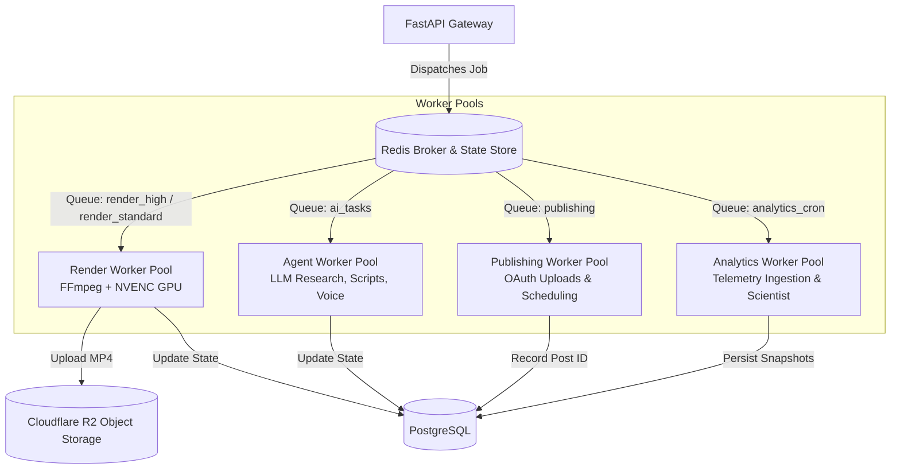
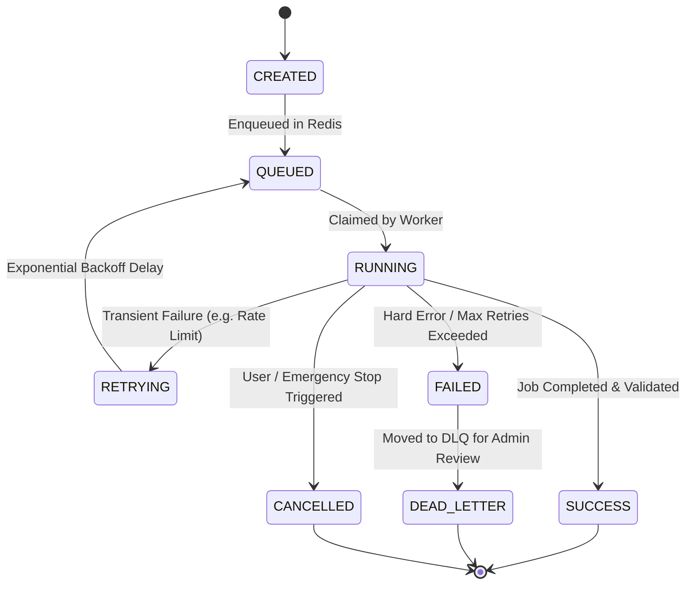

# AUTOPILOT — DISTRIBUTED WORKER ARCHITECTURE & JOB QUEUES

**Author:** Principal AI Infrastructure & Systems Architect  
**Specification Version:** 1.0.0  
**Target Environment:** Redis + Celery / Distributed Background Processors  

---

## 1. QUEUE ENGINE DECISION: CELERY + REDIS (PYTHON STACK)

### Architecture Decision Record (ADR):
* **Context**: Some microservice architectures utilize Node.js-based BullMQ. However, AUTOPILOT's core AI, agent swarm, and FFmpeg media pipeline are written in **100% Python**.
* **Decision**: **Celery + Redis** is our standard production task queue broker.
* **Rationale**:
  1. **Native Runtime & Zero Overhead**: Directly imports and invokes Python agent and FFmpeg modules (`agents/writer.py`, `pipeline/render.py`) in-process without multi-runtime Node.js/Python bridge bottlenecks.
  2. **Celery Beat**: Provides built-in distributed cron scheduling for YouTube/Instagram telemetry ingestion.
  3. **Task Routing & Prioritization**: Supports dedicated queues (`render_urgent`, `render_standard`, `ai_tasks`) with granular worker concurrency.
  4. **Local Fallback**: Includes synchronous / thread-based local task runner for offline dev environments where Redis is not provisioned.

---

## 2. DISTRIBUTED WORKER TOPOLOGY

To ensure high availability, fast API response times (<100ms), and zero resource starvation, AUTOPILOT segregates workloads into **specialized, independently auto-scalable worker pools**:



---

## 2. QUEUE TOPOLOGY & PRIORITY MATRIX

| Queue Name | Typical Duration | Resource Profile | Max Concurrency / Pod | Priority Level |
|---|---|---|---|---|
| **`render_urgent`** | 15s – 45s | High CPU / GPU Memory | 2 jobs | 100 (Agency Priority) |
| **`render_standard`**| 20s – 60s | High CPU / RAM | 2 jobs | 50 (Pro / Starter) |
| **`ai_agents`** | 2s – 10s | Network I/O, Low RAM | 16 jobs | 75 |
| **`voice_synthesis`**| 3s – 15s | Network I/O, Audio processing | 8 jobs | 70 |
| **`publishing`** | 10s – 60s | High Outbound Bandwidth | 4 jobs | 80 |
| **`analytics_sync`** | 5s – 30s | Network I/O, Low CPU | 8 jobs | 20 (Low background) |

---

## 3. ASYNC JOB STATE MACHINE

Every background task follows a deterministic lifecycle. Jobs never get silently lost or stuck in an indefinite state.



### State Definitions:
1. **`CREATED`**: Database record created with `job_id`; payload validated.
2. **`QUEUED`**: Payload serialized and pushed into Redis broker.
3. **`RUNNING`**: Worker heartbeat received; lock acquired; progress increments emitted.
4. **`SUCCESS`**: Artifacts uploaded to S3/R2; database updated; event `JobCompleted` broadcast.
5. **`RETRYING`**: Transient network or provider failure. Backoff delay calculated as:
   $$\text{Delay} = \min(300, 2^{\text{retry\_count}} \times 5) \text{ seconds}$$
6. **`DEAD_LETTER`**: 3 successive failures reached. Full execution trace stored in `dead_letter_jobs` for engineering inspection.
7. **`CANCELLED`**: Cancelled via workspace emergency stop. Worker immediately halts FFmpeg process via `SIGTERM`.

---

## 4. REAL-TIME PROGRESS REPORTING

Workers continuously update progress in Redis using hash keys (`job_progress:<job_id>`):

```json
{
  "jobId": "job_ren_019283",
  "workspaceId": "ws_alpha",
  "status": "RUNNING",
  "currentStep": "ffmpeg_composition",
  "stepProgress": 65,
  "overallProgress": 78,
  "heartbeat": 1725894120,
  "etaSeconds": 12
}
```

The FastAPI gateway subscribes to Redis Pub/Sub channels and streams these events directly to the frontend via **Server-Sent Events (SSE)**.

---

## 5. WORKER IDEMPOTENCY & LOCKING

1. **Distributed Locks**: To prevent duplicate renders or dual-publishing, workers acquire a Redis lock:
   `lock:render:<video_id>` with a 120-second lease and automatic renewal.
2. **Idempotency Key**: Each mutation includes `Idempotency-Key` in the request header or payload. If a duplicate job submission arrives, the API immediately returns the existing `job_id` rather than queueing a second render.
3. **Clean Teardown**: Workers trap `SIGTERM` and `SIGINT`:
   - Finish in-flight FFmpeg subprocess if completion is within 5 seconds.
   - If aborted, clean up temporary local render directories (`/tmp/render_<job_id>`) and mark status `CANCELLED`.
